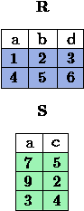

Lecture 3 - Relational Algebra: Select, Project, Join
-------------------------------------------------------

Basics of relational algebra
~~~~~~~~~~~~~~~~~~~~~~~~~~~~~~~~

.. index:: Basics of relational algebra

Algebra, in general, consists of operators and atomic operands. For instance, in the algebra of 
arithmetic, the atomic operands are variables like r, and constants like 15. The operators are 
the usual arithmetic ones:

 * Addition
 * Subtraction
 * Multiplication
 * Division.

Any algebra allows us to build expressions by applying operators to atomic operands and/or 
other expressions of the algebra. Usually, parentheses are needed to group operators and their 
operands. For instance, in arithmetic we have expressions such a `(x + y) * z` ó `((x + 7)/(y - 3)) + x`.

Relational algebra is another example of algebra. Its atomic operands are:

 1.  Variables that stand for relations
 2.  Constants, which are finite relations

.. note::
	
	In some books of relational algebra or SQL, a relation is considered a synonym of a table.

As we mentioned, in the classical relational algebra, all operands and the results of expressions are sets. 
The operations of the traditional relational algebra fall into four broad classes:

 1. The usual set operations - ``union``, ``intersection``, and ``difference`` - applied to relations.
 2. Operations that remove parts of a relation: ``selection`` eliminates some **rows (tuples)**, and ``projection`` eliminates some **columns**.
 3. Operations that combine the tuples of two relations, including ``Cartesian product``, which pairs the tuples of two relations in all possible ways and various kinds of ``join`` operations, which selectively pair tuples from two relations.
 4. An operation called “renaming” that does not affect the tuples of a relation, but changes the relation schema, i.e., the names of the attribute sand/or the name of the relation itself.

We shall generally refer to expressions of relational algebra as queries. While we don’t yet
have the symbols needed to show many of the expressions of relational algebra, you should be
familiar with the operations of **group (a)**; and thus recognize ( `\text{R} \cup \text{S}` ) as an example 
of an expression of relational algebra. `\text{R}` and `\text{S}` are atomic operands standing for relations,
whose sets of tuples are unknown. This query asks for the union of whatever tuples are in the
relations named `\text{R}` and `\text{S}`.
The three most common operations on sets are ``union``, ``intersection``, and ``difference``, que se verán en la lectura 4.  

.. role:: sql(code)
   :language: sql
   :class: highlight

Relational operators
~~~~~~~~~~~~~~~~~~~~

.. index:: Relational operators

Relational operators are used to filter, cut or join tables.

SELECT
*******
.. index:: SELECT in relational algebra

This operator is applied to a relation `\text{R}` producing a new relation with a subset of tuples of `\text{R}`. 
The tuples of the resulting relation are the ones that satisfy a condition `C` about some attribute
of `\text{R}`. In other words, it selects rows of a table according to a certain criterion `C`. That is, 
select **rows (tuples)** from a table according to a certain criterion `C`.
`C` is a conditional expression, similar to the statements of the type “if”, is “booleana” this means 
that for each tuple of `\text{R}`, it takes the value of True or False.

* Values of attributes with NULL will not meet any condition.
* Each simple condition or clause `C` has the format:
  ``<Atributte> <Comparator> <Atributte or Constant>``
  where: ``Comparator`` field is one of the **logical operator** which are shown below:
  ``<Comparator>``  `\in {\{=,\geq,>,<, \neq,\leq \}}`

 * `=` : equal sign.
 * `\neq`: not-equal sign, in some books this operator is represented by the symbol ``!=``.
 * `\geq`: greater than or equal.
 * `>`: greater than.
 * `<`: less than.
 * `\leq`: less than or equal.

**Logical operators** that are used, also called relational operators, provide us a result from 
the fulfillment or not fulfillment of a certain condition. They are symbols used to compare two 
values. If the result of the comparison is correct, the considered expression is true; in the 
contrary case, is false. For example, 11>4 (eleven greater than four) is true, it is represented 
by the value “true” of the basic type boolean. On the other hand, 11<4 (eleven less than four) 
is false and it is represented by the value “false.”

The clauses `C` can be connected with the logical operators, which like the previous ones that 
were used as Comparator (between attributes or constrant attribute), thrown bololean (true or false) result:

* **NOT**: The ``NOT`` operator denotes a true output if the input is false, and a false exit if input is true. 
  Notation in Relational Algebra: `¬ \text{C}_1`

* **AND**: The ``AND`` operator denotes true output, if and only if its inputs are true. 
  If `\text{C}_1` is fulfilled and `\text{C}_2` is fulfilled, the output will be true.
  Notation in Relational Algebra: `\text{C}_1 \wedge \text{C}_2`
    
* **OR**: The ``OR`` operator denotes a true output if there is any true input put (or both).
  If `\text{C}_1` and/or `\text{C}_2` is/are true, the expression will be true. Notation in 
  Relational Algebra: `\text{C}_1 \vee \text{C}_2`

**Notation in Relational Algebra**

To represent ``Select`` in relational algebra it is use the Greek letter sigma:
:math:`\sigma`. So if :math:`\sigma_{c} \ \boldsymbol{R}` is used, means that the
condition `C` is applied to each tuple of `\text{R}`. If the condition is true, this 
tuple will belong to the result and if it false, this tuple will not be selected. 
The scheme of the resulting relationship is the same scheme `\text{R}`, shows the attributes
in the same order as used in Table `\text{R}`. 

Example 1
^^^^^^^^^

.. math::

 \textbf{Engineers Table} \\

   \begin{array}{|c|c|c|c|}
    \hline
    \textbf{id} & \textbf{name} & \textbf{age} & \textbf{workingYears}\\
    \hline
    123 & \text{Mark} & 39 & 15 \\
    \hline
    234 & \text{Tomas} & 34 & 10 \\
    \hline
    345 & \text{Owen} & 45 & 21 \\
    \hline
    143 & \text{Lexie} & 25 &  1 \\
    \hline
  \end{array}

Select tuples from the `\text{Engineers}` table that comply an age greater than 30 years:

**Answer**

.. math::
     \sigma_{\text{age>30}} \hspace{0.2cm} \text{Engineers}

.. image:: ../../../sql-course/src/select2.png
   :align: center

In the image you can see that are selected only the rows that comply with the condition that
was requested (to be greater than 30 years), the tuple of “Lexie” is left outside of the selection 
for not fulfill the condition (as 25 < 30). 

So the table would look like this:

.. math::

 \textbf{Engineers Table} \\

   \begin{array}{|c|c|c|c|}
    \hline
    \textbf{id} & \textbf{name} & \textbf{age} & \textbf{workingYears}\\
    \hline
    123 & \text{Mark} & 39 & 15 \\
    \hline
    234 & \text{Tomas} & 34 & 10 \\
    \hline
    345 & \text{Owen} & 45 & 21 \\
    \hline
  \end{array}

Example 2
^^^^^^^^^

Select from the `\text{Engineer}` table people who are over 30 years old and carrying less than 16 years working:

**Answer**

.. math::
    \sigma_{(\text{age} >30 \wedge  <16)}  \ \text{Engineers}

.. image:: ../../../sql-course/src/select3.png
      :align: center

By having the logical operator ``AND`` is required to meet two conditions simultaneously. 
First that the age is greater than 30 years, like in the previous example, the tuple 
of “Lexie” is left out of the selection. Then from the remaining tuples, the second 
condition is evaluated. In the image it is shown that only are selected the rows that 
do not have the ``X`` in any of the conditions. 

So the table would finally look like this:

.. math::

 \textbf{Engineers Table} \\

 \begin{array}{|c|c|c|c|}
  \hline
  \textbf{id} & \textbf{name} & \textbf{age} & \textbf{workingYears} \\
  \hline
  123 & \text{Mark} & 39 & 15 \\
  \hline
  234 & \text{Tomas} & 34 & 10 \\
  \hline
 \end{array}

Project
*******

.. index:: Project in relational algebra

The ``Project`` operator is used to produce a new relation from `\text{R}`. This new relation 
contains only some of the attributes of `\text{R}`, in other words, performs the selection 
of some of the **columns** of a table `\text{R}`.

**Notation in Relational Algebra**

``Project`` in Relational Algebra is represented by the Greek **letter pi**:

.. math::
       \pi \hspace{0.2cm} _{(A_1,...,A_n)} \hspace{0.3cm} \text{R}

The result is a relation selecting only attributes `A1,...,An` of the relation `R`. 
If `A1,...,An` does not include a key, it may cause repeated tuples in the result, 
which will be removed.

Example 1
^^^^^^^^^
.. math::

 \textbf{Engineers Table} \\

 \begin{array}{|c|c|c|c|}
  \hline
  \textbf{id} & \textbf{name} & \textbf{age} & \textbf{workingYears} \\
  \hline
  123 & \text{Mark} & 39 & 15 \\
  \hline
  234 & \text{Tomas} & 34 & 10 \\
  \hline
  345 & \text{Owen} & 45 & 21 \\
  \hline
  143 & \text{Lexie} & 25 & 1 \\
  \hline
 \end{array}

Select columns of ID and Name of the `\text{Engineer}` table:

**Answer**

.. math::
           \pi \hspace{0.2cm}_{(\text{id,name})} \hspace{0.3cm} \text{Engineers}

So the table would finally look like this:

.. math::

 \textbf{Engineers Table}  \\

 \begin{array}{|c|c|}
  \hline
  \textbf{id} & \textbf{name} \\
  \hline
  123 & \text{Mark} \\
  \hline
  234 & \text{Tomas} \\
  \hline
  345 & \text{Owen} \\
  \hline
  143 & \text{Lexie} \\
  \hline
 \end{array}

Example 2
^^^^^^^^^

Select id and name of the `\text{Engineers}` who have more than 30 years old.

**Answer**

.. math::
       \pi \hspace{0.2cm} _{(\text{id,name})} (\sigma_{\text{age>30}} \hspace{0.3cm} \text{Engineers})

.. image:: ../../../sql-course/src/prosel.png
   :align: center

It is appreciated that the tuples that do not meet the condition of selection are left out of the 
result, then it is performed a ``PROJECT`` on the rows of the result, separating only the columns that 
contain the id and name attributes. Finally the table would look like this:

.. math::

 \textbf{Engineers Table} \\

 \begin{array}{|c|c|}
  \hline
  \textbf{id} & \textbf{name} \\
  \hline
  123 & \text{Mark} \\
  \hline
  234 & \text{Tomas} \\
  \hline
  345 & \text{Owen} \\
  \hline
 \end{array}

Cross-Product
*************

.. index:: Cross-Product in Relational Algebra

In theory of sets, the ``Cross-Product`` (or Cartesian product) of two sets is an operation that results 
in another set whose elements are all the ordered pairs that can be formed by taking
the first element of the pair of the first set, and the second element of the second
set. In Relational Algebra this idea is maintain except that `\text{R}` and `\text{S}` are relations,
so the members of `\text{R}` and `\text{S}` are tuples, which generally consist of more than one component,
which result of the link with a tuple of `\text{R}` with a tuple of `\text{S}` is a longer tuple, with
one component for each of the components of the constituent tuples. That is, ``Cross-Product``
defines a relation that is the concatenation of each of the rows of the relation 
`\text{R}` with each of the rows in the relation `\text{S}`.

**Notation in Relational Algebra**

To represent ``Cross-product`` in Relational Algebra, it is used the following terminology:

.. math::
    \text{R} \times \text{S}

By convention for the previous statement, the components of `\text{R}` precede `\text{S}` components in 
the order of attributes for the result, creating a new relationship with all possible 
combinations of tuples of `\text{R}` and `\text{S}`. The number of tuples of the resulting new relation 
is the multiplication of the number of tuples of `\text{R}` by the number of tuples that have 
`\text{S}` (product of both).
If `\text{R}` and `\text{S}` have some common attributes, then we must invent new names for at least one 
of each pair of identical attributes. To eliminate ambiguity of an attribute *a*, which 
is in `\text{R}` and `\text{S}`, it is used `R.a` for the attribute of `\text{R}` and `S.a` for the attribute of `\text{S}`.

Noteworthy that by notation: 

.. math::
    \text{R} \times \text{S} \neq  \text{S} \times \text{R}

Example 1
^^^^^^^^^

With the given tables make the ``Cross-product`` of `\text{R}` with `\text{S}`:

With blue are highlighted the tuples which come from `\text{R}` that are
preceded and mixed with the ones of `\text{S}` highlighted in green. 

With the given tables make a ``Cross-product`` of `\text{S}` with `\text{R}`:

.. image:: ../../../sql-course/src/CROSS-PRODUCT3.png
   :align: center

Example 2
^^^^^^^^^

Given the following tables:

.. math::

 \textbf{Engineers Table} \\

 \begin{array}{|c|c|c|}
  \hline
  \textbf{id} & \textbf{name} & \textbf{d#} \\
  \hline
  123 & \text{Mark} & 39 \\
  \hline
  234 & \text{Tomas} & 34 \\
  \hline
  143 & \text{Lexie} & 25 \\
  \hline
 \end{array}

 \textbf{Projects Table} \\

 \begin{array}{|c|c|}
  \hline
  \textbf{project} & \textbf{duration} \\
  \hline
  \text{ACU0034} & 300 \\
  \hline
  \text{USM7345} & 60 \\
  \hline
 \end{array}

Write the resulting table to perform the following operation:

.. math::
    \textbf{Engineers} \times \textbf{Projects}

**Answer**

.. math::

 \textbf{Engineers} \times \textbf{Projects} \\

 \begin{array}{|c|c|c|c|c|}
  \hline
  \textbf{id} & \textbf{name} & \textbf{d#} & \textbf{project} & \textbf{duration} \\
  \hline
  123 & \text{Mark} & 39 & \text{ACU0034} & 300 \\
  \hline
  123 & \text{Mark} & 39 & \text{USM7345} & 60 \\
  \hline
  234 & \text{Tomas} & 34 & \text{ACU0034} & 300 \\
  \hline
  234 & \text{Tomas} & 34 & \text{USM7345} & 60 \\
  \hline
  143 & \text{Lexie} & 25 & \text{ACU0034} & 300 \\
  \hline
  143 & \text{Lexie} & 25 & \text{USM7345} & 60 \\
  \hline
 \end{array}

NaturalJoin
************

.. index:: NaturalJoin in relational algebra

This operator is used when there is the need to link relations linking only tuples 
that match somehow. ``NaturalJoin`` joins only the pairs of tuples of `R` and `S` that are 
common. More precisely a tuple `r` of `R` and a tuple `s` of `S` are matched correctly if 
and only if `r` and `s` coincide in each of the values of the common attributes, the 
result of the linking is a tuple, called “joined tuple.” So when performing 
``NaturalJoin`` it is obtained a relation with the attributes of both relations that 
have the same value in the common attributes.

**Notation in Relational Algebra**

For denoting ``NaturalJoin`` it is used the following symbols:

.. math::
   \text{R} \rhd \hspace{-0.1cm} \lhd \text{S}

**Equivalence with basic operators**

``NaturalJoin`` can be written in terms of some operators already seen, the equivalence is:

.. math::
   R \rhd \hspace{-0.1cm} \lhd S=  \pi \hspace{0.2cm} _{R.A_1,...,R.A_n,  S.A_1,...,S.A_n} (\sigma_{R.A_1=S.A_1 \wedge ... \wedge R.A_n=S.A_n  }\hspace{0.3cm} (R \times S ))

**Method**

    1. Perform the ``Cross-Product`` `\text{R} \times \text{S}`.
    2. Select those rows of the Cartesian product for which the common attributes have the same value.
    3. Delete from the result an occurrence (column) of each of the common attributes.

Example 1
^^^^^^^^^

.. math::

 \textbf{R}  \\

 \begin{array}{|c|c|c|}
  \hline
  \textbf{a} & \textbf{b} & \textbf{c} \\
  \hline
  1 & 2 & 3 \\
  \hline
  4 & 5 & 6 \\
  \hline
 \end{array}

 \textbf{S} \\

 \begin{array}{|c|c|}
  \hline
  \textbf{c} & \textbf{d} \\
  \hline
  7 & 5 \\
  \hline
  6 & 2 \\
  \hline
  3 & 4 \\
  \hline
 \end{array}

With the tables given make a ``NaturalJoin`` of `\text{R}` and `\text{S}`:

The attribute that has in common `\text{R}` and `\text{S}` is the attribute *c*, so the 
tuples are join where *c* has the same value in `\text{R}` and `\text{S}`.

.. math::
 \textbf{R} \rhd \hspace{-0.1cm} \lhd \textbf{S} \\

 \begin{array}{|c|c|c|c|}
  \hline
  \textbf{a} & \textbf{b} & \textbf{c} & \textbf{d} \\
  \hline
  1 & 2 & 3 & 4 \\
  \hline
  4 & 5 & 6 & 2 \\
  \hline
 \end{array}

Example 2
^^^^^^^^^

Perform ``NaturalJoin`` to the following tables:

.. math::

 \textbf{Engineers Table} \\

 \begin{array}{|c|c|c|}
  \hline
  \textbf{id} & \textbf{name} & \textbf{d#} \\
  \hline
  123 & \text{Mark} & 39 \\
  \hline
  234 & \text{Tomas} & 34\\
  \hline
  143 & \text{Lexie} & 25 \\
  \hline
  090 & \text{Maria} & 34 \\
  \hline
 \end{array}

 \textbf{Projects Table} \\

 \begin{array}{|c|c|}
  \hline
  \textbf{d#} & \textbf{project}\\
  \hline
  39 & \text{ACU0034} \\
  \hline
  34 & \text{USM7345} \\
  \hline
 \end{array}

**Answer**

.. math::

 \textbf{Engineers} \rhd \hspace{-0.1cm} \lhd \textbf{Projects} \\

 \begin{array}{|c|c|c|c|}
  \hline
  \textbf{id} & \textbf{name} & \textbf{d#} & \textbf{project} \\
  \hline
  123 & \text{Mark} & 39 & \text{ACU0034} \\
  \hline
  234 & \text{Tomas} & 34 & \text{USM7345} \\
  \hline
  090 & \text{Maria} & 34 & \text{USM7345} \\
  \hline
 \end{array}

ThetaJoin
**********

.. index:: ThetaJoin in relational algebra

It defines a relation containing tuples that satisfy the predicate `C` in the 
``Cross-Product`` of `\text{R} \times \text{S}`. It connects relations when 
the values ​​of certain columns have a specific interrelation. The condition `C` 
is of the form ``R.ai <operator_of_comparation> S.bi``, this condition is of the
same type used ``Select``. The predicate does not have to be defined on common 
attributes. The term “join” usually refers to ``ThetaJoin``.

**Notation in Relational Algebra**

The notation of the ``ThetaJoin`` is the same symbol used for ``NaturalJoin``; the difference 
is that ``ThetaJoin`` carries the predicate `C`:

.. math::
    \text{R} \rhd \hspace{-0.1cm} \lhd_C \text{S} \\

``C = <Atributte> <Comparator> <Atributte o Constant>`` where ``<Comparator>`` `\in {\{=,\geq,>,<, \neq,\leq \}}`

**Equivalence with basic operators**

As NATURALJOIN, THETAJOIN can be written in function of previously viewed operators:

.. math::
   R \rhd \hspace{-0.1cm} \lhd_C S= \sigma_{F} (R \times S)

**Method**

   1. Form the CROSS-PRODUCT `R \times S`.
   2. Select, in the product, only the tuple that satisfy the condition `C`.

Example 1
^^^^^^^^^

.. math::

 \textbf{R} \\

 \begin{array}{|c|c|c|c|}
  \hline
  \textbf{a} & \textbf{b} & \textbf{c} & \textbf{d} \\
  \hline
  1 & 3 & 5 & 7 \\
  \hline
  3 & 2 & 9 & 1 \\
  \hline
  2 & 3 & 5 & 4 \\
  \hline
 \end{array}

 \textbf{S} \\

 \begin{array}{|c|c|c|}
  \hline
  \textbf{a} & \textbf{c} & \textbf{e} \\
  \hline
  1 & 5 & 2 \\
  \hline
  1 & 5 & 9 \\
  \hline
  3 & 9 & 2 \\
  \hline
  2 & 3 & 7 \\
  \hline
 \end{array}

Write the resultant table as you do the following operation:

.. math::
   R \rhd \hspace{-0.1cm} \lhd_{(A >= E)} S 

**Answer**

.. image:: ../../../sql-course/src/THETAJOIN1.png
    :align: center

It is compared the attribute *a* of the first row of `\text{R}` with each of the values of attribute *e* 
of the `\text{S}` table. In this case, none of the comparisons returns the true value (``true``).

.. image:: ../../../sql-course/src/THETAJOIN2.png
    :align: center
Then it is compared the attribute *a* in the second row of `\text{R}` with each of the values of the 
attribute *e* of the table `\text{S}`. In this case, 2 comparisons return the true value (true), so that 
in the relation of resultant will be the second row of `\text{R}` mixed with the first and third row of `\text{S}`.

.. image:: ../../../sql-course/src/THETAJOIN3.png
    :align: center

In the same way, now it is compared the value of *a* of the third tuple of `\text{R}`. 
Once again, 2 tuples of `\text{S}` comply with the condition. 

.. math::

 \textbf{S} \\

 \begin{array}{|c|c|c|c|c|c|c|}
  \hline
  \textbf{R.a} & \textbf{b} & \textbf{R.c} & \textbf{d} & \textbf{S.a} & \textbf{S.c} & \textbf{e} \\
  \hline
  3 & 2 & 9 & 1 & 1 & 5 & 2 \\
  \hline
  3 & 2 & 9 & 1 & 3 & 9 & 2 \\
  \hline
  2 & 3 & 5 & 4 & 1 & 5 & 2 \\
  \hline
  2 & 3 & 5 & 4 & 3 & 9 & 2 \\
  \hline
 \end{array}

Example 2
^^^^^^^^^

With the following conceptual scheme, find the names of the directors of each department:

`\text{Department} (\underline{\text{numDpto}, \text{name, nIFDirector,  dateStart})`

`\text{Employee} (\underline{\text{nIF}, `\text{name, address, salary, dpto, nIFSupervisor})`

**Answer**

.. math::
    \pi_{(\text{Department.name,Employee.name})} (\text{Department} \rhd \hspace{-0.1cm} \lhd_{\text{nIFDirector=nIF}} \text{Employee})

* Tuples with Null in the "Attributes of the Meeting", are not included in the result.

EXERCISES
***********

Consider the following databases:

1.  `\text{Person} ( \underline{\text{name}, \text{age, gender} ) ` : name is a key.

2.  `\text{Frequents} ( \underline{\text{name, pizzeria} ) ` : (name, pizzeria) is a key.

3.  `\text{Eats} ( \underline{\text{name, pizza} ) ` : (name, pizza) is a key.

4.  `\text{Serves} ( \underline{\text{pizzeria, pizza}, `\text{price} ) `: (pizzeria, pizza) is a key.

Write relational algebra expressions for the following five queries.

*  Select those people who eat pizzas with extra cheese.

*  Select those people who eat pizzas with extra cheese and frequent the pizzeria X.

