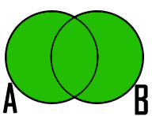

Lectura 4 - Álgebra Relacional: Set operators, renaming, notation
===================================================================

Set operations:
-------------------

.. index:: Set operations

UNION
*****

In math, algebra of sets is called to the basic operations that can be performed on sets, 
such as union, intersection, etc. A set is a collection of objects considered as an object
in itself. The **UNION** of two sets `A` and `B` is the set that contains all the elements 
of `A` and `B`. The symbol`\cup` is used to represent **UNION**.The operator **UNION*** is 
commutative, that is `A \cup B = B \cup A`. Remember that an operation is commutative when
the result of the operation is the same, whatever the order of the elements with which it operates.
 

In an analogous manner joining two relations `R` and `S`, is another relation that contains 
tuples that are in `R` or `S`, or both, eliminating duplicated tuples. `R` and `S` must be 
**union-compatible**, that is, defined on the same set of attribute (`R` and `S` must have 
identical schemas. Should have the same columns and their order must be the same).
 
**Notation in relational algebra**

.. math::

    R \cup S \\

If you perform `R \cup S` is the same as `S \cup R` , that is the same result is obtained.
This is due to the property of commutativity derived from the algebra of sets. 

Example 
^^^^^^^^
Given the following relations:

.. math::
 \textbf{Engineers Table} \\

   \begin{array}{|c|c|c|}
        \hline
         \textbf{id} & \textbf{name} & \textbf{age}\\
        \hline
        123 & \text{Mark}   & 39\\
        \hline
        234 & \text{Tomas}  & 34\\
        \hline
        345 & \text{Owen}   & 45\\
        \hline
        143 & \text{Lexie} & 25\\
        \hline
   \end{array}

.. math::
 \textbf{Chiefs Table} \\

      \begin{array}{|c|c|c|}
        \hline
         \textbf{id} & \textbf{name} & \textbf{age}\\
        \hline
        123 & \text{Mark}   & 39\\
        \hline
        235 & \text{Meredith}   & 29\\
        \hline
      \end{array}

Apply the operator **UNION**:

.. math::

 \textbf{Engineers Table} \cup  \textbf{Chiefs}  \\

   \begin{array}{|c|c|c|}
        \hline
         \textbf{id} & \textbf{name} & \textbf{age}\\
        \hline
        123 & \text{Mark}   & 39\\
        \hline
        234 & \text{Tomas}  & 34\\
        \hline
        345 & \text{Owen}   & 45\\
        \hline
        143 & \text{Lexie} & 25\\
        \hline
        235 & \text{Meredith} & 29\\
        \hline
   \end{array}

As it was mentioned before, performing the `Chiefs \cup Engineers`
operation would have as a result the same table above, debido a la propiage de conmutatividad.

DIFFERENCE
**********

Returning to the analogy of algebra of sets, the difference between two sets `A` and `B`
is the set that contains all the elements of `A` that do not belong to `B`. 

.. math:: A-B

.. image:: ../../../sql-course/src/a-b.png
   :align: center

.. math::
	B-A

.. image:: ../../../sql-course/src/b-a.png
   :align: center

As it is shown in the images, the operation **DIFFERENCE**, in sets, is not commutative, 
just as in subtraction, operator already learned in basic arithmetic. That is, if you
change the order of sets to which **DIFFERENCE** operation is applied, you will get 
different results. Therefore:

.. math::
    \text{A} - \text{B} \neq  \text{B} - \text{A}    

In the same way, the difference of two relations `R` and `S` is other relation 
that contains the tuples that are in the relation `R` but not in `S`. `R` and `S` 
must be **union-compatible** (they must have identical schemes).

**Notation in relational algebra**

.. math::

    R - S

It is important to highlight that  `R - S` is different from `S - R`.

Example 
^^^^^^^^

Using the same tables given in the previous example, perform `Engineers - Chiefs` 
and `Chiefs - Engineers`:

.. math::
   \textbf{Engineers - Chiefs} \\

   \begin{array}{|c|c|c|}
        \hline
         \textbf{id} & \textbf{name} & \textbf{age}\\
        \hline
        234 & \text{Tomas}  & 34\\
        \hline
        345 & \text{Owen}   & 45\\
        \hline
        143 & \text{Lexie} & 25\\
        \hline
   \end{array}

.. math::
   \textbf{Chiefs - Engineers} \\

   \begin{array}{|c|c|c|}
        \hline
        \textbf{id} & \textbf{name} & \textbf{age}\\
        \hline
        235 & \text{Meredith} & 29\\
        \hline
   \end{array}

As can be seen, both operations gave as a result different relations, as it was 
mentioned above.

INTERSECTION
************

In algebra of sets the **INTERSECTION** of two sets `A` and `B` is the set that contains 
all the common elements of `A` and `B`. The symbol `\cap` represent the **INTERSECTION** 
of two sets. As operator **UNION, INTERSECTION** is commutative, so is fulfilled that
`A \cap B = B \cap A` .

.. math::
    A \cap B

.. image:: ../../../sql-course/src/inter.png
   :align: center

In a homologous way, in relational algebra **INTERSECTION** is defined as a relation that 
contains tuples that are in both relation `R` and `S`. `R` and `S` must be **union-compatible**.
(same attributes and same order).

**Notation in relational algebra**

.. math::
    R \cap S

If it is perform `R \cap S` is the same as `S \cap R`, which means that obtains the same result, 
so it can be said that **INTERSECTION** is commutative.

**Equivalence with previous operators**

.. math::
    R \cap S= R-(R-S)

Example 
^^^^^^^^

Using the same tables from the previous example, find the intersection of the `Engineers`
table with the one of `Chiefs`:

.. math::
    Engineers \cap Chiefs

      \begin{array}{|c|c|c|}
        \hline
         \textbf{id} & \textbf{name} & \textbf{age}\\
        \hline
        123 & \text{Mark}   & 39\\
        \hline
      \end{array}

.. important::

   When we apply these operations to relations, we need to put some conditions on `R` and `S`:

	* `R` and `S` must have schemas with identical sets of attributes, and the types (domains) for each attribute must be the same in `R` and `S`.
	* Before compute the set-theoretic union, intersection, or difference of sets of tuples, the columns of `R` and `S` must be ordered so that the order of attributes is the same for both relations.

DEPENDENT AND INDEPENDENT OPERATIONS
************************************

Some of the operations that we have described in the lectures 3 and 4, can be expressed in
terms of other relational-algebra operations. For example, intersection can be expressed in terms
of set difference: `R <INTERSECTION> S = R - (R - S)`. That is, if `R` and `S` are any two relations with the
same schema, the intersection of `R` and `S` can be computed by first subtracting `S` from `R` to form a
relation `T` consisting of all those tuples in `R` but not `S`. We then subtract `T` from `R`, 
leaving only those tuples of `R` that are also in `S`.

RELATIONAL ALGEBRA AS A CONSTRAINT LANGUAGE
*******************************************

There are two ways in which we can use expressions of relational algebra to express constraints:

   1. If `R` is an expression of relational algebra, then `R = 0` is a constraint that says
      "The value of R must be empty," or equivalently "There are no tuples in the result of `R`."
   2. If `R` and `S` are expressions of relational algebra, then `R \subset S` is a constraint
      that says "Every tuple in the result of R must also be in the result of S."
      Of course the result of `S` may contain additional tuples not produced by `R`.

These ways of expressing constraints are actually equivalent in what they can express,
but sometimes one or the other is clearer or more succinct.
That is, the constraint `R \subset S` could just as well have been written `R - S = 0`.
To see why, notice that if every tuple in `R` is also in `S`, then surely `R - S` is empty.
Conversely, if `R - S` contains no tuples, then every tuple in `R` must be in `S`
(or else it would be in `R - S`).

On the other hand, a constraint of the first form, `R = 0`, could just as well have been written
`R \subset 0`.
Technically, `0` is not an expression of relational algebra, but since there are expressions
that evaluate to `0`, such as `R - R`, there is no harm in using `0` as a relational-algebra
expression.
Note that these equivalences hold even if `R` and `S` are bags, provided we make the conventional
interpretation of `R \subset S`: each tuple **t** appears in `S` at least as many times as it
appears in `R`.

EXERCISES 
**********

Exercise 1
^^^^^^^^^^^^
The base relations that form the databases of a video club are the following:

* Member(**codmember**,name,address,phone)

* Film(**codfilm**,title,genre)

* Tape(**codtape**,codfilm)

* Loan(**codmember,codtape,date**,pres_dev)

* WaitingList(**codmember,codfilm**,date)

Member: stores the data of each of the members of the video club: member code, name, address, and phone.

Film: stores information about each of the films from which have copies the video club: code of the movie, title, and genre (horror, comedy, etc.).

Tape: stores information referring to the existing copies of each film (different copies of the same film will have a different tape code).

Loan: stores information of the loans that have been made. Each loan is from a tape to a member in a date. If the loan has not yet finalized, pres_dev has the value “borrowed”; otherwise its value is “returned”.

WaitingList: stores information about the members who wait available copies of films for borrowing them. It also saves the date in which they began the wait for maintaining the order. It is important to take into account that when a member gets the desired film, it disappears from the waiting list.

In previous relations, primary keys are the attributes and groups of attributes in bold. Foreign keys are shown in the following referential diagrams:

Solve the following queries using relational algebra (remember that also in lecture 3 some operators of relational algebra were given):

1.1 Select all the members who are called: “Charles”.

**Answer**

.. math::
    \sigma_{\text{name='Charles'}} \text{(Member)}

1.2 Select the member code of all the members who are called: “Charles.”

**Answer**

.. math::
    \pi_{\text{codmember}}(\sigma_{\text{name='Charles'}} \text{(Member))}

1.3 Select the names of films that are on the waiting list.

**Answer**

.. math::
    \pi_{\text{title}}(\text{Film} \rhd \hspace{-0.1cm} \lhd \text{WaitingList})

1.4 Get the names of the members who are waiting films.

**Answer**

.. math::
    \pi_{\text{name}}(\text{Member} \rhd \hspace{-0.1cm} \lhd \text{WaitingList})

1.5 Get the names of the members who have actually borrowed a film that had already borrowed previously.

**Answer**

.. math::
    \pi_{\text{name}} ( \{(\text{Loan} \rhd \hspace{-0.1cm} \lhd_{ (\text{pres_dev='prestada'})} \text{Tape}) \cap (\text{Loan} \rhd \hspace{-0.1cm} \lhd_{(\text{pres_dev='devuelta'})} \text{Tape})\} \rhd \hspace{-0.1cm}\lhd \text{Member})

1.6. Get the titles of the movies that have never been borrowed.

**Answer**

.. math::
    \pi_{\text{title}} \{(\pi_{\text{codfilm}} \text{Film}  - \pi_{\text{codfilm}} (\text{Loan} \rhd \hspace{-0.1cm} \lhd \text{Tape}) ) \rhd \hspace{-0.1cm} \lhd \text{Film}\}

(All movies) except (the movies that have ever been borrowed)

1.7. Get the names of the members who have borrowed the film “WALL*E” once or are waiting to borrow.

**Answer**

.. math::
    \pi_{\text{codmember,name}}((\text{Member} \rhd \hspace{-0.1cm} \lhd \text{Loan} \rhd \hspace{-0.1cm} \lhd \text{Tape} \rhd \hspace{-0.1cm} \lhd_{\text{title='WALL*E'}} \text{Film}) \cup \\ (\text{Member} \rhd \hspace{-0.1cm} \lhd \text{WaitingList} \rhd \hspace{-0.1cm} \lhd_{\text{title='WALL*E'}} \text{Film}) )

1.8. Get the names of the members who have ever borrowed the film WALL*E and that also are on its waiting list.
 
**Answer**

.. math::
    \pi_{\text{codmember,name}}((\text{Member} \rhd \hspace{-0.1cm} \lhd \text{Loan} \rhd \hspace{-0.1cm} \lhd \text{Tape} \rhd \hspace{-0.1cm} \lhd_{\text{title='WALL*E'}} \text{Film}) \cap \\ (\text{Member} \rhd \hspace{-0.1cm} \lhd \text{WaitingList} \rhd \hspace{-0.1cm} \lhd_{\text{title='WALL*E'}} \text{Film}) )

Exercise 2
^^^^^^^^^^^^

Consider the following databases:
 
	1.  Person ( name, age, gender ) : name is a key
	2.  Frequents ( name, pizzeria ) : (name, pizzeria) is a key
	3.  Eats ( name, pizza ) : (name, pizza) is a key
	4.  Serves ( pizzeria, pizza, price ): (pizzeria, pizza) is a key

Write relational algebra expressions for the following nine queries. (Warning: some of the later queries are a bit challenging.)

	* Find all pizzerias frequented by at least one person under the age of 18.
	* Find all pizzerias that serve at least one pizza that Amy eats for less than $10.00.
	* Find all pizzerias that are frequented by only females or only males.
	* For each person, find all pizzas the person eats that are not served by any pizzeria the person frequents. Return all such person (name) / pizza pairs.
	* Find the names of all people who frequent only pizzerias serving at least one pizza they eat.
	* Find the names of all people who frequent every pizzeria serving at least one pizza they eat.
	* Find the pizzeria serving the cheapest pepperoni pizza. In the case of ties, return all of the cheapest-pepperoni pizzerias.

