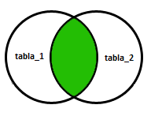
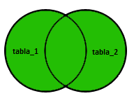

Lecture 11 - The JOIN family of operators
-----------------------------------------

.. role:: sql(code)
   :language: sql
   :class: highlight

The SQL :sql:`JOIN` sentence allows to query data from two or more tables. These tables 
are related to each other somehow, through some of its columns. 
The purpose of :sql:`JOIN` is joining information from different tables to avoid repeating 
data between tables.

INNER JOIN
~~~~~~~~~~

The :sql:`INNER JOIN` sentence is the :sql:`JOIN` sentence by default which consists in combining 
each row of a table with each row in another table, selecting the rows that meet a 
determined condition.

This is the structure that deals this type of :sql:`JOIN`.

.. code-block:: sql

 SELECT * FROM table_1 INNER JOIN table_2 ON condition

Here is a diagram of how this query works.

Next, it will be shown an example of a **People** table and one of **Purchases** Orders 
which they have made.

We make the creation of **People** and **Purcharses** table.

.. code-block:: sql

  CREATE TABLE People(id_person serial, name VARCHAR(30), last_name VARCHAR(30), address VARCHAR(30), city VARCHAR(30), PRIMARY kEY(id_person));
  CREATE TABLE Purchases(id_purchase serial, number_purchase INTEGER, person INTEGER, PRIMARY KEY(id_purchase), FOREIGN KEY(person) REFERENCES People(id_person));

Now we *insert* some data.

.. code-block:: sql

 INSERT INTO People(name, last_name, address, city) VALUES('Allen' , 'Doyle'   , '772 Azores'           , 'New York');
 INSERT INTO People(name, last_name, address, city) VALUES('Amy'   , 'Looper'  , '4525 North Oracle Rd.', 'Miami');
 INSERT INTO People(name, last_name, address, city) VALUES('Bibi'  , 'Mingus'  , '3901 W Ina Rd'        , 'Los Angeles');
 INSERT INTO People(name, last_name, address, city) VALUES('Caden' , 'Anderson', '7635 N La Cholla Blvd', 'Chicago');
 INSERT INTO People(name, last_name, address, city) VALUES('Calvin', 'Dixson'  , 'CALLE WALLABY 42'     , 'San Francisco');
 INSERT INTO Purchases(number_purchase, person) VALUES(226345,3);
 INSERT INTO Purchases(number_purchase, person) VALUES(345478,2);
 INSERT INTO Purchases(number_purchase, person) VALUES(218909,2);
 INSERT INTO Purchases(number_purchase, person) VALUES(567432,5);
 INSERT INTO Purchases(number_purchase, person) VALUES(675209,5);

And we make the query to join the two tables, according to the condition which we would 
detail.

.. code-block:: sql

 postgres=# SELECT People.name, People.last_name, Purchases.number_purchase FROM People INNER JOIN Purchases ON People.id_person=Purchases.person;
  name | last_name | number_purchase
 --------+----------+--------------
  Bibi   | Mingus   |       226345
  Amy    | Looper   |       345478
  Amy    | Looper   |       218909
  Calvin | Dixson   |       567432
  Calvin | Dixson   |       675209
 (5 rows)

We can also show all the attributes.

.. code-block:: sql

 postgres=# SELECT * FROM People INNER JOIN Purchases ON People.id_person=Purchases.person;
  id_person | name | last_name |       address       |    city     | id_purchase | number_purchase | person
 ------------+--------+----------+-----------------------+---------------+----------+--------------+---------
           3 | Bibi   | Mingus   | 3901 W Ina Rd         | Los Angeles   |        1 |       226345 |       3
           2 | Amy    | Looper   | 4525 North Oracle Rd. | Miami         |        2 |       345478 |       2
           2 | Amy    | Looper   | 4525 North Oracle Rd. | Miami         |        3 |       218909 |       2
           5 | Calvin | Dixson   | CALLE WALLABY 42      | San Francisco |        4 |       567432 |       5
           5 | Calvin | Dixson   | CALLE WALLABY 42      | San Francisco |        5 |       675209 |       5
 (5 rows)

.. note::

 It is observed that the two tables **People** and **Purchases** are meeting the condition 
 that we have defined.

NATURAL JOIN
~~~~~~~~~~~~

In the case there are columns with the same name in the relations in which they are 
combined; only one result of them will be include in the end result of the combination.

Two tables called **FOOD** and **COMPANY** will be *created* to do the example which will 
demonstrate how NATURAL JOIN works.

.. code-block:: sql

 CREATE TABLE COMPANY(id_company serial, name_company VARCHAR(30), city VARCHAR(30), PRIMARY KEY(id_company));
 CREATE TABLE FOOD(id_food serial, name_food VARCHAR(30), id_company INTEGER, PRIMARY KEY(id_food), FOREIGN KEY(id_company) REFERENCES COMPANY(id_company));

We *enter* the data into the tables.

.. code-block:: sql

 INSERT INTO COMPANY(name_company, city) VALUES('Order All'    , 'Boston');
 INSERT INTO COMPANY(name_company, city) VALUES('Akas Foods'   , 'Delhi');
 INSERT INTO COMPANY(name_company, city) VALUES('Foodies'      , 'London');
 INSERT INTO COMPANY(name_company, city) VALUES('sip-n-Bite'   , 'New York');
 INSERT INTO COMPANY(name_company, city) VALUES('Jack Hill Ltd', 'London');
 INSERT INTO FOOD (name_food, id_company) VALUES('Chex Mix',    2);
 INSERT INTO FOOD (name_food, id_company) VALUES('Cheez-lt',    3);
 INSERT INTO FOOD (name_food, id_company) VALUES('BN Biscuit',  3);
 INSERT INTO FOOD (name_food, id_company) VALUES('Mighty Munch',5);
 INSERT INTO FOOD (name_food, id_company) VALUES('Pot Rice',    4);

Now we can make the *query* of **NATURAL JOIN**.

.. code-block:: sql

 postgres=# SELECT * FROM FOOD NATURAL JOIN COMPANY;
   id_company | id_food |    name_food    |   name_company  |  city
 -------------+---------+-----------------+-----------------+----------
            2 |       1 | Chex Mix        | Akas Foods      | Delhi
            3 |       2 | Cheez-lt        | Foodies         | London
            3 |       3 | BN Biscuit      | Foodies         | London
            5 |       4 | Mighty Munch    | Jack Hill Ltd   | London
            4 |       5 | Pot Rice        | sip-n-Bite      | New York
 (5 rows)

.. note::

 When performing the :sql:`NATURAL JOIN`, returns a table with only one column called 
 id_company which was repeated in the two tables **FOOD** and **COMPANY**, and the 
 union of the other columns.

INNER JOIN USING(attrs)
~~~~~~~~~~~~~~~~~~~~~~~

When performing **INNER JOIN** with the **USING(attrs)** clause.

The following show the previous example using the **USING(id_company)** clause which 
is a column repeated in the two tables.

.. code-block:: sql

 postgres=# SELECT * FROM FOOD INNER JOIN COMPANY USING(id_company);
  id_company | id_food | name_food | name_company |  city
 -------------+-------------+-----------------+-----------------+----------
            2 |           1 | Chex Mix        | Akas Foods      | Delhi
            3 |           2 | Cheez-lt        | Foodies         | London
            3 |           3 | BN Biscuit      | Foodies         | London
            5 |           4 | Mighty Munch    | Jack Hill Ltd   | London
            4 |           5 | Pot Rice        | sip-n-Bite      | New York
 (5 rows)

LEFT|RIGHT|FULL OUTER JOIN
~~~~~~~~~~~~~~~~~~~~~~~~~~

We will create the following example to make these three queries.

We will *create* the tables **table_A** and **table_B**.

.. code-block:: sql

 CREATE TABLE table_A(id serial, name VARCHAR(30), PRIMARY KEY(id));
 CREATE TABLE table_B(id serial, name VARCHAR(30), PRIMARY KEY(id));

Now we *enter* data in these tables.

.. code-block:: sql

 INSERT INTO table_A(name) VALUES('Pirate');
 INSERT INTO table_A(name) VALUES('Monkey');
 INSERT INTO table_A(name) VALUES('Ninja');
 INSERT INTO table_A(name) VALUES('Spaghetti');
 INSERT INTO table_B(name) VALUES('Rutabaga');
 INSERT INTO table_B(name) VALUES('Pirate');
 INSERT INTO table_B(name) VALUES('Darth Vader');
 INSERT INTO table_B(name) VALUES('Ninja');

LEFT OUTER JOIN
===============

The sentence :sql:`LEFT OUTER JOIN` or :sql:`LEFT JOIN` combines the values in the first 
table with the values of the second table that meet the condition. If there is no match, 
the right side will contain null (or empty).

.. code-block:: sql

 SELECT * FROM table_1 LEFT OUTER JOIN table_2 ON table_1.column = table_2.column

.. image:: ../../../sql-course/src/left.png
   :align: center

Now we make the query with the example that we defined at the beginning.

.. code-block:: sql

 postgres=# SELECT * FROM table_A LEFT OUTER JOIN table_B ON table_A.name=table_B.name;
  id |  name   | id | name
 ----+-----------+----+--------
   1 | Pirate    |  2 | Pirate
   2 | Monkey    |    |
   3 | Ninja     |  4 | Ninja
   4 | Spaghetti |    |
 (4 rows)

.. note::

 We can see that returns all attributes of **table_A** (left) and **table_B**, which only 
 returns the attributes that meet the condition we set.

RIGHT OUTER JOIN
================

The sentence **RIGHT OUTER JOIN** or **RIGHT JOIN** combines the values of the first 
table with the values in the second table. It will always return the rows in the second 
table, even though they not meet the condition.

.. code-block:: sql

 SELECT * FROM table_1 RIGHT OUTER JOIN table_2 ON table_1.column = table_2.column;

The following is a diagram of the query.

.. image:: ../../../sql-course/src/right.png
   :align: center

Now we make the following query.

.. code-block:: sql

 postgres=# SELECT * FROM table_A RIGHT OUTER JOIN table_B ON table_A.name=table_B.name;
  id | name | id |   name
 ----+--------+----+-------------
     |        |  1 | Rutabaga
   1 | Pirate |  2 | Pirate
     |        |  3 | Darth Vader
   3 | Ninja  |  4 | Ninja
 (4 rows)

.. note::

 It is noted that the return of the query are all attributes of **table_B** (right) and 
 only the attributes that meet the condition that we have defined of **table_A**.

FULL OUTER JOIN
===============

The sentence **FULL OUTER JOIN** or **FULL JOIN** combines the values of the first table 
with the values in the second table. Always return rows of two tables, although they 
not meet the condition.

.. code-block:: sql

 SELECT * FROM table_1 FULL OUTER JOIN table_2 ON table_1.column = table_2.column;

The following is a diagram of the query.

Now we will do an example of the query.

.. code-block:: sql
 
 postgres=# SELECT * FROM table_A FULL OUTER JOIN table_B ON table_A.name=table_B.name;
  id |  name   | id |   name
 ----+-----------+----+-------------
     |           |  3 | Darth Vader
   2 | Monkey    |    |
   3 | Ninja     |  4 | Ninja
   1 | Pirate    |  2 | Pirate
     |           |  1 | Rutabaga
   4 | Spaghetti |    |
 (6 rows)

.. note::

 You can see that it will be return all the attributes of **table_A** and **table_B**, 
 although they do not meet the condition.
