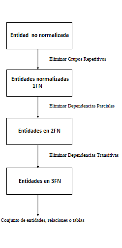

Lecture 15 - Relational Desing Theory: Overview
-------------------------------------------------

Design a scheme of database
~~~~~~~~~~~~~~~~~~~~~~~~~~~~~~~~~~~

* Generally there are many possible designs.
* Some are better than others.
* How should we choose?

The design of relational database can be addressed in two forms:

* **Getting the relational scheme directly:** objects and rules captured from real-world analysis, represented by a set of schemes of relation, their attributes and constraints of integrity.
* **Design of the conceptual scheme:** make the design of the “conceptual” scheme of the BD (E/R model) and transforming it into a relational scheme.   

In database schemes is possible to find anomalies which will be deleted thanks to the process of normalization.
Those anomalies are:

* **The redundancy of data:** repetition of data in a system.
* **Anomalies of update:** inconsistency of data as a result of redundant data and partial updates.
* **Anomalies of elimination:** unintentional loss of data because other data are deleted.
* **Anomalies of insertion:** inability to add data to the database because of the absence of other data.

Now we will show you a table and then its problems presented with more detail:

.. math::

   \begin{array}{|c|c|c|c|c|c|}
    \hline
    \textbf{Name_author} & \textbf{Country} & \textbf{Cod_book} & \textbf{Title_book} & \textbf{publisher} & \textbf{Address_publishing_house}\\
    \hline
    \text{Cortázar, Julio} & \text{Arg} & \text{9786071110725} & \text{Cuentos Completos 1 Julio Cortazar}  & \text{Alfaguara} & \text{Padre Mariano 82}\\
    \hline
    \text{Rosasco, José Luis}  & \text{Chi} & \text{9789561224056} & \text{Donde Estas, Constanza} & \text{Zig-Zag} & \text{Los Conquistadores 1700} \\
    \hline
    \text{Rosasco, José Luis}  & \text{Chi} & \text{9561313669} & \text{Hoy Día es Mañana} & \text{Andrés Bello} & \text{Ahumada 131}\\
    \hline
    \text{Coloane, Francisco} & \text{Chi} & \text{9789563473308} & \text{Golfo De Penas} & \text{Alfaguara} & \text{Padre Mariano 82}\\
    \hline
   \end{array}

* **Redundancy:** when an author has several books, his/her nationality is repeated.
* **Anomalies of modification:** if you change the address of “Algaguara” editorial, you must modify two rows. A priori, you cannot tell how many books an author has. Errors are very frequent when you forget to modify an author.
* **Anomalies of insertion:** you want to insert an author who does not present books. “Name_author” and “Cod_book” are key fields, so the keys cannot be null values.

By deleting these anomalies ensures:

* **Integrity among data:** consistency of the information.

Other example is shown in the following table:

**Apply(SSN, sName, cName, HS, HScity, hobby)**

.. note::
  
 The notation that we use in the table is:
 
 HS = high school

*123 Ann of PAHS (P.A) and GHS (P.A) plays tennis and the trumpet. She applied to Stanford, Berkeley and MIT.*

The inserted data in the table could be the ones shown:

.. math::

	\begin{array}{|c|c|c|c|}
	    \hline
	    \text{123} & \text{Ann} & \text{Stanford} & \text{PAHS} & \textbf{P.A} & \text{tennis} \\
	    \hline
	    \text{123} & \text{Ann} & \text{Berkeley} & \text{PAHS}  & \text{P.A} & \text{tennis}\\
	    \hline
	    \text{123}  & \text{Ann} & \text{Berkeley} & \text{PAHS} & \text{P.A}  & \text{trumpet}\\
	    \hline
	    \text{.}  & \text{.} & \text{.} & \text{GHS} & \text{.} & \text{.}\\
	    \hline
	    \text{.} & \text{.} & \text{.} & \text{.} & \text{.} & \text{.}\\
	    \hline
	 \end{array}

* **Redundancy:** captures information many times, for instance: “123 Ann”, “PAHS”, “tennis” or “MIT”.
* **Anomalies of update:** update data in a different way such as “bugle” for “trumpet.”
* **Anomalies of elimination:** data inadvertent eliminated.

A correct form to do the previous table without anomalies is

  * Student(SSN, sName);
  * Apply(SSN, cName);
  * High_School(SSN, HS);
  * Located(HS, HSciudad);
  * Hobbies(SSN, hobby);

Exercise
=========
Consider the possibility of a database containing information about the courses taken by students. 
Students have a unique ID of student and (possibly not a unique) name. Courses have a unique number of 
courses and (possibly not a unique) title. Students take a course of a determined year and receive a grade.

Which of the following eschemes would you recommend?

 1. Took(SID, name, courseNum, title, year, grade)
 2. Course(courseNum, title, year), Took(SID, courseNum, grade)
 3. Student(SID, name), Course(courseNum, title), Took(SID, courseNum, year, grade)
 4. Student(SID, name), Course(courseNum, title), Took(name, title, year, grade)

The right choice is letter (c), as it says in the statement that there are students with a unique ID, which in 
this case is "SID" and "name". The courses have an unique ID which is "courseNum" and "title". Further says that
students take a course in a given year "year" and receive a "grade", but the attribute "courseNum" acts as 
foreign key of the Course table with which you can get the title of the course. And also must have a primary
 key to identify the course that will be taken "SID".

Desing by decomposition
~~~~~~~~~~~~~~~~~~~~~~~~~

* Start with *“mega” relations* which contain everything.
* *Decompose* in smaller parts to obtain better relations with the same information.
* Can you *decompose it automatically*?

Automatic decomposition:

* “Mega” relations + properties of data
* The system decompose based on the properties.
* Final ser of relations satisfy the normal form.
* There are no anomalies; there is a loss of information.
 
Normalization
~~~~~~~~~~~~~

Process that analyzes dependencies between attributes of a relation in a way to combine those attributes, 
in entities and associations less complex and smaller. It consists of a set of rules called normal forms (NF), 
which establish the properties that data must meet to achieve a normalized representation. In this step, you 
take every relationship to become them into an entity (relationship or table) no normalized. Defined rules are 
applied for 1NF, 2NF, 3NF, Boyce Codd and 4NF.

Normal Forms
===============

The following image shows the three main levels used in the design of schemes of database:

The process of normalization is essential in order to obtain an efficient design of database. 

In a non-normalized entity, generally expressed in a plane form (like a table), it is very likely there are 
one or two more repetitive groups. In that case, its primary key cannot be a simple attribute.
 
Next, we will give you a definition and an example regarding normal forms:

First normal form  (1FN)
^^^^^^^^^^^^^^^^^^^^^^^^^^^

A table is normalized or in 1NF, if it only has atomic values in the intersection of every row and 
column, which means that it does not have repetitive groups. In order to meet this, we must pass to 
another table those **repetitive groups**, generating two tables based on the original one. The 
resultant tables must have some attribute in common. Generally, one of the tables has a compound 
primary key. This normal form generates tables with problems of redundancy, and therefore, anomalies 
of insertion, elimination or modification. This is because of the existence of what we called **partial 
dependencies**.

Example
"""""""

It is said that a table is in first normal form (1NF) if and only if each of the fields contain a unique 
value for a determined record. Let’s suppose that we want to create a table for storing courses of
 informatics students in USM. We could consider the following design:

.. math::

 \begin{array}{|c|c|c|}                                                          
    \hline                                                                           
    \textbf{Code} & \textbf{Name} & \textbf{Courses} \\
    \hline                                                                           
    \text{1} & \text{Patricia} & \text{Structure of data} \\
    \hline                                                                           
    \text{2}  & \text{Margarita} & \text{Database, Theory of systems \\
    \hline                                                                           
    \text{3}  & \text{Joao} & \text{Structure of data, Databases} \\         
    \hline                                                                           
   \end{array}   

You can see that record 1 meets with the first normal form since each field meets the condition 
of having only one data. However, this condition does not meet with record 2 and 3 in the *Courses* 
field because in both there are two data. The solution to this problem is to create two tables in 
the following way:

.. math::                                                                            
 \text{Table 1}
                                                                                     
 \begin{array}{|c|c|}                                                            
    \hline                                                                           
    \textbf{Código} & \textbf{Nombre}  \\                           
    \hline                                                                           
    \text{1} & \text{Patricia}  \\                       
    \hline                                                                           
    \text{2}  & \text{Margarita} \\      
    \hline                                                                           
    \text{3}  & \text{Joao} \\          
    \hline                                                                           
   \end{array}  

 \text{Table 2}                                                                           
                                                                                     
 \begin{array}{|c|c|}                                                            
    \hline                                                                           
    \textbf{Code} & \textbf{Courses} \\                           
    \hline                                                                           
    \text{1} & \text{Structure of data} \\                       
    \hline                                                                           
    \text{2}  & \text{Database} \\      
    \hline                                                                           
    \text{2}  & \text{Theory of systems} \\          
    \hline       
    \text{3}  & \text{Structure of data} \\      
    \hline                                                                           
    \text{3}  & \text{Database} \\                                                                        
    \hline
  \end{array}  

As you can check, now all the records of the two tables meet the conditions of having in all fields
 only one data. So, Table 1 and Table 2 are in first normal form.

Second normal form (2FN)
^^^^^^^^^^^^^^^^^^^^^^^^^^

A table is in 2NF if the table is in 1NF and you have deleted partial dependencies among its 
attributes. A partial dependency 
occurs when one or more attributes that are not primary key, are only dependent of the compound 
primary key, in other words, when part of the primary key determines a non-key attribute. 
This type of dependency is deleted by creating several tables from a table presenting problems. 
For instance, a table with attributes which are dependent of the complete primary key and other 
with those dependent only to one part. The generated tables must leave with some attribute in 
common to represent the association between them. By applying this normal form, there are still 
some problems of anomalies since there are **transitive dependencies**.

Example
"""""""

The second normal form compares all and each of the fields of the table with the defined key. 
If all the fields depend directly on the key, it is said that the table is in second normal form.

Now we create a table with the years that each professor has worked in each department of USM.

.. math::

 \begin{array}{|c|c|c|c|c|}                                                                
    \hline                                                                           
    \textbf{Code_professor} & \textbf{Code_department} & \textbf{Name} & \textbf{Department} & \textbf{Years_worked} \\                                  \hline                                                                           
    \text{1} & \text{6} & \text{Javier} & \text{Electronic} & 3\\                                         
    \hline                                                                           
    \text{2}  & \text{3} & \text{Luis} & \text{Electric} & 15\\                                             
    \hline                                                                           
    \text{3}  & \text{2} & \text{Cecilia} & \text{Informatics} & 8\\                                         
    \hline                                                                           
    \text{4}  & \text{3} & \text{Nora} & \text{Electric} & 2\\                                        
    \hline                                                                           
    \text{2}  & \text{6} & \text{Luis} & \text{Electronic} & 20\\                                                                        
    \hline                                                                           
  \end{array}                                                                        

The key of this table is conformed for the Code_professor and Code_department. Also we can say the 
table is in first normal form, so that we can transform it in second normal form now.

* The *Name* field does not depend functionally on the whole key. It only depends on the *Code_professor* key.
* The *Department* field does not depend functionally on the whole key. It only depends on the *Code_department* key.
* The *Years_worked* K depends functionally on the keys *Code_professor* and *Code_department* (it
 represent the years worked of each professor in the deparment of the university).

Therefore, as it does not depend functionally on all the fields of the previous table, it is not in the second 
normal form. So the solution is the following:            

.. math::                                                                            

 \text{Table A}
                                                                                     
 \begin{array}{|c|c|}                                                                
    \hline                                                                           
    \textbf{Code_professor} & \textbf{Name} \\
    \hline                                                                           
    \text{1} & \text{Javier} \\                                         
    \hline                                                                           
    \text{2}  & \text{Luis} \\                                             
    \hline                                                                           
    \text{3}  & \text{Cecilia} \\                                         
    \hline                                                                           
    \text{4}  & \text{Nora} \\                                        
    \hline                                                                           
  \end{array} 

 \text{Table B}

 \begin{array}{|c|c|}                                                                
    \hline                                                                           
    \textbf{Code_department} & \textbf{Department} \\                                    
    \hline                                                                           
    \text{2} & \text{Informatics} \\                                                      
    \hline                                                                           
    \text{3}  & \text{Electric} \\                                                       
    \hline                                                                           
    \text{6}  & \text{Electronic} \\                                                    
    \hline                                                                           
  \end{array}  

 \text{Table C}

  \begin{array}{|c|c|c|}                                                                
    \hline                                                                           
    \textbf{Code_employee} & \textbf{Code_department} & \textbf{Years_worked} \\                                    
    \hline                                                                           
    1 & 6 & 3 \\                                                      
    \hline                                                                           
    2  & 3 & 15\\                                                       
    \hline                                                                           
    3  & 2 & 8\\                                                    
    \hline
    4  & 3 & 2\\                                                    
    \hline 
    2  & 6 & 20\\                                                    
    \hline                                                                            
  \end{array}   

It can be seen that *Table A* has as index the key *Code_employee*, *Table B* has as key *Code_department*, 
and *Table C* which has as a compound key *Code_employee* and *Code_department*. All these tables are in second normal form.

Third normal form (3FN)
^^^^^^^^^^^^^^^^^^^^^^^^^^

A table is in 3NF if it is in 2NF, and it does not contain **transitive dependencies**. That is, each 
non-primary attribute depends only on the primary key, with no dependencies between attributes that are
 not primary key. This type of dependency is deleted by creating a new table with the non-key attribute(s) 
which depend on another non-key attribute. And with an initial table, which has its own attributes, it must
 contain the attribute that makes the primary key in the new generated table. This attribute is called 
foreign key within the initial table. So by foreign key we understand that is those attribute that in
 table are not primary key, but it actually is in another table.

Example
"""""""

It is said that a table is in third normal form if and only if the fields of the table depend 
only on the key. In other words, the fields of the tables do not depend on each other. Taking 
as reference the example of the first normal form where a student can only take one course at 
a time and you want to save in which room is taught.

.. math::
 
  \begin{array}{|c|c|c|c|}                                                                
    \hline                                                                           
    \textbf{Code} & \textbf{Name} & \textbf{Course} & \textbf{Room} \\                                    
    \hline                                                                           
    1 & \text{Patricia} & \text{Structure of data} & \text{A}\\                                                                     
    \hline                                                                           
    2  & \text{Margarita} & \text{Theory of systems} & \text{B}\\                                                                    
    \hline                                                                           
    3  & \text{Joao} & \text{Databases} & \text{C}\\                                                                     
    \hline                                                                           
  \end{array} 

Let’s see the dependencies of each field in terms of the key:

* *Name* depends directly on the Code
* *Course* depends, in the same way, on Code
* *Room* depends on the Code, but it is more linked to the Course that the student is taking.

It is for the last point that we said the table is not in 3NF. However, we will show you the solution now:

.. math::                                                                            
               
  \text{Table A}
                                                                      
  \begin{array}{|c|c|c|}                                                                
    \hline                                                                           
    \textbf{Code} & \textbf{Name} & \textbf{Course} \\                                    
    \hline                                                                           
    1 & \text{Patricia} & \text{Structure of data} \\                                                                     
    \hline                                                                           
    2  & \text{Margarita} & \text{Theory of systems} \\                                                                    
    \hline                                                                           
    3  & \text{Joao} & \text{Databases} \\                                                                     
    \hline                                                                           
  \end{array}  

  \text{Table B}

  \begin{array}{|c|c|}                                                                
    \hline                                                                           
    \textbf{Course} & \textbf{Room} \\                                    
    \hline                                                                           
    \text{Structure of data} & \text{A} \\                                                                     
    \hline                                                                           
    \text{Theory of systems} & \text{B}\\                                                                    
    \hline                                                                           
    \text{Databases} & \text{C}\\                                                                     
    \hline                                                                           
  \end{array} 

Boyce-Codd normal form (FNBC)
^^^^^^^^^^^^^^^^^^^^^^^^^^^^^^

It is a slightly stronger version of the third normal form (3NF). The normal form Boyce-Codd requires 
that **there are no non-trivial functional dependencies** of attributes that are not a set of the candidate
 key. On a table in 3NF, all attributes depend on a key. It is said that a table is in BCNF if and 
only if it is in 3NF and every non-trivial functional dependency has a candidate key as a determinant.

Functional dependencies and BCNF
"""""""""""""""""""""""""""""""

* **Apply (SSN, sName, cName)**
* Redundancy, anomalies of update and elimination.
* Storage of SSN-sName for one time for each university.

**Functional dependency SSN -> sName**

* SSN always has the same sName
* In case of store sName, each SSN only one time.

Decompose: Student(SSN, sName) Apply(SSN, cName) giving as a result SSN as a primary key.

Example
"""""""

Consider the relationship Took (SID, name, courseNum, title). Students have a student card and a unique name. 
Courses have a unique course number and title. Each tuple of the relation encodes the fact that a given 
student took the course. Which are all the functional dependencies to the relation Took?

a) sID → courseNum
b) sID → name, courseNum → title
c) name → sID, title → courseNum
d) courseNum → sID

The correct answer is option (b), since a single student id "sID” is assigned to only one student and the 
course id that is unique "courseNum" has assigned a title. The other alternatives are not possible because
 the alternative (a) says a student can only take a course, the alternative (c) says that the names of 
students and course titles are unique and alternative (d) says that courses can only be taken by a student.

Fourth normal form (4FN)
^^^^^^^^^^^^^^^^^^^^^^^^^

The 4NF ensures that independent multivalued dependencies are correctly and efficiently 
represented in a database design. The 4NF is the next level of normalization after the 
normal form Boyce-Codd (BCNF). A table is in 4NF if and only if it is in third normal 
form or BCNF and has no non-trivial multivalued dependencies. The definition of the 4NF 
relies on the notion of a multivalued dependency. A table with a multivalued dependency 
is where there is an existence of two or more independent relationship of many to many 
causes redundancy, which is suppressed by the fourth normal form.

Mutivaluated dependencies and 4NF
"""""""""""""""""""""""""""""""""

**Apply(SSN, cName, HS)**

* Redundancies, anomalies of update and elimination.
* Multiplicative effect: S schools or H high schools, so it generates “S*H” or “S+H” tuples.
* It is not directed by BCNF: there are no functional dependencies.

**Multivalue dependency SSN ->> cName or SSN ->> HS**

* SSN counts all combinations of cName with HS.
* In case of store each cName and HS, to obtain one time a SSN.

.. note::
 
 The arrow ->> means “many”

**Fourth normal form if A ->> B so A is a key**

Decompose: Apply(SSN, cName) High_school(SSN, HS)

Example 1
"""""""""

Consider the relationship Information_student (SID, bedroom, courseNum). Students usually live in 
several bedrooms and take many courses in college. Suppose that data does not captured in which bedroom (s)
 a student was in when taking a specific course, ie all courses-bedroom combinations are recorded for each 
student. What are all the dependencies for Information_student relation?

a) sID->>bedroom
b) sID->>courseNum
c) sID->>bedroom, sID->>courseNum
d) sID->>bedroom, sID->>courseNum, bedroom->>courseNum

The correct alternative is ( c ) as for a stundet there are many bedrooms and he/she can take many courses. 
Both alternatives (a) and (b) omit one dependency. And alternative (d) says that all students of each bedroom 
take the same set of courses.

Example 2
"""""""""

A table is in the fourth normal form if and only if for any combination key-field there are no duplicated values.

.. math::

 \text{Geometría}
 
 \begin{array}{|c|c|c|}                                                                
    \hline                                                                           
    \textbf{Figure} & \textbf{Color} & \textbf{Size} \\                                    
    \hline                                                                           
    \text{Square} & \text{Red} & \text{Big} \\                                                                     
    \hline                                                                           
    \text{Square} & \text{Blue} & \text{Big}\\                                                                    
    \hline                                                                           
    \text{Square} & \text{Blue} & \text{Medium}\\                                                                     
    \hline
    \text{Circle} & \text{White} & \text{Medium}\\                                                                     
    \hline 
    \text{Circle} & \text{Blue} & \text{Small}\\                                                                     
    \hline 
    \text{Circle} & \text{Blue} & \text{Medium}\\                                                                     
    \hline                                                                            
  \end{array} 

Let’s compare the *Figure* and *Size* attributes. You can observe that Square and Big, Circle 
and Blue, and other records are repeated. These kinds of repetitions are the ones that you should 
avoid in order to have a table in 4NF.

The solution to the previous table is the following:

Size
.. math::

 \text{Size}
 
 \begin{array}{|c|c|}                                                                
    \hline                                                                           
    \textbf{Figure} & \textbf{Size} \\                                    
    \hline                                                                           
    \text{Square} \text{Big} \\                                                                     
    \hline                                                                           
    \text{Square} & \text{Medium}\\                                                                     
    \hline                                                                           
    \text{Circle} & \text{Medium}\\                                                                     
    \hline                                                                           
    \text{Circle} & \text{Small}\\                                                                     
    \hline                                                                           
  \end{array}

 \text{Color}

 \begin{array}{|c|c|}                                                                
    \hline                                                                           
    \textbf{Figure} & \textbf{Color}  \\                                    
    \hline                                                                           
    \text{Square} & \text{Red} \\                                                                     
    \hline                                                                           
    \text{Square} & \text{Blue} \\                                                                    
    \hline                                                                           
    \text{Circle} & \text{White} \\                                                                     
    \hline                                                                           
    \text{Circle} & \text{Blue} \\                                                                     
    \hline                                                                            
  \end{array}

