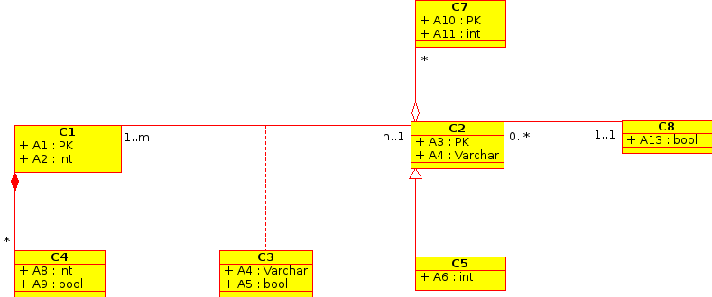

Assignment 5
============

Deadline: Monday January 21 2013 till 23:59
-----------------------------------------------------------

.. role:: sql(code)
   :language: sql
   :class: highlight

-------------------------
Fourth Normal Form (4NF)
-------------------------

Question  1 (12 pts.)
^^^^^^^^^^^^^^^^^^^^^

Explain, in your own words and in accordance of  this week readings, the following:

1. Which is the use of the Fourth Normal Form?

2. What is it purpose?

3. What is a multi evaluated dependency? 

4. What is it purpose?

----------------------------
UML: Conceptual Questions
----------------------------

Question 1 (3 pts.)
^^^^^^^^^^^^^^^^^^^^

In your own words and in accordance of  this week readings, which is the use of UML?

Question 2 (25 pts.)
^^^^^^^^^^^^^^^^^^^^^

Define, in your own words and in accordance of  this week readings, the following concepts: (5 pts. each):

1. Class:
 
2. Association:

3. Multiplicity:

4. Super Class:

5. Child Class:

.. note::

  “in your own words” refers that the answer must NOT be a copy of one of the lectures.

----------------------------
UML: Development Questions
----------------------------

Question 1 (30 pts.)
^^^^^^^^^^^^^^^^^^^^^^

In England exists the “Premier League”. The 20 teams that compose this league can play in a variety
of championships and tournaments, both nationally and internationally. From the international 
championships, the “Champions League”, the “Europa League” and the “Mundial de Clubes” stand out, 
among others. This type of championships are usually played by 16 to 32 teams. A team can play in more 
than one International Championship, but it must fill the inscription forms that allows allowing 
differentiation of the championships in which it participates.

Each team is composed by a roster of players and a technical director.
The players from the roster are foreign and national; they can be differentiated by the fact that
the national use an ID and the foreign use a passport.

Each player has certain characteristics: Attack, Defense, Assault Capacity, Mentality, Injury Risk, 
Age, Height, Nationality and Name. Also, each player has a medical record, that in the eventuality 
that the player changes teams, the record is transferred to the new team.

From the situation described above, create a UML diagram using a software of your choosing (DIA, StarUML, Umbrello, etc).

Question 2 (30 pts.)
^^^^^^^^^^^^^^^^^^^^^

Bender needs a lot of beers because he is running low on energy. There are no more beers in Earth, 
as the inhabitants of the planet “Omicron Persei 8” took them all in their last invasion. Planet Express 
must now journey to the planet UML (whose inhabitants are avid drinkers of beer) to recover this 
precious drink. When they arrive,  Fry and Leela notice they didn’t had any money to buy beer. 
Fortunately, the UMLians will allow them to take all the beer they want, if the answer a thousand 
years old problem correctly. The problem is the following:

From the following classes and associations, describe the relationships between them:

Will Fry and Leela be able to save Bender?

.. note::

	The assignment is to be `delivered`_ in a compress file, containing the file “assignment5” 
	with a file extension of .doc, .docx or .pdf. Any other extension or format will not be accepted so be carefull.

.. _`delivered`: https://csrg.inf.utfsm.cl/claroline/

