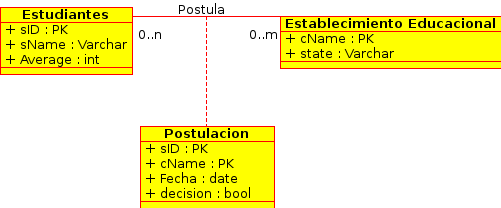
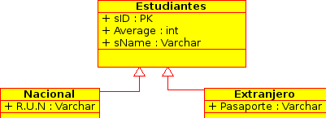
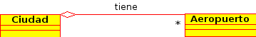
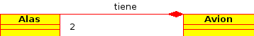

Lecture 19 - Unified Modeling Language: UML data modeling
---------------------------------------------------------

.. role:: sql(code)
         :language: sql
         :class: highlight

Inside the modeling of relational DB, the most known methods are the Entity-Relation (ER) 
diagrams, seen in the first week, and the Unified Modeling Language (UML). Both share the 
characteristic of being graphic. This mean that UML as well as ER, are compose by “symbols” 
under a series of rules. Also, both share the quality that they can be passed to the language 
of DB of the form relatively autonomous.

On the other hand, it is important to highlight that ER is much older than UML, super passing 
in age in the order of decades. UML is a broader language, that is, not only used for modeling 
DB, as it is used for modeling programs as well.

Instead of creating the relations in a direct form in the DB, the designer makes a modeling 
of high level, so that the situation that we are facing with the DB can be seen in its totality. 
After the designer makes valid its model, he proceeds to translate it to the language of the DB.

This situation does not present unnecessary work (corresponding to the mould and the creation 
of relations afterwards in the DB), since fortunately the majority of these tools let us 
do a translation in the language of the DB.

.. note::
 
 There are several tools for making UML diagrams. Some of them are: DIA, StarUML or Umbrello, among others. 
 
There are 5 key concepts in UML:

1. Classes
2. Associations
3. Clases of associations
4. Subclasses
5. Compositions and aggregations  

Class
~~~~~

The class are composed of a name, attributes and methods. For the ones who had experienced 
sometime with programming orientated to objects that probably feel more familiarize with.

When you make models of DB, it is necessary to add an identification that the attribute 
corresponds to the primary key and a method for deleting as well.  

Nevertheless, in this lecture we will emphasize the attributes, since they are more focused 
on the modeling of data rather than to its operation through its methods.

Example 1
^^^^^^^^^

Let’s return to the case of Students and Universities. Draw both relations as class in UML:

.. image:: ../../../sql-course/src/diagrama1_lecture19.png                               
   :align: center  

Associations
~~~~~~~~~~~~

The associations correspond to how are related two classes.

Example 2
^^^^^^^^^

The example 1 finished with two class separated, that is, Students and Universities. However, 
and as you have seen in examples of previous lectures, the students apply to these universities, so 
the relation is **apply**:

.. image:: ../../../sql-course/src/diagrama2_lecture19.png                               
   :align: center  

That is the **Student** **applies** to a **University**. It is possible direct this relation 
to get more clarity when we are observing diagrams:

.. image:: ../../../sql-course/src/diagrama3_lecture19.png                               
      :align: center  

However, it does not make any difference when we translate to relations.

============
Multiplicity
============

It is necessary determine how many times an object of a type can have a relation with objects 
of other classes. 
Let’s suppose that we have created the class **C1** and **C2**, the multiplicity points to::

 "Each object of the class C1 is associated (through relation A) to at least 'm' and most 
 'n' objects of the class C2”
 
The notation for that corresponds to *m..n*, that is the minimum value is *m* and the maximum is *n*. 
Both values go separated by *..* (two periods).

.. image:: ../../../sql-course/src/diagrama4_lecture19.png                               
      :align: center  

It is important to mention that these relations can be bidirections. 
                
Some special cases are::

 m..*   -> at least 'm' at most any value greater to 'm'.
 0..n   -> at least '0' at most 'n'.
 0..*   -> at least '0' at most any value greater to '0', that is , without restrictions.
 1..1   -> only 1 value.

There are several types of multiplicity with their respective notaion. There are:

1. One to one: **0..1 - 0..1**
2. Many to one: **0..* - 0..1**
3. Many to many:  **0..* - 0..*** 
4. Complete: **1..* - 1..1** o **1..1 - 1..*** o **1..* - 1..***

.. note::
 
  In the complete multiplicity, you must not leave objects without being related with others.

Example 3
^^^^^^^^^

Suppose that each student must apply to at least one university and no more than 3. On the 
other hand, each university can receive no more than 50000 applications.

.. image:: ../../../sql-course/src/diagrama5_lecture19.png                               
      :align: center  

Example 4
^^^^^^^^^

In order to diversify and under the next context, suppose that there are people doing 
draft in banks. Depending on the type of account, suppose there is an account that allows 
at most 3 drafts per month. The bank has not restrictions about drafts that you can receive.

.. image:: ../../../sql-course/src/diagrama6_lecture19.png                               
      :align: center  

Class of association
~~~~~~~~~~~~~~~~~~~~

When the multiplicity of relations cannot define with accuracy what object of the class **C1** 
is associated to what object of the class **C2**.

Example 5
^^^^^^^^^

Suppose that we have several students who want to apply to different universities.

.. image:: ../../../sql-course/src/diagrama7_lecture19.png                               
         :align: center  

Nevertheless, there is not information which allows defining which student makes the application. 
Therefore, we create a class of association, in this case Application (Apply).

.. image:: ../../../sql-course/src/diagrama8_lecture19.png                               
         :align: center  

.. note::

 It is important to remember that if you do not specify the multiplicity of the relation, 
 you define **1..1** by default. 

However, in this model it is not allowed the case in which a student applies multiple times 
to the same university. Therefore, that it is a good practice that, in case of using these types of classes, 
you use as primary key (PK), the PK of the classes that are related.

The following diagram clarifies the idea:

=========================================
Delete classes of unnecessary association
=========================================

Using the generic classes C1, C2 with the attributes A1, A2, A3 and A4 respectively. Suppose 
that the relationship between them is the multiplicity (* - 1..1) o (* - 0..1). Suppose 
that there is a type of association AC of attributes B1 and B2. 
Everything is sorted according to the following image:

.. image:: ../../../sql-course/src/diagrama10_lectura19.png                               
      :align: center  

It is possible to move attributes B1 and B2 to the class C1, since given the multiplicity; 
an object of the class C1 is associated to an object of the class C2. So, the type of association can be deleted.

.. image:: ../../../sql-course/src/diagrama11_lectura19.png                               
      :align: center  

.. note::
  
  The class of association can be deleted when there is multiplicity (* - 1..1) or (* - 0..1). 
  In fact, it is intended to make clear that the association between objects in case the 
  multiplicity is m, n or * on both sides of the relationship.  
 
=================
Auto-associations
=================

They correspond to associations between one type and itself.

Example 6
^^^^^^^^^

Suppose you want to modeling in UML the Universidad Técnica Federico Santa María (UTFSM), 
its main house and its campus. Suppose there are the *NumStudents, Address, Name, Campus* 
attributes. 

There is only one main house, but several campuses. So suppose that for budget issues there 
are only seven campuses.

.. image:: ../../../sql-course/src/ejemplo6_lectura19.png
            :align: center

In UML, it is possible to tag the relation.

Subclasses
~~~~~~~~~~

The types are divided into:

1. Superclass/Class Father: it is of general character. It contains information that inherited the diverse superclasses.
2. Subclasses/Classes Daugther: it is of specific character. It contains extra information which is inherited from the superclass.

These concepts arise from programming oriented to objects.

Example 7
^^^^^^^^^

Suppose that inside the type Students, we want to differentiate foreign students from 
the national ones. We could think in creating two new classes, call **National Student** 
and **Foreign Students**:

.. image:: ../../../sql-course/src/ejemplo7a_lectura19.png
         :align: center

However, there are attributes that are repeated in both, those are: *sID, sName, Average*. 
For this reason, we can separate in one superclass called Student (the same used in other lectures), 
and create 2 subclasses called **Foreign** and **National**.

As you can see, this attributes are inherited for both subclasses. Also, both add more specific 
information, as **country** and **passport** in the case of **Foreign**. And *region* and *RUN* 
in the case of **National**. These techniques are very useful for reuse.

.. note::

 Subclasses **inherit** properties of **superclasses / father class**, ie not only attributes, 
 but also associations or operations are available in the **subclasses / class daughters**.
 
Compositions and Aggregations
~~~~~~~~~~~~~~~~~~~~~~~~~~~~~

Both correspond to the form of representing that an object has as content another one, 
this means that **an object of a type can contain other**.

Example 8
^^^^^^^^^

Suppose an object of the type city has a list of objects of type airport. This means that 
a city has a number of airports.

.. note::

   It should be noted that the cardinality of the end carrying the rhombus, is always one.  

It can also be read as in a means of transport has several wheels. It is saying that 
objects “wheel” are part of the object “means of transport.” However, its cycle of life 
is not tied to the object of “means of transport.” This means that if the car is destroyed, 
the wheels can still exist independently.

In the same way, the composition is a stronger relation of objects. As aggregation, it is 
the fact that an object has other one, the composition is when the relation between objects 
is such that, the first has no loose sense, and second, that it needs to define the first to 
extend its meaning.

Example 9
^^^^^^^^^

The airplane makes sense by itself. It is clear that is composed of 2 wings, this relationship 
is very strong, much more than the case of airports, and it is clear that a plane will 
always have its 2 wings, and these will always be in the same plane.

The composition corresponds to those objects that depends an object so that it comes to 
work. In this case the plane cannot work without the 2 wings.
