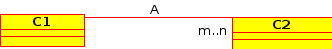
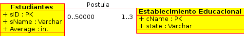

Lecture 19 - Unified Modeling Language: UML data modeling
---------------------------------------------------------

.. role:: sql(code)
         :language: sql
         :class: highlight

Dentro del modelado de BD Relacionales, los métodos más conocidos son los diagramas de Entidad-Relación
(ER), vistos en la primera semana, y el Lenguaje de Modelado Unificado (UML, por sus siglas en inglés).
Ambos comparten la característica de ser gráficos; es decir que UML, al igual que ER está compuesto por
"símbolos" bajo una serie de reglas. Además, ambos comparten la cualidad de que pueden ser traspasados
a lenguaje de BD de forma relativamente autónoma.

Por otro lado, cabe destacar que ER es mucho más antiguo que UML, superándole en edad en el orden de 
décadas. UML es un lenguaje más amplio, es decir, no solo se utiliza para modelar BD, sino que es utilizado
para modelar programas también.

En lugar de crear las relaciones de forma directa en la BD, el diseñador realiza un modelado de 
alto nivel, de modo que la situación que se está enfrentando con la BD pueda verse en su totalidad.
Posteriormente el diseñador, una vez que valida su modelo, procede a su traducción al lenguaje de la BD.

Esta situación no presenta trabajo innecesario (correspondiente al modelado y a la posterior creación
de relaciones en la BD), pues afortunadamente la gran mayoría de estas herramientas permiten realizar 
una traducción al lenguaje de la BD.
 

.. note::
 
 There are several tools for making UML diagrams. Some of them are: DIA, StarUML or Umbrello, among others. 
 
There are 5 key concepts in UML:

1. Class
2. Associations
3. Types of associations
4. Subclass
5. Compositions and aggregations  

Class
~~~~~

The class are composed of a name, attributes and methods. For the ones who had experienced 
sometime with programming orientated to objects that probably feel more familiarize with.

When you make models of DB, it is necessary to add an identification that the attribute 
corresponds to the primary key and a method for deleting as well.  

Nevertheless, in this lecture we will emphasize the attributes, since they are more focused 
on the modeling of data rather than to its operation through its methods.

Example 1
^^^^^^^^^

Let’s return to the case of Students and Universities. Draw both relations as class in UML:

.. image:: ../../../sql-course/src/diagrama1_lecture19.png                               
   :align: center  

Associations
~~~~~~~~~~~~

The associations correspond to how are related two class.

Example 2
^^^^^^^^^

The example 1 finished with two class separated, that is, Students and Universities. However, 
and as you have seen in examples of previous lectures, the students apply to these universities, so 
the relation is **apply**:

.. image:: ../../../sql-course/src/diagrama2_lecture19.png                               
   :align: center  

That is the **Student** **applies** to a **University**. It is possible direct this relation 
to get more clarity when we are observing diagrams:

.. image:: ../../../sql-course/src/diagrama3_lecture19.png                               
      :align: center  

However, it does not make any difference when we translate to relations.

============
Multiplicity
============

It is necessary determine how many times an object of a type can have a relation with objects 
of other classes. 
Let’s suppose that we have created the class **C1** and **C2**, the multiplicity points to::

 "Each object of the class C1 is associated (through relation A) to at least 'm' and most 
 'n' objects of the class C2”
 
The notation for that corresponds to *m..n*, that is the minimum value is *m* and the maximum is *n*. 
Both values go separated by *..* (two periods).

It is important to mention that these relations can be bidirections. 
                
Some special cases are::

 m..*   -> at least 'm' at most any value greater to 'm'.
 0..n   -> at least '0' at most 'n'.
 0..*   -> at least '0' at most any value greater to '0', that is , without restrictions.
 1..1   -> only 1 value.

There are several types of multiplicity with their respective notaion. There are:

1. One to one: **0..1 - 0..1**
2. Many to one: **0..* - 0..1**
3. Many to many:  **0..* - 0..*** 
4. Complete: **1..* - 1..1** o **1..1 - 1..*** o **1..* - 1..***

.. note::
 
  In the complete multiplicity, you must not leave objects without being related with others.

Example 3
^^^^^^^^^

Suppose that each student must apply to at least one university and no more than 3. On the 
other hand, each university can receive no more than 50000 applications.

Example 4
^^^^^^^^^

In order to diversify and under the next context, suppose that there are people doing 
draft in banks. Depending on the type of account, suppose there is an account that allows 
at most 3 drafts per month. The bank has not restrictions about drafts that you can receive.

.. image:: ../../../sql-course/src/diagrama6_lecture19.png                               
      :align: center  

Class of association
~~~~~~~~~~~~~~~~~~~~

When the multiplicity of relations cannot define with accuracy what object of the class **C1** 
is associated to what object of the class **C2**.

Example 5
^^^^^^^^^

Suppose that we have several students who want to apply to different universities.

.. image:: ../../../sql-course/src/diagrama7_lecture19.png                               
         :align: center  

Nevertheless, there is not information which allows defining which student makes the application. 
Therefore, we create a class of association, in this case Application (Apply).

.. image:: ../../../sql-course/src/diagrama8_lecture19.png                               
         :align: center  

.. note::

 It is important to remember that if you do not specify the multiplicity of the relation, 
 you define **1..1** by default. 

However, in this model it is not allowed the case in which a student applies multiple times 
to the same university. Therefore, that it is a good practice that, in case of using these types of classes, 
you use as primary key (PK), the PK of the classes that are related.

The following diagram clarifies the idea:

.. image:: ../../../sql-course/src/diagrama9_lecture19.png                               
      :align: center  

=======================================
Delete types of unnecessary association
=======================================

Usando las clases genéricas C1, C2 de atributos A1, A2 y A3, A4 respectivamente. Supongamos que la relación entre 
ellas es de multiplicidad (* - 1..1) o (* - 0..1). Supongamos que existe una clase de asociación AC de atributos
B1 y B2. Todo ordenado de acuerdo a la siguiente imagen:

.. image:: ../../../sql-course/src/diagrama10_lectura19.png                               
      :align: center  

Es posible mover los atributos B1 y B2 a la clase C1, pues dada la multiplicidad un objeto de la clase C1 está
asociado a 1 objeto de la clase C2. Por lo tanto la clase de asociación se puede eliminar.

.. image:: ../../../sql-course/src/diagrama11_lectura19.png                               
      :align: center  

.. note::
 
  La clase de asociación se puede eliminar cuando hay multiplicidad 
  (* - 1..1) o (* - 0..1). De hecho está pensada para dejar en claro que
  la asociación entre objetos en caso de que la multiplicidad sea m, n o * en
  ambos lados de la relación.

=====================
Auto asociaciones
=====================

Corresponden a asociaciones entre una clase y si misma.

Ejemplo 6
^^^^^^^^^

Supongamos que se desea modelar en UML a la Universidad Técnica Federico Santa María (UTFSM), su Casa
Central y Campus. Supongamos que existen los atributos *NumAlumnos, Dirección, Nombre, Campus*. 

Existe una sola Casa Central, pero varios Campus, supongamos que por temas de presupuesto, solo existen
7 campus.

.. image:: ../../../sql-course/src/ejemplo6_lectura19.png
            :align: center

En UML, es posible etiquetar la relación.

Subclases
~~~~~~~~~

Las clases se dividen:

1. Superclase/ Clase Padre: De carácter general, contiene información que heredarán las diversas subclases.
2. Subclases/ Clases Hijas: De carácter específico, contiene información extra a la que hereda de la superclase.

Estos conceptos nacen de la programación orientada a objetos.

Ejemplo 7
^^^^^^^^^

Supongamos que dentro de la clase Estudiantes, se desea diferenciar a los estudiantes extranjeros
de los estudiantes nacionales.  Se podría pensar en crear dos clases nuevas, llamadas 
**Estudiantes Nacionales** y **Estudiantes Extranjeros**:

.. image:: ../../../sql-course/src/ejemplo7a_lectura19.png
         :align: center

Sin embargo, hay atributos que se repiten en ambas, ellos son: *sID, sName, Average*. Es por ello que
se pueden separar en una superclase llamada Estudiante (la misma utilizada en las otras lecturas), y crear
2 subclases llamadas **Extranjeros** y **Nacionales**.

.. image:: ../../../sql-course/src/ejemplo7b_lectura19.png
            :align: center

Como se puede observar, los atributos mencionados son heredados por ambas subclases. Ambas además agregan
información más específica, como lo son el *país* y *pasaporte* en el caso de los **Extranjeros**; la
*región* y *RUN* en el caso de los **Nacionales**. Esta técnica es muy útil para la reutilización.

.. note::
 
 Las Subclases **heredan** propiedades de las **superclases / clase padre**, es decir no solo 
 atributos, sino que también asociaciones u operaciones  están disponibles en las 
 **subclases / clases hijas**

Composiciones y Agregaciones
~~~~~~~~~~~~~~~~~~~~~~~~~~~~~

Ambas corresponden a la forma de representar que un objeto tiene como contenido a otro, esto quiere decir que 
**un objeto de un tipo, puede contener a otro**.

Ejemplo 8
^^^^^^^^^

Supongamos que un objeto de tipo ciudad tiene una lista de objetos de tipo aeropuerto, esto quiere decir, que 
una ciudad, tiene un número de aeropuertos. 

.. note::
  
   Hay que destacar, que la cardinalidad del extremo que lleva el rombo, es siempre uno.

.. image:: ../../../sql-course/src/ejemplo8_lectura19.png                               
         :align: center  

También se puede leer como que un medio de transporte tiene varias ruedas.
Nos esta diciendo que los objetos rueda forman parte del objeto medio de transporte. Pero, su ciclo de 
vida no esta atado al del objeto medio de transporte. Es decir si el automóvil se destruye las ruedas 
pueden seguir existiendo independientemente.

En la misma linea, la composición, es una relación más fuerte de los objetos, así como la agregación, es el 
hecho de que un objeto posea a otro, la composición es cuando la relación entre ambos objetos es tal, que el 
primero no tiene sentido suelto, y el segundo, necesita definir al primero para ampliar su significado

Ejemplo 9
^^^^^^^^^

.. image:: ../../../sql-course/src/ejemplo9_lectura19.png                               
         :align: center  

El avión tiene sentido por si solo. Esta claro que esta compuesto de 2 alas, esta relación es de mucha 
fuerza, mucho más que el caso de los aeropuertos, y esta claro, que un avión siempre tendrá sus dos alas, y 
estas siempre serán del mismo avión.

La composición corresponde a aquellos objetos de los que depende un objeto para que este llegue a funcionar,
en este caso el avión no puede funcionar sin las 2 alas.

