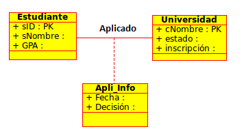
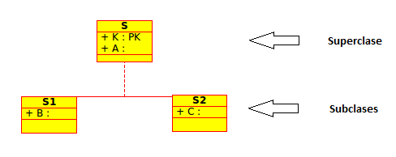
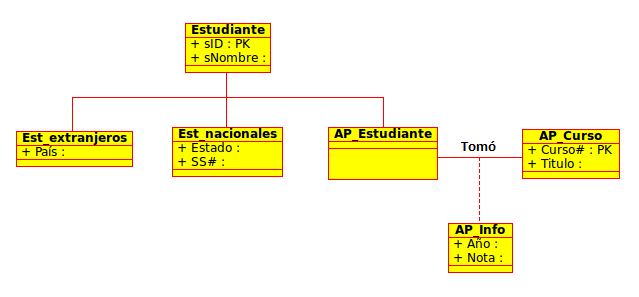
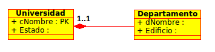

Lecture 20 - Unified Modeling Language: UML to relations
--------------------------------------------------------

Database of high level and model of design.

* Very easy to use (graphic), specification of the language.
* Translated to the model of DBMS

.. image:: ../../../sql-course/src/dibujo1_semana5.png                               
   :align: center  

In the previous image, you can observe that the UML language can be translated in relations 
of a database.

UML (Unified Modeling Language)
~~~~~~~~~~~~~~~~~~~~~~~~~~~~~~~

Subset of data of modeling

* Five concepts

 1) Classes
 2) Associations
 3) Associations of classes
 4) Subclasses
 5) Composition and Aggregation

* The designs can be translated automatically to the relations.

 Always and each “regular” type has a key. 

Classes
=======

Each type becomes into a relation; pk-> primary key.

.. image:: ../../../sql-course/src/diagrama1_semana5.png                               
   :align: center   

According to the types described before, we have the following relations:

.. math::

 Estudiante(\underline{sID}, sNombre, GPA)

 Universidad(\underline{cNombre}, estado, inscripción)

Associations 
============

Relation to the type of each side. 

.. image:: ../../../sql-course/src/diagrama2_semana5.png                               
   :align: center 

You will obtain the same relations of the previous example, but it will be added a new 
relation with the primary keys of both types. 

.. math::

 Aplicado(sID, cNombre)

Keys for the relations of association
^^^^^^^^^^^^^^^^^^^^^^^^^^^^^^^^^^^^^^

* Depends on the multiplicity

 * **Multiplicity 1-1**

  * Each object of A is associated with an object of B, and each object of B is associated with an object of A.
  * Any of the two related tables will implement a column with the *ID* of the other table. 
  * This column will be the foreign key in order to related them.

 * **Multiplicity 1-n**

  * Each A object is associated with more B objects, but each B objects is associated with an A object. 
  * By implementing the foreign key **ID** in the “many” table to the “one” table.

  For example,

  .. image:: ../../../sql-course/src/diagrama3_semana5.png                               
     :align: center

  Now that we have a multiplicity of 1-n, we must add the primary key *Atr1_clase1* of the 
  *Clase1* to the *Clase2* (which is the one that has the “many” multiplicity), leaving 
  as foreign key the *Clase2*.

  Finally, the relations result in the following way: 

  .. math::

     Clase1(\underline{Atr1\_clase1}, Atr2\_clase1)
 
     Clase2(\underline{Atr1\_clase2}, Atr2\_clase2, Atr1\_clase1)
    
  If the relation has been of o..1-n, the *Atr1_clase1* attribute will be *NULL*. 

  Now we will show this with other example:

  .. image:: ../../../sql-course/src/diagrama4_semana5.png                               
     :align: center
  
  The relations for this example will be:

  .. math::

     Estudiante(\underline{sID}, sNombre, GPA, cNombre)
 
     Universidad(\underline{cNombre}, estado, inscripción)
   
  By owning this type of multiplicity (1-n), it is added to the type *Estudiante* (many) 
  the primary key *cNombre* of the class *Universidad*.

 * **Multiplicity n-m**
 
  * Each A object is associated with more B objects, and at the same time, each B object is associated with more A objects.
  * In the relational model, it is used an associated auxiliary table for the representation of the relation.
  * That table will need to have at least two columns, each one representing the foreign key to the two tables that are related.
  * With this, the n-m relation is transformed to two relations (1-n, 1-m). 
 
Example
"""""""
Suppose that we have 0..2 on the right side, therefore students can ask for at most 2 universities. 
Is there still a way to "bend" the relationship of association in this case, or that we 
have an independent relation *Aplicado*?

.. image:: ../../../sql-course/src/ejemplo_asociacion.png                               
   :align: center 

a) Yes, there is a way.
b) No, if it is not 0..1 or 1..1 *aplicado* then, is required.

The correct answer is (a), since we should create the relation Estudiante(sID, sNombre, GPA, cNombre1, cNombre2), 
supposing that null values are allowed. 

Class of association
====================

The types of association allows adding attributes, operations, and others characteristics 
to the associations. 

The relations of this classes result in the following way:

.. math::

 Estudiante(\underline{sID}, sNombre, GPA)                              
                                                                                     
 Universidad(\underline{cNombre}, estado, inscripción)

 Aplicado(sID, cNombre, Fecha, Decisión)

Another example that details more clearly the classes of association.

.. image:: ../../../sql-course/src/diagrama6_semana5.png                               
   :align: center 

The diagram allows us to see that a *Persona* can work for a single *Compañia*. We need 
to keep information on the amount of time that each employee works for each *Compañia*.

To achieve this, we add an *Periodo* attribute to the association *Empleo*.

Subclasses
==========

If the type "A" inherited the class "B", then "B" is a **superclass** of "A". "A" is **subclass** 
of "B". The objects of a **subclass** can be used in the circumstances in which are used 
the objects of the corresponding **subclass**. This is due to the fact that the objects 
of the **subclass** share the same behavior of the objects of the **superclass**. 

1) The relations of the subtypes have a key of the supertype, plus the specialized attributes. 
   
.. math::

  S(\underline{K}, A)

  S1(\underline{K}, B)

  S2(\underline{K}, C)
   
2) The relations of the subtypes have all the attributes.

.. math::

  S(\underline{K}, A)

  S1(\underline{K}, A, B)

  S2(\underline{K}, A, C)

3) A relation that contains all the attributes of the superclass and subclass. 

.. math::

  S(\underline{K}, A, B, C)

Example of subclasses
^^^^^^^^^^^^^^^^^^^^^

The relations of this example are:

.. math::

 Estudiante(\underline{sID}, sNombre)

 Est\_extranjeros(\underline{sID}, País)

 Est\_nacionales(\underline{sID}, Estado, SS\#)

 AP\_Estudiante(\underline{sID})

 AP\_Curso(\underline{Curso\#}, Titulo)

 Tomó(sID, Curso\#, Año, Nota)

Composition and Aggregation
===========================

Composition
^^^^^^^^^^^

The composition is a type of static relation, in which the time of life of the included 
object is conditioned by time of life that includes (the base object is constructed from 
the object included, ie, is part / whole).

Example
"""""""

The relations are defined in the following way: 

.. math::

 Universidad(\underline{cNombre}, Estado)

 Departamento(\underline{cNombre}, Edificio, cNombre)

Aggregation
^^^^^^^^^^^

The aggregation is a type of dynamic relation, in which the time of life of the included 
object is independent of what include it (the base object use the included one for its 
functioning). 

Example
"""""""

.. image:: ../../../sql-course/src/diagrama10_semana5.png                               
   :align: center

The relations are in the same way as the previous example, but as it has a different multiplicity, 
the value of the *cNombre* attribute of the class *Departamento* can take the value **NULL**. 

.. note::

 The sofware used in this lecture to create the diagrams is called “Umbrello”
