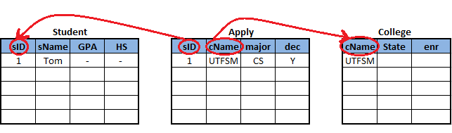
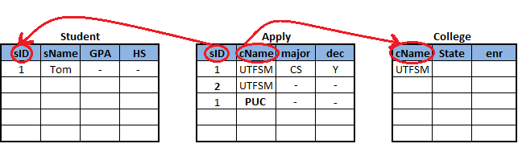

Lecture 23 - Constraints and triggers: Referential integrity
-------------------------------------------------------------

.. role:: sql(code)
         :language: sql
         :class: highlight

This lecture presents a very important type of *restriction* known as **referential integrity**.

As a reminder of previous lectures, the restrictions of *integrity* of a database are to impose restrictions to the allowed data beyond the ones imposed by the structure and the type of databases. 
Now, the term **referential integrity** refers to the *integrity of references* which appear in the database. 
Next we will show an example of databases with the *Student*, *Apply*, and *College* tables.

    
Suppose for example that we have one student, “1”, who has asked to the “UTFSM” university to make a specialization in “CS” (science), with a decision of acceptance “Y” (yes) in the **Apply** table. While having these data in the **Apply** table, you can observe that the data of this tuple (or row) must be referenced of other tables, as the case of the *sID* and *cName* attribute, in which we will obtain more information. For this reason, that’s why it appears in the **Student** table, which has the data of each student who applies to some specialization on a university. And the **College** table, which gives more information of the university in which the student applies. 

In the **Student** table the attributes are:  *sID* "1", *sName* "Tom", *GPA* and"HS" (high school) and the **College** table, the attributes are: *cName* "UTFSM", *State* y *enr*.

So in this example we talk about **referential integrity** when we make the corresponded references in the other tables. That is the case of *sID* in the **Student** table and 
*cName* in the **College** table.

Specifically if we have referential integrity, the “A” attribute of a relation “R” (R.A) in an attribute “B” of other relation “S” (S.B).
 
This refers to each value that appears in column A of relation R must have some value corresponding in the column B of the relation S. So, if we observe the previous example, we could say that we have **referential integrity** of the column *sID* of **Apply**, to the column *sID* of **Student**. In the same way, we have that **referential integrity** of the column *cName* of **Apply**, to the column *cName* in **College**.

In the next image you see a violation of **referential integrity**. For example, if we have a 
*sID* "2", *cName* "UTFSM", a *major* and *dec*, in the **Apply** table and in the  **Student** table there is no this *sID*. So it is considered a violation of the referential integrity. 

In the same way, we could have a *sID* "1", which is valid because we have a student “1” in the **Student** table. However, if a “1” applies to “PUC” university and in the **College** table you cannot find “PUC”, then you will have a violation of the referential integrity. 

Example
=======

Consider two tables:

Dorm(name, address)
Student(name, dormName, roommateName)

Suppose that some students live in individual rooms
(roommateName is null) 
and dorms are not empty. Which of the following restrictions of referential integrity is not met?

a) Student.dormName a Dorm.name
b) Dorm.name a Student.dormName
c) Student.name a Student.roommateName
d) Student.roommateName a Student.name

The correct alternative is  (c), as answer (a) dorm says that each student exists. Answer (b) says that each dorm has at least one student. Answer (c ) says that each student has some roommate (not necessarily). Answer (d) says that each roommate is a current student .

Now, we will only give some details of the restrictions of **referential integrity**.

The relations ``R.A to S.B`` has as characteristics:

* "A" is **foreign key**
  
  In fact, the **referential integrity** usually refers as restrictions of foreign keys.  
  Even in the SQL syntax, we will see that in the external key this term is used. 

* B, generally, is required in order to be the primary key for the S table or at least, unique. 

* Multiple attributes of foreign keys are allowed. 

  For example, if  *cName* and *State* attributes of the **College** table were foreign keys, 
  it is necessary to add a column in the **Apply**  table of *State*.

Application of referential integrity (R.A to R.B)
~~~~~~~~~~~~~~~~~~~~~~~~~~~~~~~~~~~~~~~~~~~~~~~~~~~

Modifications potentially violated:

* :sql:`INSERT INTO` R.

	If we insert  one tuple (or row) in the *Apply* relation, you might violate the referential integrity. 
	Because, if the inserted value, for instance a name of *sID* or *cName*, does not have matching values 
	in the relations of reference such as **Student** and **College**.

* :sql:`DELETE FROM` R.

	If we delete of one relation of reference, like a student in the **Student** table, then that could  
	cause a violation of referential integrity ,since deleting the tuple (or row) from the **Student** 
	table the value *sID* =”1”,   result in the loss of the reference that existed of this student in 
	the **Apply** table.

* :sql:`UPDATE` R.A.
* :sql:`UPDATE` S.B.

 	If we update the value that makes reference to any of these columns, they could cause a violation of 
	the referential integrity in the case that the new value does not exist in the table of reference, or 
	if the values of reference were updated. 

Example
=======

Consider the tables Dorm(name, address) and Student(name, dormName, roommateName) 
with restrictions of referential integrity:

(1) Student.dormName a Dorm.name
(2) Dorm.name a Student.dormName
(3) Student.roommateName a Student.name

Which of the following modifications cannot  cause a violation of referential integrity?

a) Insertion into Student.
b) Deletion from Student.
c) Update Student.roommateName.
d) All of them can cause  violations.

The correct alternative is (d), since when we *insert* a student, we can violate the restrictions (1) and/or (3). Deleting a student can violate restrictions (2) and/or (3). Updating a roommate can violate the restriction (3). 

In the SQL standard and in all the implementations, if we have an insertion or one update in the table of reference that can cause a violation of the restriction of integrity, then it will generate an error and the modification will not be allowed. 

Special actions
~~~~~~~~~~~~~~~~~~~

* :sql:`DELETE FROM` S.

 * Restrict(default):
 * SET NULL
 * CASCADE

* :sql:`UPDATE` S.B.

 * Restrict(default)
 * SET NULL
 * CASCADE

Now we will explain with examples in postgreSQL, for a better understanding:

.. code-block:: sql

 CREATE TABLE College(cName text PRIMARY KEY, state text, enrollment INT);
 CREATE TABLE Student(sID INT PRIMARY KEY, sName text, GPA REAL, sizeHS INT);
 CREATE TABLE Apply(sID INT REFERENCES Student(sID), cName text REFERENCES College(cName), major text, decision text);

In the **Apply** table you can observed the referential integrity with “REFERENCES” to the *Student* table with the *sID* and **College** attribute, with the *cName* attribute.

.. code-block:: sql

 INSERT INTO Apply VALUES(1,'UTFSM','CS','Y');
 INSERT INTO Apply VALUES(2,'PUC','biology','N'); 

When wanting to add these tuples (or rows), you will see the following error::

 ERROR:  insert or update on table "apply" violates foreign key constraint "apply_sid_fkey"
 DETAIL:  Key (sid)=(1) is not present in table "student".
 ERROR:  insert or update on table "apply" violates foreign key constraint "apply_sid_fkey"
 DETAIL:  Key (sid)=(2) is not present in table "student".

This happens because it does not find the references of these data in the **Student** 
and **College** table.

In order to solve this error, first, it is necessary to *insert* the tuples in the tables of  **Student** and **College**, then finally you can insert the tuples in **Apply**.

.. code-block:: sql

 INSERT INTO Student VALUES(1, 'Tom', 3.4, 1000);
 INSERT INTO Student VALUES(2, 'Brad', 3.8, 1500);

 INSERT INTO College VALUES('UTFSM', 'CA', 15000);
 INSERT INTO College VALUES('PUC', 'CA', 36000);

 INSERT INTO Apply VALUES(1,'UTFSM','CS','Y');                                       
 INSERT INTO Apply VALUES(2,'PUC','biology','N');
 
Now we want to update the **Apply** table. 

.. code-block:: sql

 UPDATE Apply SET sID=3 WHERE sID=1;

Which returns the following ``error``, since it tries to establish the identification of the student sID=1 to sID=3 of the **Apply** table. However, we will get a violation of the referential integrity because there are no students with sID = 3 in the **Student** table.::

 ERROR:  insert or update on table "apply" violates foreign key constraint "apply_sid_fkey"
 DETAIL:  Key (sid)=(3) is not present in table "student".

.. code-block:: sql

 UPDATE Apply SET sID=2 WHERE sID=1;
 UPDATE 1

This last update is satisfactory since the application of the student “1” will be updated  to get a *sID* = "2".

Until now, we have seen modifications to the table of reference. However, we also have to pay attention on the modifications of the tables of reference. 

For example, suppose that we try to delete de **College** table, where *cName* is "UTFSM".

.. code-block:: sql

 DELETE FROM College WHERE cName='UTFSM';

But it returns the following as the *cName* attribute has a reference to the *sName* attribute of the **Apply** table. So, it is impossible to delete this tuple (or row).::

 ERROR:  update or delete on table "college" violates foreign key constraint "apply_cname_fkey" on table "apply"
 DETAIL:  Key (cname)=(UTFSM) is still referenced from table "apply".

In the same way it occurs if you try to delete the next tuple (or row) of the **Student** table.  

.. code-block:: sql

 DELETE FROM Student WHERE sID=2;

Returning the following error, because the *sID* attribute of the **Student** table has a reference to the *sID* attribute of the **Apply** table.::
 
 ERROR:  update or delete on table "student" violates foreign key constraint "apply_sid_fkey" on table "apply"
 DETAIL:  Key (sid)=(2) is still referenced from table "apply".

When wanting to delete the next tuple (or row), it does not return error, since the student *sID* =”1” does not have reference to the **Apply** table. 

.. code-block:: sql

 DELETE FROM Student WHERE sID=1;
 DELETE 1

If we want to update the name of the “UTFSM” university for “USM” in the **College** table. 

.. code-block:: sql

 UPDATE College SET cName='USM' WHERE cName='UTFSM'; 

But the result is not satisfactory as if we modify the *cName* attribute by “USM” of the **College** table, we will get a reference in the **Apply** table with the *cName* attribute, but it will have the value of “UTFSM”, generating a violation of integrity.::

 ERROR:  update or delete on table "college" violates foreign key constraint "apply_cname_fkey" on table "apply"
 DETAIL:  Key (cname)=(UTFSM) is still referenced from table "apply".  

Now we will see how we delete the tables. 

For example, if we try to delete the **Student** table, we will have again a restriction of referential integrity because the data of the **Apply** table will be referencing to an non-existing  **Student** table. 

.. code-block:: sql

 DROP TABLE Student;

returning the following error::

 ERROR:  cannot drop table student because other objects depend on it
 DETAIL:  constraint apply_sid_fkey on table apply depends on table student
 HINT:  Use DROP ... CASCADE to drop the dependent objects too.
 
Next we are going to configure the **Apply** table with some automatic mechanism for the management of violations of referential integrity. 

.. code-block:: sql

 CREATE TABLE Apply(sID INT REFERENCES Student(sID) ON DELETE SET NULL, cName text REFERENCES College(cName) ON UPDATE CASCADE, major text, decision text);
 CREATE TABLE

For the restriction of *sID*, the referential integrity that we are going to specify is that if a student is deleted, we would not establish any reference to “null” values. We do this we the keywords “ON DELETE” which tell us what to do when there is an elimination of the table of reference; we use the SET NULL option. 

For the *cName* attribute, the referential integrity that we are going to specify is that if a university is updated in the **College** table, we will use the cascade option. This mean that if we modify the value of a tuple of the *cName* attribute in the *College** table, this will also be modify automatically in the **Apply** table.  

We could have specified two more options that could have been an option for updating the *sID* of the student, and an option to delete the *cName*. So, we could have ended up with four options in total. 

Now we are going to generate some modifications (starting tables from zero):

.. code-block:: sql

 INSERT INTO Student VALUES(1, 'Tom', 3.4, 1000);                                    
 INSERT INTO Student VALUES(2, 'Brad', 3.8, 1500);
 INSERT INTO Student VALUES(3, 'Lucy', 3.9, 3600);

 INSERT INTO College VALUES('UTFSM', 'CA', 15000);                                   
 INSERT INTO College VALUES('PUC', 'CA', 36000);

 INSERT INTO Apply VALUES(1,'UTFSM','CS','Y');                                       
 INSERT INTO Apply VALUES(2,'PUC','biology','N');
 INSERT INTO Apply VALUES(1,'PUC','CS','Y');
 INSERT INTO Apply VALUES(3,'UTFSM','history','Y');
 INSERT INTO Apply VALUES(3,'UTFSM','CS','Y');

Fulfilling all the tuples of the **Apply** table with the referential integrity. 

.. code-block:: sql

 SELECT * FROM Student;
 sid | sname | gpa | sizehs 
 ----+-------+-----+--------
   1 | Tom   | 3.4 |   1000
   2 | Brad  | 3.8 |   1500
   3 | Lucy  | 3.9 |   3600
 (3 rows)

 SELECT * FROM College;
  cname | state | enrollment 
 -------+-------+------------
  UTFSM | CA    |      15000
  PUC   | CA    |      36000
 (2 rows)

 SELECT * FROM Apply;
  sid | cname |  major  | decision 
 -----+-------+---------+----------
    1 | UTFSM | CS      | Y
    2 | PUC   | biology | N
    1 | PUC   | CS      | Y
    3 | UTFSM | history | Y
    3 | UTFSM | CS      | Y
 (5 rows)

Example :sql:`ON DELETE SET NULL`
=================================

Now we are going to delete all students whose *sID* is greater than 2:

.. code-block:: sql

 DELETE FROM Student WHERE sID > 2;
 DELETE 1

Leaving as a result the **Student** and **Apply** tables

.. code-block:: sql

 SELECT * FROM Student;
 sid | sname | gpa | sizehs 
 ----+-------+-----+--------
   1 | Tom   | 3.4 |   1000
   2 | Brad  | 3.8 |   1500
 (2 rows)

 SELECT * FROM Apply;
 sid | cname |  major  | decision 
 ----+-------+---------+----------
   1 | UTFSM | CS      | Y
   2 | PUC   | biology | N
   1 | PUC   | CS      | Y
     | UTFSM | history | Y
     | UTFSM | CS      | Y
 (5 rows)

You can observe that we have deleted the student “Lucy” who had a *sID* = 3 of the **Student** table and **Apply** table, leaving in the latter the value of the attribute *sID* = "null", and fulfilling the restriction that was detailed in the creation of the table  :sql:`ON DELETE SET NULL`.

Example :sql:`CASCADE`
======================

We want to update *cName* of the **College** table, and the value of “UTFSM” for “USM”.

.. code-block:: sql

 UPDATE College SET cName='USM' WHERE cName='UTFSM'; 
 UPDATE 1

Now it did not return any error like in the previous example, due to the restriction that was added in the creation of the **Apply** table, in which violations to the referential integrity are automatically managed. 

After executing the command of updating, the tables result in the following way:

.. code-block:: sql

 SELECT * FROM College;
  cname | state | enrollment 
 -------+-------+------------
  PUC   | CA    |      36000
  USM   | CA    |      15000
 (2 rows)

 SELECT * FROM Apply;
  sid | cname |  major  | decision 
 -----+-------+---------+----------
    2 | PUC   | biology | N
    1 | PUC   | CS      | Y
    1 | USM   | CS      | Y
      | USM   | history | Y
      | USM   | CS      | Y
 (5 rows)

Observing in the **College** and **Apply** tables, you can see that *cNAme* = ‘USM’ was updated in both tables. 

Next, we will show other characteristics that we have not showed you in previous examples:

.. code-block:: sql

 CREATE TABLE T(A INT, B INT, C INT, PRIMARY KEY(A,B), FOREIGN KEY(B,C) REFERENCES T(A,B) ON DELETE CASCADE);

 INSERT INTO T VALUES(1,1,1);
 INSERT INTO T VALUES(2,1,1);
 INSERT INTO T VALUES(3,2,1);
 INSERT INTO T VALUES(4,3,2);
 INSERT INTO T VALUES(5,4,3);
 INSERT INTO T VALUES(6,5,4);
 INSERT INTO T VALUES(7,6,5);
 INSERT INTO T VALUES(8,7,6);

This example is to demonstrate the referential integrity within only one **T** table. 

.. code-block:: sql

 SELECT * FROM T;
  a | b | c 
 ---+---+---
  1 | 1 | 1
  2 | 1 | 1
  3 | 2 | 1
  4 | 3 | 2
  5 | 4 | 3
  6 | 5 | 4
  7 | 6 | 5
  8 | 7 | 6
 (8 rows)

If we want to delete of the **T** table, when A=1.

.. code-block:: sql

 DELETE FROM T WHERE A=1;

Leaving the table like:

.. code-block:: sql

 SELECT * FROM T;
  a | b | c 
 ---+---+---
 (0 rows)

We can observe that when we give the condition of deleting a=1, it removes all other values, since by the definition that we gave as foreign key of B and C in the creation of the **T** table. 

The referential integration is very common in the implementations of relational databases. The natural form for designing a relational scheme usually has values in the columns of a table which refer to the values of the columns of another table, and the establishment of restrictions of referential integrity; this system will control the database and will sure to maintain them always constant. 
