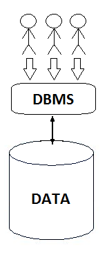
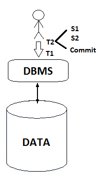

Lecture 26 - Transactions: Properties
-------------------------------------

.. role:: sql(code)
   :language: sql
   :class: highlight

In this reading we will explain in deep the properties of transactions.
As a reminder, the transactions are a concept that has been introduced as a solution for both the
concurrency problem as well as the system failure problem.
Anyone who works with databases knows that transaction support what is known as ACID properties:

 * ``A``: Atomicity
 * ``C``: Consistency
 * ``I``: Isolation
 * ``D``: Durability

We will now detail each one of these properties and explain them:

Isolation (I)
~~~~~~~~~~~~~~~
*"This property guarantees that transactions are not affected by other transactions. In other words, it allows for two or more transactions
to work over the same data independently and without error. "* [1]_

We can have a great number of clients operating in a database (as seen in the image), in which each client thinks he is
operating alone. As was commented in the previous reading, each client issues to the database a set of transactions. In
this way, the first client could issue the
transaction T1, then T2, T3 and so on. A second client could issue the transactions T9, T10, T11…

As a reminder, each transaction is in itself a set of instructions. Therefore, these transactions could contain one instruction,
two instructions and so on, but these  instructions would always be treated as a whole.

In this manner, the isolation property is implemented in a very specific way called *sequencing*.
This *sequencing* means that the operations might be intercalated between the clients, but the execution
must be equivalent to a sequential order (serial) of all the transactions.

Referring to the previous image, the system can execute all the instructions within a operation , at the
same time for everyone, but it has to guarantee that the behavior of the database is equivalent of a serial sequence.

Example
=======

Let’s suppose that client C1 issues T1 and T2 transactions and client C2 issues T3 and T4 transactions at the same time.
How many different “equivalent serial order”  can you make with these 4 transactions?
a) 2
b) 4
c) 6
d) 24
the correct answers is (c), as the possible combination are:
``T1,T2,T3,T4``; ``T1,T3,T2,T4``; ``T1,T3,T4,T2``; ``T3,T1,T2,T4``; ``T3,T1,T4,T2``; ``T3,T4,T1,T2``.

We could ask ourselves how the database system could guarantee this level of coherency while maintaining the
“intercommunication” of the operations. This is achieved with the use of protocols based in blocking some areas
of the database.

Let’s use an example from the last reading.

.. code-block:: sql

 UPDATE College SET enrollment = enrollment + 500 WHERE cName = 'UTFSM';

At the same time as

.. code-block:: sql

 UPDATE College SET enrollment = enrollment + 1000 WHERE cName = 'UTFSM';

In this example 2 clients modify the enrolment to the UTFSM. We’ll call the first instruction T1 and the second one T2,
so when we execute them the sequence is guaranteed. We’ll have now a behavior equivalent, be it T1 followed by T2 or vice versa.

So in this case, if the enrolment starts at15.000, the correct execution will output a final enrolment of 16.500, resolving
our concurrency problems.

Now will explain another example from the previous reading.

.. code-block:: sql

 UPDATE Apply SET major = 'history' WHERE sID = 1;

At the same time as

.. code-block:: sql

 UPDATE Apply SET decision = 'Y' WHERE sID = 1;

In this example, the first client makes a modification in *major* of the student *sID=1* in the table **Apply** and the
second modifies *decision* of the same student.  We’ve seen that if we allow this to execute intercalated, is possible
that only one of them is executed. Once more , with *sequencing* we’re going to obtain a behavior that guaranties a
equivalent to T1 followed by T2 or T2 followed by T1. In both cases, all the changes executed into the database,
which es what we were looking for.

Durability (D)
~~~~~~~~~~~~~~~

*“Is the property of transaction that assures that once the execution ends, its result will permanent,
independently of any problem the system presents. For example, if the hard drive fails, the system will
still be capable of remembering all the transaction the system has executed. "* [1]_

Now we only have one client and what is currently happening.

Our client (as in the image) is issuing a sequence of instructions (S1, S2, …,Sn) to the database. And
each transaction (T1, T2, …, Tn) is a sequence of instruction (S) that has at the end of it a confirmation “commit”.

If the system stops working after the “commit” command, all the effects of the transaction stay in the database.
Thanks to this, if a failure occurs by any reason, the client can be sure the database has been modified by the
transaction, and when the system comes back online, the changes will still be there.

Is possible to guarantee this, as the database system move information between the hard drive and the memory, and
a failure can occur at any moment?

The protocols used for this are not that complicate and are based in the concept of logging.

Atomicity (A)
~~~~~~~~~~~~~~
*"Any change of state that creates an atomic change, in other words, all changes are executed or none. This property
guarantees that all the actions within a transaction are carried out. This requires that if a transaction is interrupted
by a failure, it partial results must be undone. "* [1]_

This time we will also be working with a single client who sent a series of transaction to the database. Also we
are going to see the transaction T2 as set of instructions followed by a confirmation “commit”.

Atomicity works when there’s been a failure after the transaction has been “send” to the database. What this
mean is that, even in the case of a system failure, each transaction is executed all or nothing in the database.
There is also a log-in mechanism, specifically, when the system recovers from a failure and there’s a process that
was in the middle of execution when the failure took place.

Example:
=======

Consider the possibility of a relation R(A) that contains {(5), (6)} and 2 transactions
T1: UPDATE R SET A = A + 1; T2: UPDATE R SET A = 2 * A. Suppose both transactions are presented under
the same properties of isolation an atomicity. Which of the following is not a possible end state for R?

a) {(10,12)}
b) {(11,13)}
c) {(11,12)}
d) {(12,14)}

The correct answer is (c), because answer (a) only happens if T1 is not completed. Answer (b) happens when T2 is
executed before T1 and answer (d) happens when T1 is executed before T2.

Undo (Rollback) Transaction
===============================

* Undoes the partial effects of a transaction
* Can be started by the system or the user.

We’ll now execute a practical example in postgreSQL.

Example
^^^^^^^
We have the table **colors**, with its *id* and  *color*, but before starting we must define some concepts:

* **begin:** Starts a transaction. By accessing this clause, it allows the system to recover from any errors that may occur.
* **savepoint:** With this sentence a *commit* is executed, saving the data till the point which is sure to not have any errors. The difference with *commit* is that *savepoint* doesn’t ends the transaction.
* **rollback:** Undoes all the changes executed since the sentence *begin* or since the last *savepoint* .
* **commit:** confirms and ends the transaction.

.. code-block:: sql

 SELECT * FROM colors;

 id | color
 ----+--------
   1 | yellow
   2 | blue
   3 | red
   4 | green
 (4 rows)

Now we start the transaction with *commit*.

.. code-block:: sql

 begin;

With postgreSQL returning as result *BEGIN*.

We modify the color *yellow* to *black*.

.. code-block:: sql

 UPDATE colors SET color='black' WHERE color='yellow';

 SELECT * FROM colors;
 id | color
 ----+-------
   2 | blue
   3 | red
   4 | green
   1 | black
 (4 rows)

Now we confirm that till here everything is good.

.. code-block:: sql

savepoint b;

With postgreSQL returning as a result *SAVEPOINT*.

Again, we modify the color *blue* to *orange*.

.. code-block:: sql

 UPDATE colors SET color='orange' WHERE color='blue';
 SELECT * FROM colors;
 id | color
 ----+--------
   3 | red
   4 | green
   1 | black
   2 | orange
 (4 rows)

But we realize it wasn’t *orange* the color we wanted, so we go back to the last save point.

.. code-block:: sql

 rollback TO b;

With postgreSQL returning as a result *ROLLBACK*.

Returning to the previous point.

.. code-block:: sql

 SELECT * FROM colors;
 id | color
 ----+-------
   2 | blue
   3 | red
   4 | green
   1 | black
 (4 rows)

Consistency (C)
~~~~~~~~~~~~~~~~

*"This property established that only valid values or data will be stored in the database. If by any reason the
transaction violates this property, a rollback will be applied, leaving the database in its previous state.
In case the transaction is successfully executed, the database will change from the previous state to a new consistency state."* [1]_

The *consistency* property defines how the transaction interact with the integrity restrictions that can exist in a database.
When we have multiple clients interacting with the database at the same time, we can have a configuration that
satisfies all the integrity restrictions, so when a client starts operating, he can use it.

.. [1] http://www.slideshare.net/W4L73R/bases-de-datos-acid-reglas-de-codd-e-integridad-de-datos
