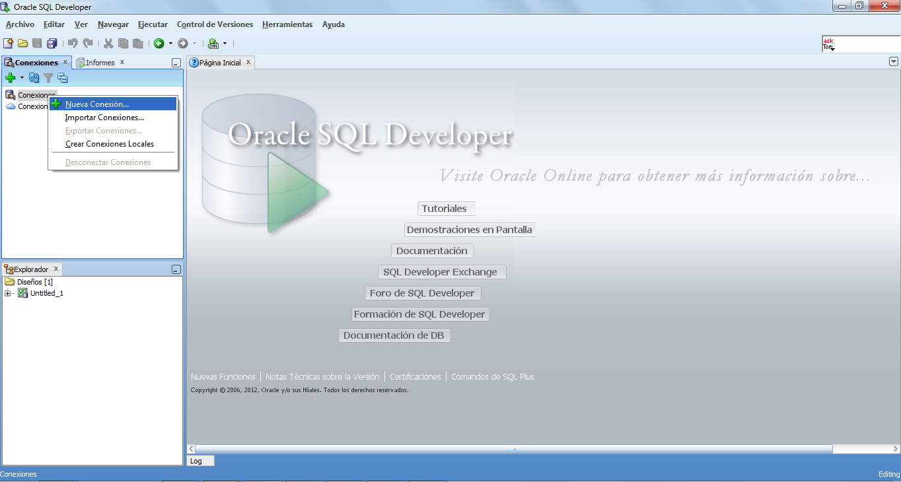
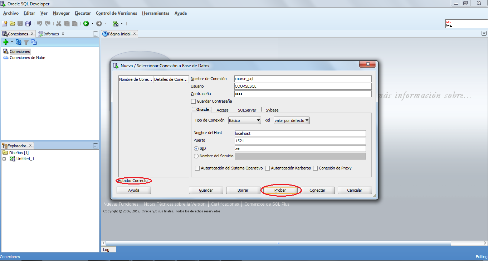
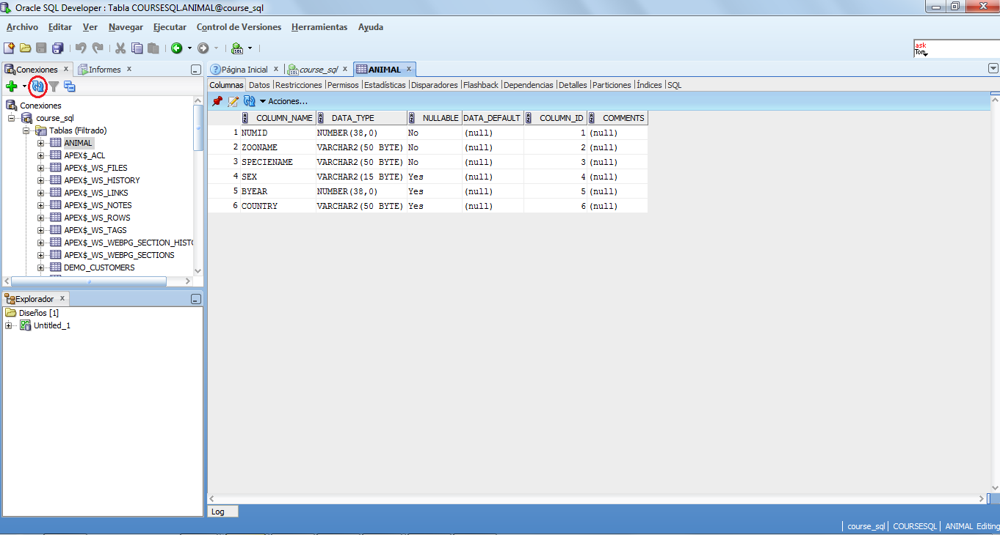
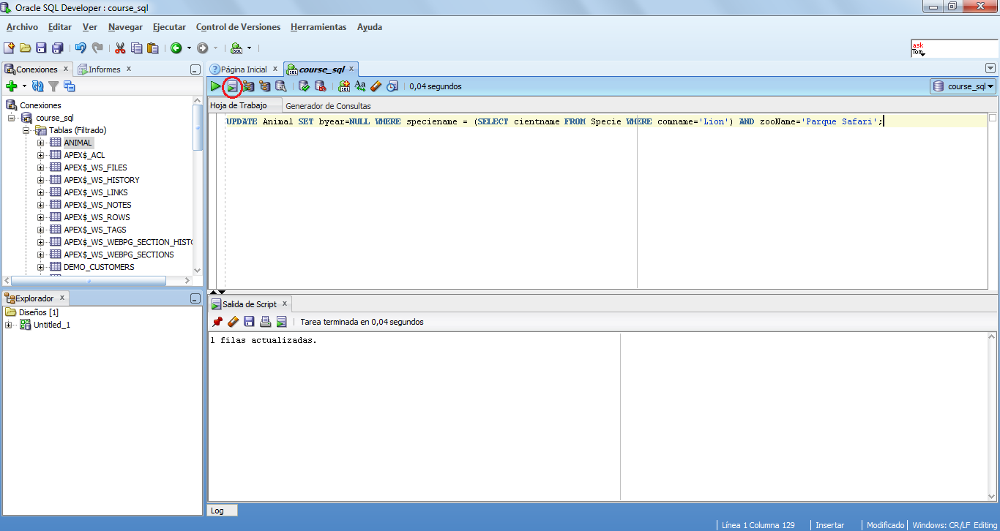
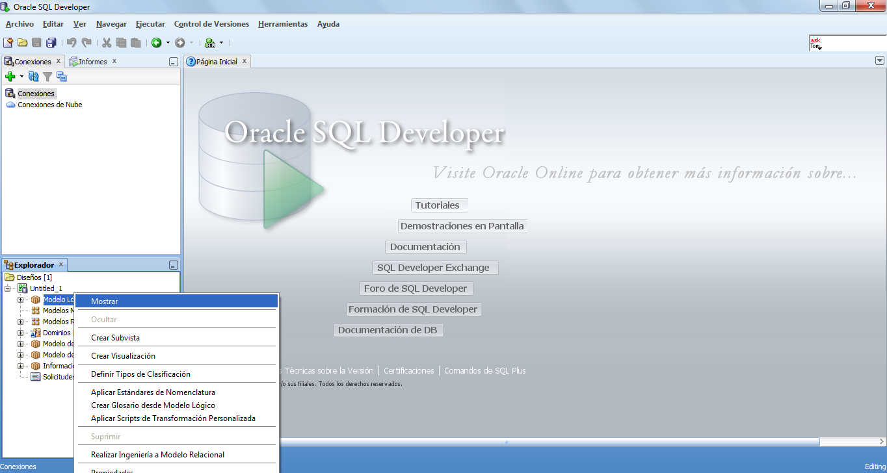
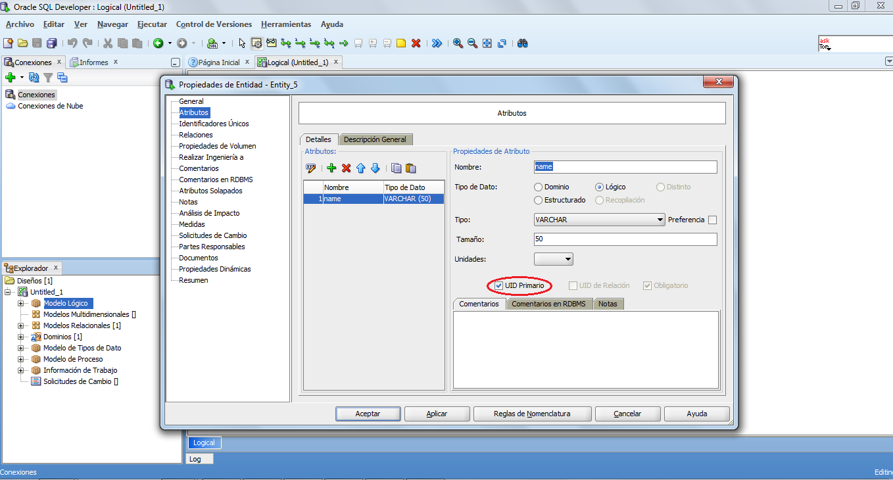
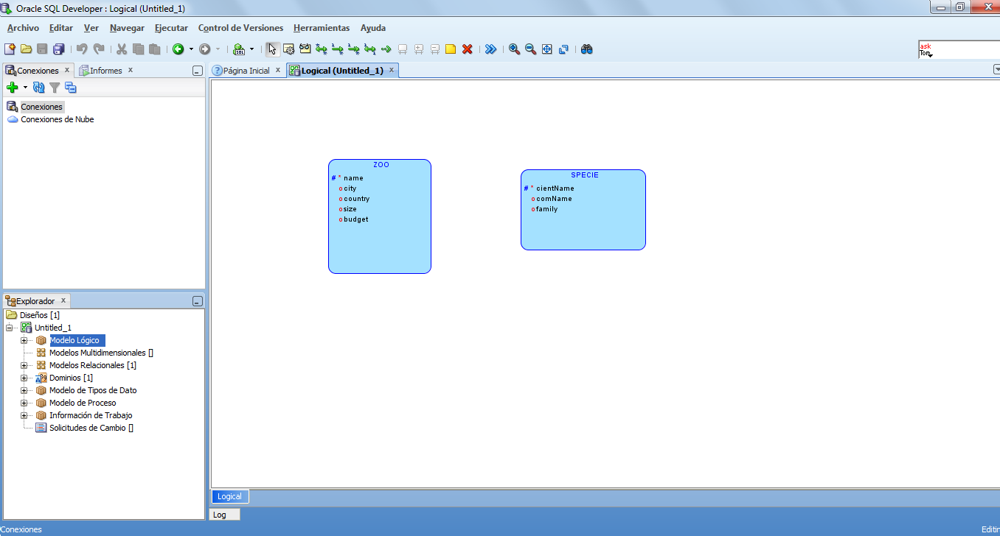
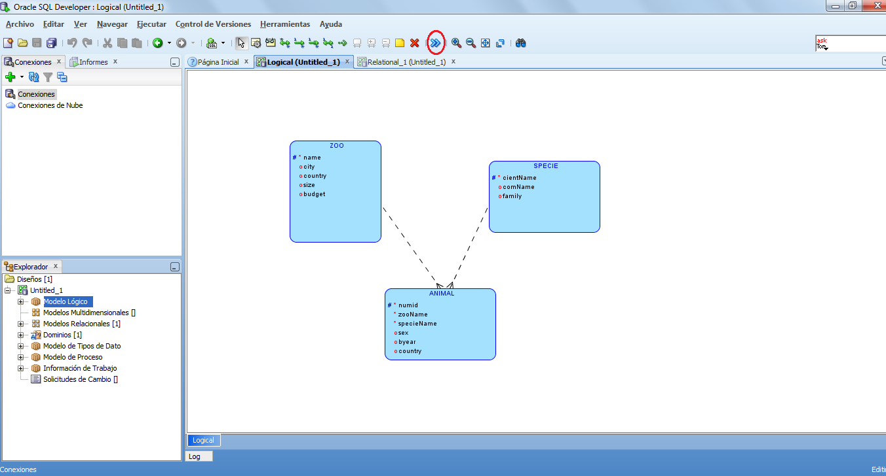
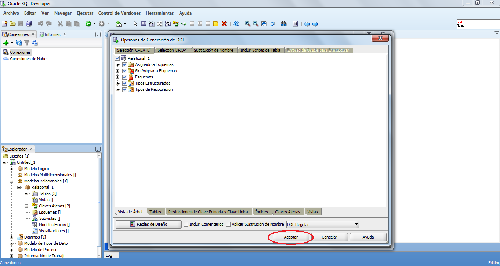

Lecture 32 - Using SQL Developer
--------------------------------

.. role:: sql(code)
  :language: sql
  :class: highlight

In this reading we will explain in detail some important tool from ``Oracle SQL Developer``, 
which can be downloaded from `first link <http://www.oracle.com/technetwork/developer-tools/sql-developer/downloads/index.html>`_.
**“JDK”** must be installed. If it isn’t, you can download it from `second link  <http://www.oracle.com/technetwork/java/javase/downloads/jdk7-downloads-1880260.html>`_.

Oracle SQL Developer
~~~~~~~~~~~~~~~~~~~~

Oracle SQL Developer is a graphic version of SQL * Plus, that offers to database developers 
a convenient way to carry out certain basic tasks. It can explore, edit and delete objects 
from a database, in addition to executing SQL commands and scripts.  
It can connect to any Oracle database scheme using standard Oracle Database authentication. 
Once connected, it can execute operations over the objects of the data base.
It can also connect to third-party database schemes (non-Oracle) such as MySQL, Microsoft SQL Server and Microsoft Access.

Instalation
~~~~~~~~~~~

1. Download the installation file from the Oracle home page.
2. Execute the file ``“sqldeveloper.exe”`` from the downloaded file
3. A window asking for the path to a ``“java”`` file will appear. In the case of windows is in the C disk, ``“Program Files->Java->jdk1.7.0_13->bin->java``.
4. The installation will start now and at the end of it Oracle SQL Developer will start.

Database Connection
~~~~~~~~~~~~~~~~~~~

Oracle
======

To set up a database connection we must first download ``Oracle Database Express Edition 
11g Release 2``, from this `third link <http://www.oracle.com/technetwork/products/express-edition/downloads/index.html>`_.

In the installation you will be required to enter a password, you must not forget it, 
as it will be used later. When the installation is ready, we open our web browser and 
enter the address `http://127.0.0.1:8080 <http://127.0.0.1:8080>`_. A screen will appear, 
where you must enter ``login: SYSTEM`` and the password you entered in the previous installation.

This will allows us to enter the ``“SYSTEM”`` session. Make click in the ``“Application Express”`` 
Tab and create a new database, for this example we will use the name **COURSESQL** and you 
must enter a new password that suit you.

.. image:: ../../../sql-course/src/lectura32/oracle2/imagen1.png                                  
  :height: 500 px                                                                      
  :width: 800 px                                                                        
  :scale: 50 %                                                                          
  :align: center  

Then we open the ``Oracle SQL Developer`` software, make right click in ``“Connections-> New Connection…”``

A window will appear where you must enter the data of the web site: ``“Connection name: 
course_sql”``, ``“User: COURSESQL”`` and ``“Password: (the one you entered before)”``. Click on 
**“Test”**,  and a message should appear on the left side of the windows saying **“Status: OK”**, 
and if all is correct we click **Connect**

Finally, we can now interact by code with the database, clicking on the ``SQL worksheet`` called **"course_sql"**.

.. image:: ../../../sql-course/src/lectura32/oracle2/imagen4.png                                  
  :height: 500 px                                                                      
  :width: 800 px                                                                        
  :scale: 50 %                                                                          
  :align: center

We will now make the Zoo queries from Assignment 4. The data can be downloaded from the claroline platform.

.. note::
 The data types from PostgreSQL and Oracle are different. The “serial” type doesn’t exists, only a trigger that makes the integer auto increase can be created.

Paste the data in the screen and click the tool **"Execute Script"**.

.. image:: ../../../sql-course/src/lectura32/oracle2/imagen5.png                                  
  :height: 500 px                                                                      
  :width: 800 px                                                                        
  :scale: 50 %                                                                          
  :align: center

Click **"Refresh"**, as to update the database with the command we executed on the Script.

We can now test queries such as the ones form the second question from Assigment 4:

*”Assing a unknow value (NULL) to the animal that has the common name “Leon” and inhabits the “Parque Safari”*

We execute a :sql:`SELECT` to visualize the changes:

.. image:: ../../../sql-course/src/lectura32/oracle2/imagen7.png                                  
  :height: 500 px                                                                      
  :width: 800 px                                                                        
  :scale: 50 %                                                                          
  :align: center

Now the modification with the command :sql:`UPDATE` assigning the value **NULL** to the animal that has the common name “Leon” and inhabits the “Parque Safari”.

And now we execute a :sql:`SELECT`, to verify the modification:

.. image:: ../../../sql-course/src/lectura32/oracle2/imagen9.png                                  
  :height: 500 px                                                                      
  :width: 800 px                                                                        
  :scale: 50 %                                                                          
  :align: center

Creation of a referential model
~~~~~~~~~~~~~~~~~~~~~~~~~~~~~~~~

To start we create our relational model entering th tab ``“View->Data Modeler->Explorer”``.

.. image:: ../../../sql-course/src/lectura32/oracle1.png
  :height: 500 px
  :width: 800 px
  :scale: 50 %                                      
  :align: center

A window in the left side of the screen will appear. Click on **"Logical Model"** and then in the **“New entity”** tool, as shown in the image (circled by red):

We draw the entity and the following window will appear:

.. image:: ../../../sql-course/src/lectura32/oracle3.png                                     
  :height: 500 px                                                                      
  :width: 800 px                                                                        
  :scale: 50 %   
  :align: center

We’ll enter the example of the Zoo from Assigment 4. In the **general** section, we add the name for the table, ``“Zoo”``.

.. image:: ../../../sql-course/src/lectura32/oracle4.png
  :height: 500 px                                                                      
  :width: 800 px                                                                        
  :scale: 50 %                                      
  :align: center  

We now, in the **"Attributes"** section, add the tables attributes, by clicking the **"+"** sign.

.. image:: ../../../sql-course/src/lectura32/oracle5.png                                     
  :height: 500 px                                                                      
  :width: 800 px                                                                        
  :scale: 50 %
  :align: center  

Enter the first atribute *Name*, click in **"Primary UID"** (Primary key). Repeat accordingly for the rest of attributes, as shown in the following images:

.. image:: ../../../sql-course/src/lectura32/oracle7.png                                     
  :height: 500 px                                                                      
  :width: 800 px                                                                        
  :scale: 50 %
  :align: center   

With the *"Zoo"* table as shown in the image:  

.. image:: ../../../sql-course/src/lectura32/oracle8.png                                     
  :height: 500 px                                                                      
  :width: 800 px                                                                        
  :scale: 50 %
  :align: center  

We make the same in the *"Specie"* table.

To create the “Animal” table, we do it in the same way as before, but as some attributes in this table are ``“NOT NULL”``, some adjustment is required. In the **“Required”** field click as shown in the picture:

.. image:: ../../../sql-course/src/lectura32/oracle10.png                                   
  :height: 500 px                                                                      
  :width: 800 px                                                                        
  :scale: 50 %
  :align: center

Finally the tables are as follows:

.. image:: ../../../sql-course/src/lectura32/oracle11.png                                   
  :height: 500 px                                                                      
  :width: 800 px                                                                        
  :scale: 50 %
  :align: center

Now we create the relation between the tables making a click on the icon of the **“New Relation 1:N”** tool and connect the *“Animal”* table with *“Zoo”* and *“Animal”* with *“Species”*.

.. image:: ../../../sql-course/src/lectura32/oracle12.png                                   
  :height: 500 px                                                                      
  :width: 800 px                                                                        
  :scale: 50 %
  :align: center

.. image:: ../../../sql-course/src/lectura32/oracle13.png                                   
  :height: 500 px                                                                      
  :width: 800 px                                                                        
  :scale: 50 %
  :align: center

The logical model is ready; all that remains is to translate it to a relational model. Click on the **“Engineer to relational model”** tool icon.

A window will appear as shown in the image. Click **“Engineer”**:

.. image:: ../../../sql-course/src/lectura32/oracle15.png                                   
  :height: 500 px                                                                      
  :width: 800 px                                                                        
  :scale: 50 %
  :align: center

We can see the tables in the relational model. But the foreign keys on the *“Animal”* must be fixed. For this we right click on the table.

.. image:: ../../../sql-course/src/lectura32/oracle16.png                                   
  :height: 500 px                                                                      
  :width: 800 px                                                                        
  :scale: 50 %
  :align: center

A window will appear that will allow for the modification of the foreign keys in the “Animal” table. Click on the **Foreign Keys** section, the in the first row that reads ``“Name->Relation_1”`` and ``“Reference Table->Zoo”``, with under it ``“Reference column->name”`` (which is attribute from the Zoo Table). Here we modify the attribute for the foreign key to *“zooName"*.
The same method is used with the second row that reads ``“Name->Relation_2”`` and ``“Reference Table->Species”``, with under it ``“Reference column->cientName”`` (which is an attribute from the Species Table). Here we modify the attribute for the foreign key to *"specieName"*.

.. image:: ../../../sql-course/src/lectura32/oracle17.png                                   
  :height: 500 px                                                                      
  :width: 800 px                                                                        
  :scale: 50 %
  :align: center

.. image:: ../../../sql-course/src/lectura32/oracle18.png                                   
  :height: 500 px                                                                      
  :width: 800 px                                                                        
  :scale: 50 %
  :align: center

With the relational model being the following:

.. image:: ../../../sql-course/src/lectura32/oracle19.png                                   
  :height: 500 px                                                                      
  :width: 800 px                                                                        
  :scale: 50 %
  :align: center

It’s possible to export this model to SQL code, by clicking the tool **"Generate DDL”**.

.. image:: ../../../sql-course/src/lectura32/oracle20.png                                   
  :height: 500 px                                                                      
  :width: 800 px                                                                        
  :scale: 50 %
  :align: center

In the next window we click **“Generate”** and **“Accept”**.

.. image:: ../../../sql-course/src/lectura32/oracle21.png                                   
  :height: 500 px                                                                      
  :width: 800 px                                                                        
  :scale: 50 %
  :align: center

And finally we **"Save"** the code:

.. image:: ../../../sql-course/src/lectura32/oracle23.png                                   
  :height: 500 px                                                                      
  :width: 800 px                                                                        
  :scale: 50 %
  :align: center  

