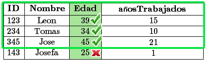
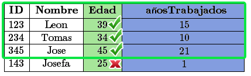
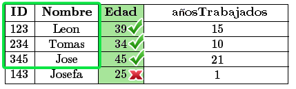
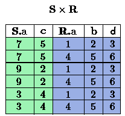
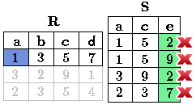
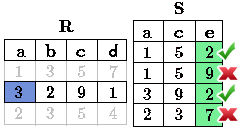
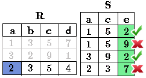

Lectura 3 - Álgebra Relacional: Select, Project, Join
-------------------------------------------------------

Conceptos básicos de álgebra relacional
~~~~~~~~~~~~~~~~~~~~~~~~~~~~~~~~~~~~~~~~

.. index:: basics of relational algebra

Algebra, en general, consiste de operadores y operandos atómicos, por ejemplo,
en el álgebra de la aritmética, los operandos atómicos son variable como `r`,
y constantes como 15.
Los operadores son los usuales en la aritmética:

 * Suma,
 * Resta,
 * Multiplicación,
 * División.

Cualquier álgebra nos permite construir expresiones mediante la aplicación de
operadores a operandos atómicos y/o otras expresiones del álgebra.
En general, los paréntesis son necesarios para agrupar operadores y sus operandos,
por ejemplo,
en aritmética tenemos expresiones tales como `(x + y) * z` ó `((x + 7)/(y - 3)) + x`.

El Álgebra Relacional es otro ejemplo del álgebra. Sus operandos atómicos son:

 1. Variables que representan relaciones.
 2. Constantes que son relaciones finitas.

.. note::

	En algunos textos de álgebra relacional o SQL, una relación es sinónimo de una tabla.

Como mencionamos, en el álgebra relacional clásica, todos los operandos y sus resultados
de expresiones son conjuntos. Los operadores del álgebra relacional tradicional se divide
en cuatro grandes categorías:

 a. Los conjuntos habituales de operaciones ``unión``, ``intersección``, y ``diferencia`` se aplica a las relaciones.
 b. Las operaciones que eliminan parte de una relación: ``selección`` elimina algunas **filas** (tuplas), y ``proyección`` elimina algunas **columnas**.
 c. Las operaciones que combinan las tuplas de dos relaciones, como el ``producto cartesiano``, que empareja las tuplas de dos relaciones en todas las maneras posibles y varios tipos de  operadores ``unión``, los cuales forman parejas de tuplas de dos relaciones selectivamente.
 d. Una operación llama “renombrar” que no afecta las tuplas de una relación, pero que cambia el esquema de relación, es decir, lo nombres de los atributos y/o los nombres de la relación misma.

Debemos por lo general referirnos a las expresiones del álgebra relacional como consultas.
A pesar de que aún no tengan los símbolos necesarios para mostrar muchas de las expresiones
del algebra relacional, se debería familiarizar con las operaciones de **grupo (a)**;
y por lo tanto reconocer: `R \cup S` como un ejemplo de una expresión de álgebra relacional.
Donde `R` y `S` son operandos atómicos para relaciones, cuyos conjuntos de tuplas son desconocidas.
Esta consulta pregunta por la ``unión`` de cualquiera tuplas que están en las relaciones
nombradas `R` y `S`.

Las tres operaciones más comunes en conjuntos son ``unión``, ``intersección``, y ``diferencia``,
que serán vistas en la lectura 4.

.. role:: sql(code)
   :language: sql
   :class: highlight

.. note:: 
	
	Resumiendo **Álgebra Relacional** se define como un conjunto de operaciones que se ejecutan sobre las relaciones (tablas) para obtener un resultado, el cual es otra relación.

Operaciones relacionales:
~~~~~~~~~~~~~~~~~~~~~~~~~~

.. index:: relational operators

Los operadores relacionales se utilizan para filtrar, cortar o combinar tablas.

Selección(Select)
******************

Este operador se aplica a una relación `R` produciendo una nueva relación con un
subconjunto de tuplas de `R`. Las tuplas de la relación resultante son las que
satisfacen una condición `C` sobre algún atributo de `R`. Es decir selecciona **filas (tuplas)**
de una tabla según un cierto criterio `C`. El criterio `C` es una expresión condicional, similar
a las declaraciones del tipo “if”, es “booleana” esto quiere decir que para cada
tupla de `R` toma el valor Verdad(true) o Falso(false).

* Valores de atributos con "NULL" no cumplirán ninguna condición.

* Cada condición simple o cláusula C tiene el formato:
  ``<Atributo> <Comparador> <Atributo o Constante del Dominio>}``.
  donde, el campo **Comparador** es un *operador lógico*, que
  pueden ser { `= , \geq , > , < , \neq , \leq` }.

   * `=` : símbolo de igual que.
   * `\neq`: significa no igual a, en algunos libros este símbolo esta representado por ``!=``.
   * `\geq`: mayor que o igual a.
   * `>`: mayor que.
   * `<`: menor que.
   * `\leq`: menor que o igual a.

Los **operadores lógicos** que se utilizan, también llamados operadores relacionales, nos proporcionan
un resultado a partir de que se cumpla o no una cierta condición. Son símbolos que se usan para comparar
dos valores. Si el resultado de la comparación es correcto la expresión considerada es verdadera, en caso
contrario es falsa. Por ejemplo, 11>4 (once mayor que cuatro) es verdadera, se representa por el valor true
del tipo básico boolean, en cambio, 11<4 (once menor que cuatro) es falsa se representa por el valor false.

Las cláusulas `C` pueden conectarse con otros operadores lógicos, que al igual que los anteriores que se usaban
como comparador (entre atributos o atributo y constante), arrojan booleano (true o false) de resultado:

 * **NOT**: El operador ``NOT`` denota una salida verdadera si la entrada es falsa,
   y una salida falsa si la entrada es verdadera. Su notación en algebra es: `¬` `C1`.
 * **AND**: El operador ``AND`` denota una salida verdadera si y sólo si sus entradas
   son verdaderas. Si `C1` se cumple y `C2` también se cumple, la salida será verdadera.
   La notación en algebra de un ``AND`` es: `C1\ \wedge \ C2`.
 * **OR**: El operador ``OR`` denota una salida verdadera si hay alguna de las entradas
   (o ambas) verdaderas. Si `C1` y/o `C2` es o son verdaderas, la expresión será verdadera.
   La notación en algebra de un ``OR`` es: `C1\ \vee \ C2`.

**Notación en Álgebra Relacional**

Para representar ``Select`` en álgebra relacional se utiliza la letra griega sigma
:math:`\sigma`. Por lo tanto, si utilizamos la notación
:math:`\sigma_{c} \ \boldsymbol{R}` queremos decir que se aplica la condición
`C` a cada tupla de `R`. Si la condición es Verdad (true),
dicha tupla pertenecerá al resultado y si es Falsa (false), dicha tupla no será seleccionada.
El esquema de la relación resultante es el mismo esquema `R`, se muestran los
atributos en el mismo orden que se usan en la tabla `R`.

Ejemplo 1
^^^^^^^^^

.. math::

 \textbf{Tabla Ingenieros} \\

   \begin{array}{|c|c|c|c|}
    \hline
    \textbf{id} & \textbf{nombre} & \textbf{edad} & \textbf{añosTrabajados}\\
    \hline
    123 & \text{Leon} & 39 & 15 \\
    \hline
    234 & \text{Tomas} & 34 & 10 \\
    \hline
    345 & \text{Jose} & 45 & 21 \\
    \hline
    143 & \text{Josefa} & 25 &  1 \\
    \hline
  \end{array}

Seleccionar las tuplas de la tabla **Ingenieros** que cumplan con tener una edad
mayor a 30 años:

**Respuesta**

.. math::
     \sigma_{\text{edad>30}} \hspace{0.2cm} \text{Ingenieros}

En la imagen se ve que selecciona solo las filas que cumplen con la condición que se pedía
(tener una edad mayor a 30 años), la tupla de "Josefa" queda fuera de la selección por no
cumplir la condición (pues 25 < 30).
De esta forma la tabla queda:

.. math::

 \textbf{Tabla Ingenieros} \\

   \begin{array}{|c|c|c|c|}
    \hline
    \textbf{id} & \textbf{nombre} & \textbf{edad} & \textbf{añosTrabajados}\\
    \hline
    123 & \text{Leon} & 39 & 15 \\
    \hline
    234 & \text{Tomas} & 34 & 10 \\
    \hline
    345 & \text{Jose} & 45 & 21 \\
    \hline
  \end{array}

Ejemplo 2
^^^^^^^^^

Seleccionar de la tabla **Ingenieros** las personas que tienen más de 30 años
y que lleven menos de 16 años trabajando:

**Respuesta**

.. math::
    \sigma_{(\text{edad} >30 \wedge \text{añosTrabajados} <16)}  \ \text{Ingenieros}

Al tener el operador lógico ``AND`` se pide que cumplan dos condiciones simultáneamente.
Primero que la edad sea mayor de 30 años, al igual que en el ejemplo anterior, la tupla
de "Josefa" queda fuera de la selección. Luego de las tuplas que quedan se evalúa la
segunda condición. En la imagen se aprecia, que solo se seleccionan las filas que no
tengan x en alguna de las condiciones.

Así finalmente quedaría la tabla:

.. math::

 \textbf{Tabla Ingenieros} \\

 \begin{array}{|c|c|c|c|}
  \hline
  \textbf{id} & \textbf{nombre} & \textbf{edad} & \textbf{añosTrabajados} \\
  \hline
  123 & \text{Leon} & 39 & 15 \\
  \hline
  234 & \text{Tomas} & 34 & 10 \\
  \hline
 \end{array}

Proyección (Project)
********************

El operador ``Proyección`` se utiliza para producir una nueva relación desde `R`. Esta
nueva relación contiene sólo algunos de los atributos de `R`,
es decir, realiza la selección de algunas de las **columnas** de una tabla `R`.

**Notación en Álgebra Relacional**

``Project`` en Álgebra Relacional se representa por la letra griega **pi**:

.. math::
       \pi \hspace{0.2cm} _{(A_1,...,A_n)} \hspace{0.3cm} \text{R}

El resultado es una relación seleccionando solo los atributos `A_1,...,A_n` de la
relación `R`.
Si `A_1,...,A_n` no incluye una llave (o clave), podrían producirse tuplas
repetidas en el resultado, las cuales serán eliminadas.

Ejemplo 1
^^^^^^^^^
.. math::

 \textbf{Tabla Ingenieros} \\

 \begin{array}{|c|c|c|c|}
  \hline
  \textbf{id} & \textbf{nombre} & \textbf{edad} & \textbf{añosTrabajados(AT)} \\
  \hline
  123 & \text{Leon} & 39 & 15 \\
  \hline
  234 & \text{Tomas} & 34 & 10 \\
  \hline
  345 & \text{Jose} & 45 & 21 \\
  \hline
  143 & \text{Josefa} & 25 & 1 \\
  \hline
 \end{array}

Escoger columnas de id y nombre de la tabla de ingenieros:

**Respuesta**

.. math::
           \pi \hspace{0.2cm}_{(\text{id,nombre})} \hspace{0.3cm} \text{Ingenieros}

La tabla finalmente queda como:

.. math::

 \textbf{Tabla Ingenieros}  \\

 \begin{array}{|c|c|}
  \hline
  \textbf{id} & \textbf{nombre} \\
  \hline
  123 & \text{Leon} \\
  \hline
  234 & \text{Tomas} \\
  \hline
  345 & \text{Jose} \\
  \hline
  143 & \text{Josefa} \\
  \hline
 \end{array}

Ejemplo 2
^^^^^^^^^

Seleccionar id y nombre de los Ingenieros que tienen más de 30 años.

**Respuesta**

.. math::
       \pi \hspace{0.2cm} _{(\text{id,nombre})} (\sigma_{\text{edad>30}} \hspace{0.3cm} \text{Ingenieros})

Se aprecia que las tuplas que no cumplan con la condición de selección quedan fuera del resultado,
luego se realiza un ``Project`` sobre las filas del resultado, separando solo las columnas que
contienen los atributos id y nombre. Finalmente la tabla queda de la siguiente manera:

.. math::

 \textbf{Tabla Ingenieros} \\

 \begin{array}{|c|c|}
  \hline
  \textbf{id} & \textbf{nombre} \\
  \hline
  123 & \text{Leon} \\
  \hline
  234 & \text{Tomas} \\
  \hline
  345 & \text{Jose} \\
  \hline
 \end{array}

Producto cartesiano (Cross-Product)
************************************

En teoría de conjuntos, el ``producto cartesiano`` de dos conjuntos es una operación
que resulta en otro conjunto cuyos elementos son todos los pares ordenados que
pueden formarse tomando el primer elemento del par del primer conjunto,
y el segundo elemento del segundo conjunto. En el Álgebra Relacional se mantiene
esta idea con la diferencia que `R` y `S` son relaciones, entonces los miembros de `R`
y `S` son tuplas, que generalmente consisten de más de un componente,
cuyo resultado de la vinculación de una tupla de `R` con una tupla de `S` es una tupla
más larga, con un componente para cada uno de los componentes de las tuplas
constituyentes. Es decir ``Cross-product`` define una relación que es la concatenación
de cada una de las filas de la relación `R` con cada una de las filas de la relación `S`.

**Notación en Álgebra Relacional**

Para representar ``Cross-product`` en Álgebra Relacional se utiliza la siguiente
terminología:

.. math::
    \text{R} \times \text{S}

Por convención para la sentencia anterior, los componentes de `R` preceden a los
componentes de `S` en el orden de atributos para el resultado, creando así una nueva
relación con todas las combinaciones posibles de tuplas de `R` y `S`.
El número de tuplas de la nueva relación resultante es la multiplicación de la cantidad
de tuplas de `R` por la cantidad de tuplas que tenga `S` (producto de ambos).
Si `R` y `S` tienen algunos atributos en común, entonces se debe inventar nuevos nombres
para al menos uno de cada par de atributos idénticos. Para eliminar la ambigüedad de
un atributo `a`, que se encuentra en `R` y `S`, se usa `R.a` para el atributo de `R` y `S.a` para
el atributo de `S`.

Cabe mencionar que por notación que: `\text{R} \times \text{S} \neq  \text{S} \times \text{R}`

Ejemplo 1
^^^^^^^^^
.. image:: ../../../sql-course/src/CROSS-PRODUCT1.png
   :align: center

Con las tablas dadas realice el ``Cross-product`` de `R` con `S`:

.. image:: ../../../sql-course/src/CROSS-PRODUCT2.png
   :align: center

Con azul se resaltan las tuplas que provienen de `R` que preseden y se mezclan con las de `S` resaltadas en verde.

Con las tablas dadas realice el ``Cross-product`` de `S` con `R`:

Ejemplo 2
^^^^^^^^^

Dada las siguientes tablas:

.. math::

 \textbf{Tabla Ingenieros} \\

 \begin{array}{|c|c|c|}
  \hline
  \textbf{id} & \textbf{nombre} & \textbf{d#} \\
  \hline
  123 & \text{Leon} & 39 \\
  \hline
  234 & \text{Tomas} & 34 \\
  \hline
  143 & \text{Josefa} & 25 \\
  \hline
 \end{array}

 \textbf{Tabla Proyectos} \\

 \begin{array}{|c|c|}
  \hline
  \textbf{proyecto} & \textbf{duracion} \\
  \hline
  \text{ACU0034} & 300 \\
  \hline
  \text{USM7345} & 60 \\
  \hline
 \end{array}

Escriba la tabla resultante al realizar la siguiente operación:

.. math::

    \textbf{Ingenieros} \times \textbf{Proyectos}

**Respuesta**

.. math::

 \textbf{Ingenieros} \times \textbf{Proyectos} \\

 \begin{array}{|c|c|c|c|c|}
  \hline
  \textbf{id} & \textbf{nombre} & \textbf{d#} & \textbf{proyecto} & \textbf{duracion} \\
  \hline
  123 & \text{Leon} & 39 & \text{ACU0034} & 300 \\
  \hline
  123 & \text{Leon} & 39 & \text{USM7345} & 60 \\
  \hline
  234 & \text{Tomas} & 34 & \text{ACU0034} & 300 \\
  \hline
  234 & \text{Tomas} & 34 & \text{USM7345} & 60 \\
  \hline
  143 & \text{Josefa} & 25 & \text{ACU0034} & 300 \\
  \hline
  143 & \text{Josefa} & 25 & \text{USM7345} & 60 \\
  \hline
 \end{array}

NaturalJoin
************

Este operador se utiliza cuando se tiene la necesidad de unir relaciones vinculando
sólo las tuplas que coinciden de alguna manera. ``NaturalJoin`` une sólo los pares de
tuplas de `R` y `S` que sean comunes. Más precisamente una tupla r de `R` y una tupla s de `S`
se emparejan correctamente si y sólo si r y s coinciden en cada uno de los valores
de los atributos comunes, el resultado de la vinculación es una tupla, llamada
“joined tuple”. Entonces, al realizar ``NaturalJoin`` se obtiene una relación con los
atributos de ambas relaciones y se obtiene combinando las tuplas de ambas relaciones
que tengan el mismo valor en los atributos comunes.

**Notación en Álgebra Relacional**

Para denotar ``NaturalJoin`` se utiliza la siguiente simbología: `\text{R} \rhd \hspace{-0.1cm} \lhd \text{S}`.

**Equivalencia con operadores básicos**

``NaturalJoin`` puede ser escrito en términos de algunos operadores ya vistos, la equivalencia
es la siguiente:

.. math::
   R \rhd \hspace{-0.1cm} \lhd S=  \pi \hspace{0.2cm} _{R.A_1,...,R.A_n,  S.A_1,...,S.A_n} (\sigma_{R.A_1=S.A_1 \wedge ... \wedge R.A_n=S.A_n  }\hspace{0.3cm} (R \times S ))

**Método**

    1. Se realiza el producto cartesiano `\text{R} \times \text{S}` .
    2. Se seleccionan aquellas filas del producto cartesiano para las que los atributos
       comunes tengan el mismo valor.
    3. Se elimina del resultado una ocurrencia (columna) de cada uno de los atributos comunes.

Ejemplo 1
^^^^^^^^^

.. math::

 \textbf{R}  \\

 \begin{array}{|c|c|c|}
  \hline
  \textbf{a} & \textbf{b} & \textbf{c} \\
  \hline
  1 & 2 & 3 \\
  \hline
  4 & 5 & 6 \\
  \hline
 \end{array}

 \textbf{S} \\

 \begin{array}{|c|c|}
  \hline
  \textbf{c} & \textbf{d} \\
  \hline
  7 & 5 \\
  \hline
  6 & 2 \\
  \hline
  3 & 4 \\
  \hline
 \end{array}

Con las tablas dadas realice el ``NaturalJoin`` de `R` y `S`:

.. image:: ../../../sql-course/src/NATURALJOIN.png
    :align: center

El atributo que tienen en común `R` y `S` es el atributo *c*, entonces las tuplas se unen donde *c* tiene el mismo valor en `R` y `S`

.. math::
 \textbf{R} \rhd \hspace{-0.1cm} \lhd \textbf{S} \\

 \begin{array}{|c|c|c|c|}
  \hline
  \textbf{a} & \textbf{b} & \textbf{c} & \textbf{d} \\
  \hline
  1 & 2 & 3 & 4 \\
  \hline
  4 & 5 & 6 & 2 \\
  \hline
 \end{array}

Ejemplo 2
^^^^^^^^^

Realizar ``NaturalJoin`` a las siguientes tablas:

.. math::

 \textbf{Tabla Ingenieros} \\

 \begin{array}{|c|c|c|}
  \hline
  \textbf{id} & \textbf{nombre} & \textbf{d#} \\
  \hline
  123 & \text{Leon} & 39 \\
  \hline
  234 & \text{Tomas} & 34\\
  \hline
  143 & \text{Josefa} & 25 \\
  \hline
  090 & \text{Maria} & 34 \\
  \hline
 \end{array}

 \textbf{Tabla Proyectos} \\

 \begin{array}{|c|c|}
  \hline
  \textbf{d#} & \textbf{proyecto}\\
  \hline
  39 & \text{ACU0034} \\
  \hline
  34 & \text{USM7345} \\
  \hline
 \end{array}

**Respuesta**

.. math::

 \textbf{Ingenieros} \rhd \hspace{-0.1cm} \lhd \textbf{Proyectos} \\

 \begin{array}{|c|c|c|c|}
  \hline
  \textbf{id} & \textbf{nombre} & \textbf{d#} & \textbf{proyecto} \\
  \hline
  123 & \text{Leon} & 39 & \text{ACU0034} \\
  \hline
  234 & \text{Tomas} & 34 & \text{USM7345} \\
  \hline
  090 & \text{Maria} & 34 & \text{USM7345} \\
  \hline
 \end{array}

ThetaJoin
**********

Define una relación que contiene las tuplas que satisfacen el predicado C en el
``producto cartesiano`` de `\text{R} \times \text{S}`.
Conecta relaciones cuando los valores de determinadas columnas tienen una interrelación
específica. La condición C es de la forma ``R.ai <operador_de_comparación> S.bi``,
esta condición es del mismo tipo que se utiliza ``SELECT`` . El predicado no tiene por que
definirse sobre atributos comunes. El término “join” suele referirse a ``ThetaJoin``.

**Notación en Álgebra Relacional**

La notación de ``ThetaJoin`` es el mismo símbolo que se utiliza para ``NaturalJoin``, la
diferencia radica en que ``ThetaJoin`` lleva el predicado C:

.. math::
    \text{R} \rhd \hspace{-0.1cm} \lhd_C \text{S} \\

``<Atributo> <Comparador> <Atributo o Constante del Dominio>`` Donde: ``<Comparador>`` `\in {\{=,\geq,>,<, \neq,\leq \}}`

**Equivalencia con operadores básicos**

Al igual ``NaturalJoin``, ``ThetaJoin`` puede ser escrito en función de los operadores vistos
anteriormente:

.. math::
   R \rhd \hspace{-0.1cm} \lhd_C S= \sigma_{F} (R \times S)

**Método**

   1. Se forma el ``producto cartesiano`` `\text{R} \times \text{S}` .
   2. Se selecciona, en el producto, solo la tupla que cumplan la condición `C`.

Ejemplo 1
^^^^^^^^^

.. math::

 \textbf{R} \\

 \begin{array}{|c|c|c|c|}
  \hline
  \textbf{a} & \textbf{b} & \textbf{c} & \textbf{d} \\
  \hline
  1 & 3 & 5 & 7 \\
  \hline
  3 & 2 & 9 & 1 \\
  \hline
  2 & 3 & 5 & 4 \\
  \hline
 \end{array}

 \textbf{S} \\

 \begin{array}{|c|c|c|}
  \hline
  \textbf{a} & \textbf{c} & \textbf{e} \\
  \hline
  1 & 5 & 2 \\
  \hline
  1 & 5 & 9 \\
  \hline
  3 & 9 & 2 \\
  \hline
  2 & 3 & 7 \\
  \hline
 \end{array}

Escriba la tabla resultante al realizar la siguiente operación:

.. math::
   R \rhd \hspace{-0.1cm} \lhd_{(a >= e)} S 

**Respuesta**

Se compara el atributo *a* de la primera fila de `R` con cada uno de los valores del atributo
*e* de la tabla `S`. En este caso ninguna de las comparaciones devuelve el valor verdadero (true).

Luego se compara el atributo *a* de la segunda fila de `R` con cada uno de los valores del atributo
*e* de la tabla `S`. En este caso 2 comparaciones devuelven el valor verdadero (true), por lo que en
la relación de resultado quedará la segunda fila de `R` mezclada con la primera y tercera fila de `S`.

De igual forma ahora se compara el valor de *a* de la tercera tupla de `R`, nuevamente 2 tuplas de `S`
cumplen con la condición.

.. math::

 \textbf{S} \\

 \begin{array}{|c|c|c|c|c|c|c|}
  \hline
  \textbf{R.a} & \textbf{b} & \textbf{R.c} & \textbf{d} & \textbf{S.a} & \textbf{S.c} & \textbf{e} \\
  \hline
  3 & 2 & 9 & 1 & 1 & 5 & 2 \\
  \hline
  3 & 2 & 9 & 1 & 3 & 9 & 2 \\
  \hline
  2 & 3 & 5 & 4 & 1 & 5 & 2 \\
  \hline
  2 & 3 & 5 & 4 & 3 & 9 & 2 \\
  \hline
 \end{array}

Ejemplo 2
^^^^^^^^^

Con el esquema conceptual siguiente, hallar los nombres de los directores de cada departamento:

`\text{Dpto} (\underline{\text{numDpto}} \text{, nombre, nIFDirector, fechaInicio})`

`\text{Empleado} (\underline{\text{nIF}} \text{, nombre, direccion, salario, dpto, nIFSupervisor})`

**Respuesta**

.. math::
    \pi_{(\text{Dpto.nombre,empleado.nombre})} (\text{Dpto} \rhd \hspace{-0.1cm} \lhd_{\text{nIFDirector=NIF}} \text{Empleado})

* Tuplas con "Null" en los “Atributos de la Reunión”, no se incluyen en el resultado.

Ejercicio propuesto
^^^^^^^^^^^^^^^^^^^^

Considere la siguiente base de datos:

   1. `\text{Persona}(\underline{\text{nombre}} \text{, edad, genero})` : nombre es la clave.
   2. `\text{Frecuenta}(\underline{\text{nombre, pizzeria}})` : (nombre, pizzeria) es la clave.
   3. `\text{Come}(\underline{\text{nombre, pizza}})` : (name, pizza) es la clave.
   4. `\text{Sirve}(\underline{\text{pizzeria, pizza}}\text{, precio})`: (pizzeria, pizza) es la clave.

Escribir expresiones en álgebra relacional para las siguientes dos preguntas:

  * Seleccionar a las personas que comen pizzas con extra queso.
  * Seleccionar a las personas que comen pizzas con extra queso y frecuentan la
    pizzería X.

