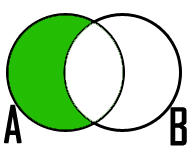
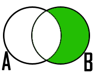
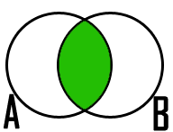

Lectura 4 - Álgebra Relacional: Set operators, renaming, notation
===================================================================

Operaciones de conjunto:
------------------------

.. index:: Operaciones de conjunto:

Unión
*****

En matemáticas, se denomina **álgebra de conjuntos** a las operaciones básicas que pueden
realizarse con conjuntos, como la unión, intersección, etc. Un **conjunto** es una colección
de objetos considerada como un objeto en sí. La ``Unión`` de dos conjuntos `\text{A}` y `\text{B}` es el
conjunto que contiene todos los elementos de `\text{A}` y de `\text{B}`.
El símbolo `\cup` es el utilizado para representar ``Unión``.

El operador ``Unión`` es **conmutativo** es decir  `\text{A} \cup \text{B} = \text{B} \cup \text{A}`. Cabe recordar que una
operación es **conmutativa** cuando el resultado de la operación es el mismo, cualquiera que sea
el orden de los elementos con los que se opera.

.. image:: ../../../sql-course/src/union.png
   :align: center

De manera análoga, la ``Unión`` de dos relaciones `\text{R}` y `\text{S}`, es otra relación que contiene
las tuplas que están en `\text{R}`, o en `\text{S}`, o en ambas, eliminándose las tuplas duplicadas.
`\text{R}` y `\text{S}` deben ser **unión-compatible**, es decir, definidas sobre el mismo conjunto de
atributo (`\text{R}` y `\text{S}` deben tener **esquemas idénticos**. Deben poseer las mismas columnas
y su orden debe ser el mismo).

**Notación en álgebra relacional**

.. math::

    \text{R} \cup \text{S} \\

Si se realiza `\text{R} \cup \text{S}` es lo mismo que  `\text{S} \cup \text{R}` , es decir se obtiene el mismo
resultado. Esto debido a la propiedad de conmutatividad derivada de la álgebra de conjuntos.

Ejemplo
^^^^^^^^
Dadas las siguientes relaciones:

.. math::
 \textbf{Tabla Ingenieros} \\

   \begin{array}{|c|c|c|}
        \hline
         \textbf{id} & \textbf{nombre} & \textbf{edad}\\
        \hline
        123 & \text{Leon}   & 39\\
        \hline
        234 & \text{Tomas}  & 34\\
        \hline
        345 & \text{Jose}   & 45\\
        \hline
        143 & \text{Josefa} & 25\\
        \hline
   \end{array}

.. math::
 \textbf{Tabla Jefes} \\

      \begin{array}{|c|c|c|}
        \hline
         \textbf{id} & \textbf{nombre} & \textbf{edad}\\
        \hline
        123 & \text{Leon}   & 39\\
        \hline
        235 & \text{Maria}   & 29\\
        \hline
      \end{array}

Aplicar el operador ``Unión``:

.. math::

 \textbf{Tabla Ingenieros} \cup  \textbf{Jefes}  \\

   \begin{array}{|c|c|c|}
        \hline
         \textbf{id} & \textbf{nombre} & \textbf{edad}\\
        \hline
        123 & \text{Leon}   & 39\\
        \hline
        234 & \text{Tomas}  & 34\\
        \hline
        345 & \text{Jose}   & 45\\
        \hline
        143 & \text{Josefa} & 25\\
        \hline
        235 & \text{Maria} & 29\\
        \hline
   \end{array}

Como se mencionó anteriormente, realizar la operación `\text{Jefes} \cup \text{Ingenieros}`
daría como resultado la misma tabla anterior, debido a la propiedad de conmutatividad.

Diferencia
***********

Volviendo a la analogía de álgebra de conjuntos, la diferencia entre dos conjuntos
`\text{A}` y `\text{B}` es el conjunto que contiene todos los elementos de `\text{A}` que no pertenecen a `\text{B}`.

.. math:: A-B

.. math::
	B-A

Como se aprecia en las imágenes la operación ``Diferencia``, en conjuntos, no es
conmutativa, al igual que la resta o sustracción, operador aprendido en aritmética
básica. Es decir, si se cambia el orden de los conjuntos a los  que se aplica la
operación ``Diferencia``, se obtendrán resultados distintos. Por lo tanto:

.. math::
    \text{A} - \text{B} \neq  \text{B} - \text{A}

De la misma forma la diferencia de dos relaciones `\text{R}` y `\text{S}`, es otra relación
que contiene las tuplas que están en la relación `\text{R}`, pero no están en `\text{S}`.
`\text{R}` y `\text{S}` deben ser **unión-compatible** (deben tener esquemas idénticos).

**Notación en álgebra relacional**

.. math::

    R - S

Es importante resaltar que `\text{R} - \text{S}` es diferente a `\text{S} - \text{R}`.

Ejemplo
^^^^^^^^

Empleando las mismas tablas dadas en el ejemplo anterior, realice `\text{Ingenieros} - \text{Jefes}`
y `\text{Jefes} - \text{Ingenieros}`:

.. math::
   \textbf{Ingenieros - Jefes} \\

   \begin{array}{|c|c|c|}
        \hline
         \textbf{id} & \textbf{nombre} & \textbf{edad}\\
        \hline
        234 & \text{Tomas}  & 34\\
        \hline
        345 & \text{Jose}   & 45\\
        \hline
        143 & \text{Josefa} & 25\\
        \hline
   \end{array}

.. math::
   \textbf{Jefes - Ingenieros} \\

   \begin{array}{|c|c|c|}
        \hline
        \textbf{id} & \textbf{nombre} & \textbf{edad}\\
        \hline
        235 & \text{Maria} & 29\\
        \hline
   \end{array}

Como se puede apreciar, ambas operaciones dieron como resultado distintas relaciones,
tal como se había mencionado anteriormente.

Intersección
*************

En  álgebra de conjuntos la ``Intersección`` de dos conjuntos `\text{A}` y `\text{B}` es el conjunto
que contiene todos los elementos comunes de `\text{A}` y `\text{B}`. El símbolo `\cap` representa
la ``Intersección`` de dos conjuntos. Al igual que el operador ``Unión``, ``Intersección``
es conmutativo, entonces se cumple que `\text{A} \cap \text{B} = \text{B} \cap \text{A}` .

.. math::
    \text{A} \cap \text{B}

De forma homóloga en álgebra relacional, ``Intersección`` define una relación que contiene
las tuplas que están tanto en la relación `\text{R}` como en `\text{S}`. `\text{R}` y `\text{S}` deben ser **unión-compatible**
(mismos atributos y mismo orden).

**Notación en algebra relacional**

.. math::
    \text{R} \cap \text{S}

Si se realiza `\text{R} \cap \text{S}` es lo mismo que `\text{S} \cap \text{R}`, es decir se obtiene el mismo resultado,
se puede decir que ``Intersección`` **es conmutativa**.

**Equivalencia con operadores anteriores**

.. math::
    \text{R} \cap \text{S}= \text{R}-(\text{R}-\text{S})

Ejemplo
^^^^^^^^

Utilizando las mismas tablas del ejemplo anterior, encontrar la ``Intersección`` de la tabla de
`\text{Ingenieros}` con la de `\text{Jefes}`:

.. math::
    \text{Ingenieros} \cap \text{Jefes}

      \begin{array}{|c|c|c|}
        \hline
         \textbf{id} & \textbf{nombre} & \textbf{edad}\\
        \hline
        123 & \text{Leon}   & 39\\
        \hline
      \end{array}

.. important::

   Para aplicar estas operaciones a relaciones, necesitamos que `\text{R}` y `\text{S}` sean **unión-compatible**:

      * `\text{R}` y `\text{S}` deben tener esquemas con conjuntos de atributos idénticos, y de tipos (dominios) para cada atributo deben ser las mismas en `\text{R}` y `\text{S}`.
      * Antes de computar el conjunto-teórico unión, intersección, o diferencia de conjuntos de tuplas, las columnas de `\text{R}` y `\text{S}` deben ser ordenadas para que el orden de los atributos sean los mismos para ambas relaciones.

Operaciones dependientes e independientes
------------------------------------------

Algunas de las operaciones que se han descrito en las lecturas 3 y 4, pueden ser expresadas
en términos de operadores de algebra relacional.
Por ejemplo, la intersección puede ser expresada en términos de conjuntos de diferencia:
`\text{R} \cap \text{S} = \text{R} - (\text{R} - \text{S})`. Es decir, si `\text{R}` y `\text{S}` son 
dos relaciones con el mismo esquema, la intersección de `\text{R}` y `\text{S}` puede ser resuelta 
restando primero `\text{S}` de `\text{R}` para formar una relación `T` que consiste en todas aquellas
tuplas en `\text{R}` pero no en `\text{S}`. Cuando se resta `\text{T}` de `\text{R}`, dejamos solo esas tuplas de `\text{R}` que están también en `\text{S}`.

Álgebra relacional como idioma restrictor
------------------------------------------

Hay dos maneras en las cuales podemos usar expresiones de algebra relacional para expresar restricción:

   1. Si `\text{R}` es una expresión de algebra relacional, entonces `\text{R} = 0` es una restricción que dice
   “El valor de `\text{R}` debe ser vacio,” o equivalentemente “No hay tuplas en el resultado de `\text{R}`."

   2. Si `\text{R}` y `\text{S}` son expresiones de algebra relacional, entonces `\text{R} \subset \text{S}` es una restricción
   que dice “Cada tupla en resultado de `\text{R}` debe estar también en resultado de `\text{S}`." Por supuesto, el
   resultado de `\text{S}` puede contener tuplas adicionales no producidas en `\text{R}`.

Estas formas para expresar restricción son de hecho equivalentes en lo que pueden expresar, pero algunas
veces uno de los dos es más clara o más sucinta. Es decir, la restricción `\text{R} \subset \text{S}` pudo también ser
escrito `\text{R} - \text{S} = 0`. Para ver por qué, observe que si cada tupla en `\text{R}` está también en `\text{S}`, entonces
seguramente `\text{R} - \text{S}` es vacío. A la inversa, si `\text{R} - \text{S}` no contiene tuplas, entonces cada tupla en `\text{R}`
debe estar en `\text{S}` (o de lo que sería `\text{R} - \text{S}`).

Por otra parte, una restricción de la primera forma, `\text{R} = 0`, también pudo haber sido escrita como
`\text{R} \subset 0`. Técnicamente, `0` no es una expresión de algebra relacional, pero ya que hay expresiones
que evalúan a `0`, tal como `\text{R} - \text{R}`, no hay nada malo en usar `0` como una expresión de algebra relacional.
Tenga en cuenta que estas equivalencias sostienen se sostienen incluso si `\text{R}` y `\text{S}` son bolsas, dado que
hacemos la interpretación convencional de `\text{R} \subset \text{S}`: cada tupla `t` aparece en `\text{S}` al menos tantas
veces como aparece en `\text{R}`.

Ejercicios Propuestos
*********************

Ejercicio 1
^^^^^^^^^^^^
Las relaciones base que forman la base de datos de un video club son las siguientes:

* `\text{Socio}(\underline{\text{codsocio}},\text{nombre,direccion,telefono})`: almacena los datos de cada uno de los socios del video club: código del socio, nombre, dirección y teléfono.

* `\text{Pelicula}(\underline{\text{codpeli}},\text{titulo,genero})`: almacena información sobre cada una de las películas de las cuales tiene copias el vídeo club: código de la película, título y género (terror, comedia, etc.).

* `\text{Cinta}(\underline{\text{codcinta}},\text{codpeli})`: almacena información referente a las copias que hay de cada película (copias distintas de una misma película tendrán distinto código de cinta).

* `\text{Prestamo}(\underline{\text{codsocio,codcinta,fecha}},\text{presdev})`: almacena información de los préstamos que se han realizado. Cada préstamo es de una cinta a un socio en una fecha. Si el préstamo aún no ha finalizado, presdev tiene el valor 'prestada'; si no su valor es 'devuelta'.

* `\text{ListaEspera}(\underline{\text{codsocio,codpeli}},\text{fecha})`: almacena información sobre los socios que esperan a que haya copias disponibles de películas, para tomarlas prestadas. Se guarda también la fecha en que comenzó la espera para mantener el orden. Es importante tener en cuenta que cuando el socio consigue la película esperada, éste desaparece de la lista de espera.

En las relaciones anteriores, son claves primarias los atributos y grupos de atributos que aparecen en negrita. Las claves ajenas se muestran en los siguientes diagramas referenciales:

Resolver las siguientes consultas mediante el álgebra relacional (recuerde que en la lectura 3 también se dieron algunos operadores de álgebra relacional):

1.1. Seleccionar todos los socios que se llaman: "Charles".

**Respuesta**

.. math::
    \sigma_{\text{nombre='Charles'}} \text{(Socio)}

1.2. Seleccionar el código socio de todos los socios que se llaman: "Charles".

**Respuesta**

.. math::
    \pi_{\text{codsocio}}(\sigma_{\text{nombre='Charles'}} \text{(Socio))}

1.3. Seleccionar los nombres de las películas que se encuentran en lista de espera.

**Respuesta**

.. math::
    \pi_{\text{titulo}}(\text{Pelicula} \rhd \hspace{-0.1cm} \lhd \text{ListaEspera})

1.4. Obtener los nombres de los socios que esperan películas.

**Respuesta**

.. math::
    \pi_{\text{nombre}}(\text{Socio} \rhd \hspace{-0.1cm} \lhd \text{ListaEspera})

1.5. Obtener los nombres de los socios que tienen actualmente prestada una película que ya tuvieron prestada con anterioridad.

**Respuesta**

.. math::
    \pi_{\text{nombre}} ( \{(\text{Prestamo} \rhd \hspace{-0.1cm} \lhd_{ (\text{presdev='prestada'})} \text{Cinta}) \cap (\text{Prestamo} \rhd \hspace{-0.1cm} \lhd_{(\text{presdev='devuelta'})} \text{Cinta})\} \rhd \hspace{-0.1cm}\lhd \text{Socio})

1.6. Obtener los títulos de las películas que nunca han sido prestadas.

**Respuesta**

.. math::
    \pi_{\text{titulo}} \{(\pi_{\text{codpeli}} \text{Pelicula}  - \pi_{\text{codpeli}} (\text{Prestamo} \rhd \hspace{-0.1cm} \lhd \text{Cinta}) ) \rhd \hspace{-0.1cm} \lhd \text{Pelicula}\}

(todas las películas) menos (las películas que han sido prestadas alguna vez)

1.7. Obtener los nombres de los socios que han tomado prestada la película “WALL*E” alguna  vez o que están esperando para tomarla prestada.

**Respuesta**

.. math::
    \pi_{\text{codsocio,nombre}}((\text{Socio} \rhd \hspace{-0.1cm} \lhd \text{Prestamo} \rhd \hspace{-0.1cm} \lhd \text{Cinta} \rhd \hspace{-0.1cm} \lhd_{\text{titulo='WALL*E'}} \text{Pelicula}) \cup \\ (\text{Socio} \rhd \hspace{-0.1cm} \lhd \text{ListaEspera} \rhd \hspace{-0.1cm} \lhd_{\text{titulo='WALL*E'}} \text{Pelicula}) )

1.8. Obtener los nombres de los socios que han tomado prestada la película “WALL*E” alguna vez y que además están en su lista de espera.

**Respuesta**

.. math::
    \pi_{\text{codsocio,nombre}}((\text{Socio} \rhd \hspace{-0.1cm} \lhd \text{Prestamo} \rhd \hspace{-0.1cm} \lhd \text{Cinta} \rhd \hspace{-0.1cm} \lhd_{\text{titulo='WALL*E'}} \text{Pelicula}) \cap \\ (\text{Socio} \rhd \hspace{-0.1cm} \lhd \text{ListaEspera} \rhd \hspace{-0.1cm} \lhd_{\text{titulo='WALL*E'}} \text{Pelicula}) )

Ejercicio 2
^^^^^^^^^^^^

Considere la base de datos con el siguiente esquema:

   1. `\text{Persona}(\underline{\text{nombre}} \text{, edad, genero})` : nombre es la clave.
   2. `\text{Frecuenta}(\underline{\text{nombre, pizzeria}})` : (nombre, pizzeria) es la clave.
   3. `\text{Come}(\underline{\text{nombre, pizza}})` : (name, pizza) es la clave.
   4. `\text{Sirve}(\underline{\text{pizzeria, pizza}}\text{, precio})`: (pizzeria, pizza) es la clave.

Escribir las expresiones de álgebra relacional para las siguientes nueve consultas. (Precaución: algunas de las siguientes consultas son un poco desafiantes).

 * Encuentre todas las pizzerías frecuentadas por al menos una persona menor de 18 años.
 * Encuentre los nombres de todas las mujeres que comen pizza ya sea con champiñones o salchichón (o ambas).
 * Encuentre los nombres de todas las mujeres que comen pizzas con los dos ingredientes, champiñones y salchichón.
 * Encuentre todas las pizzerías que sirven al menos una pizza que Amy come por menos de 10 dólares.
 * Encuentre todas las pizzerías que son frecuentadas por solo mujeres o solo hombres.
 * Para cada persona, encuentre todas las pizzas que la persona come, que no son servidas por ninguna pizzería que la persona frecuenta. Devuelve toda dicha persona (nombre)/ pizza pares.
 * Encuentre los nombres de todas las personas que frecuentan solo pizzerías que sirven al menos una pizza que ellos comen.
 * Encuentre la pizzería que sirve la pizza más barata de salchichón. En el caso de empate, vuelve todas las pizzerías que venden las pizzas de salchichón más baratas.

