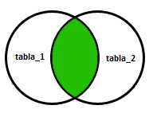
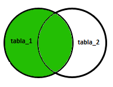
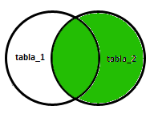
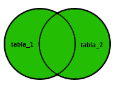

Lectura 11 - La familia de operadores JOIN
------------------------------------------

.. role:: sql(code)
   :language: sql
   :class: highlight

La sentencia SQL :sql:`JOIN` permite consultar datos de 2 o más tablas. Dichas tablas
estarán relacionadas entre ellas de alguna forma, a través de alguna de sus columnas.
El propósito del :sql:`JOIN` es unir información de diferentes tablas, para no tener que
repetir datos entre las tablas.

INNER JOIN
~~~~~~~~~~
La sentencia :sql:`INNER JOIN` es el sentencia :sql:`JOIN` por defecto que consiste en
combinar cada fila de una tabla con cada fila de la otra tabla, seleccionado
las filas que cumplan con una determinada condición.

Esta es la estructura que se ocupa para este tipo de :sql:`JOIN`.

.. code-block:: sql

 SELECT * FROM tabla_1 INNER JOIN tabla_2 ON condicion

Aquí se muestra un diagrama de como funciona esta consulta.

A continuación se mostrara un ejemplo de una tabla **Personas** y una de **Ordenes**
de compras que realizaron.

Realizamos la *creación* de las tablas **Personas** y **Ordenes**.

.. code-block:: sql

  CREATE TABLE Personas(id_persona serial, nombre VARCHAR(30), apellido VARCHAR(30), direccion VARCHAR(30), ciudad VARCHAR(30), PRIMARY kEY(id_persona));
  CREATE TABLE Ordenes(id_orden serial, numero_orden INTEGER, persona INTEGER, PRIMARY KEY(id_orden), FOREIGN KEY(persona) REFERENCES Personas(id_persona));

Ahora *insertamos* algunos datos.

.. code-block:: sql

 INSERT INTO Personas(nombre, apellido, direccion, ciudad) VALUES('Allen' , 'Doyle'   , '772 Azores'           , 'New York');
 INSERT INTO Personas(nombre, apellido, direccion, ciudad) VALUES('Amy'   , 'Looper'  , '4525 North Oracle Rd.', 'Miami');
 INSERT INTO Personas(nombre, apellido, direccion, ciudad) VALUES('Bibi'  , 'Mingus'  , '3901 W Ina Rd'        , 'Los Angeles');
 INSERT INTO Personas(nombre, apellido, direccion, ciudad) VALUES('Caden' , 'Anderson', '7635 N La Cholla Blvd', 'Chicago');
 INSERT INTO Personas(nombre, apellido, direccion, ciudad) VALUES('Calvin', 'Dixson'  , 'CALLE WALLABY 42'     , 'San Francisco');
 INSERT INTO Ordenes(numero_orden, persona) VALUES(226345,3);
 INSERT INTO Ordenes(numero_orden, persona) VALUES(345478,2);
 INSERT INTO Ordenes(numero_orden, persona) VALUES(218909,2);
 INSERT INTO Ordenes(numero_orden, persona) VALUES(567432,5);
 INSERT INTO Ordenes(numero_orden, persona) VALUES(675209,5);

Y realizamos la consulta para unir las dos tablas, de acuerdo a la condición que
detallemos.

.. code-block:: sql

 postgres=# SELECT Personas.nombre, Personas.apellido, Ordenes.numero_orden FROM Personas INNER JOIN Ordenes ON Personas.id_persona=Ordenes.persona;
  nombre | apellido | numero_orden
 --------+----------+--------------
  Bibi   | Mingus   |       226345
  Amy    | Looper   |       345478
  Amy    | Looper   |       218909
  Calvin | Dixson   |       567432
  Calvin | Dixson   |       675209
 (5 filas)

También podemos mostrar todos los atributos.

.. code-block:: sql

 postgres=# SELECT * FROM Personas INNER JOIN Ordenes ON Personas.id_persona=Ordenes.persona;
  id_persona | nombre | apellido |       direccion       |    ciudad     | id_orden | numero_orden | persona
 ------------+--------+----------+-----------------------+---------------+----------+--------------+---------
           3 | Bibi   | Mingus   | 3901 W Ina Rd         | Los Angeles   |        1 |       226345 |       3
           2 | Amy    | Looper   | 4525 North Oracle Rd. | Miami         |        2 |       345478 |       2
           2 | Amy    | Looper   | 4525 North Oracle Rd. | Miami         |        3 |       218909 |       2
           5 | Calvin | Dixson   | CALLE WALLABY 42      | San Francisco |        4 |       567432 |       5
           5 | Calvin | Dixson   | CALLE WALLABY 42      | San Francisco |        5 |       675209 |       5
 (5 filas)

.. note::
 Se observa que se unen las dos tablas **Personas** y **Ordenes** cumpliendo la condición
 que definimos.

NATURAL JOIN
~~~~~~~~~~~~

En el caso de existir columnas con el mismo nombre en las relaciones que se combinan,
solo se incluirá una de ellas en el resultado de la combinación.

Se *crearán* dos tablas llamadas **Alimentos** y **Compañia**, para realizar el ejemplo
que mostrará como funciona el **NATURAL JOIN**.

.. code-block:: sql

 CREATE TABLE COMPANIA(id_compania serial, nombre_compania VARCHAR(30), ciudad VARCHAR(30), PRIMARY KEY(id_compania));
 CREATE TABLE ALIMENTOS(id_alimento serial, nombre_alimento VARCHAR(30), id_compania INTEGER, PRIMARY KEY(id_alimento), FOREIGN KEY(id_compania) REFERENCES COMPANIA(id_compania));

*Ingresamos* datos a las tablas.

.. code-block:: sql

 INSERT INTO COMPANIA(nombre_compania, ciudad) VALUES('Order All'    , 'Boston');
 INSERT INTO COMPANIA(nombre_compania, ciudad) VALUES('Akas Foods'   , 'Delhi');
 INSERT INTO COMPANIA(nombre_compania, ciudad) VALUES('Foodies'      , 'London');
 INSERT INTO COMPANIA(nombre_compania, ciudad) VALUES('sip-n-Bite'   , 'New York');
 INSERT INTO COMPANIA(nombre_compania, ciudad) VALUES('Jack Hill Ltd', 'London');
 INSERT INTO ALIMENTOS(nombre_alimento, id_compania) VALUES('Chex Mix',    2);
 INSERT INTO ALIMENTOS(nombre_alimento, id_compania) VALUES('Cheez-lt',    3);
 INSERT INTO ALIMENTOS(nombre_alimento, id_compania) VALUES('BN Biscuit',  3);
 INSERT INTO ALIMENTOS(nombre_alimento, id_compania) VALUES('Mighty Munch',5);
 INSERT INTO ALIMENTOS(nombre_alimento, id_compania) VALUES('Pot Rice',    4);

Ahora podemos realizar la *consulta* del **NATURAL JOIN**.

.. code-block:: sql

 postgres=# SELECT * FROM ALIMENTOS NATURAL JOIN COMPANIA;
  id_compania | id_alimento | nombre_alimento | nombre_compania |  ciudad
 -------------+-------------+-----------------+-----------------+----------
            2 |           1 | Chex Mix        | Akas Foods      | Delhi
            3 |           2 | Cheez-lt        | Foodies         | London
            3 |           3 | BN Biscuit      | Foodies         | London
            5 |           4 | Mighty Munch    | Jack Hill Ltd   | London
            4 |           5 | Pot Rice        | sip-n-Bite      | New York
 (5 filas)

.. note::
 Al realizar el :sql:`NATURAL JOIN`, retorna una tabla con solo una
 columna llamada :sql:`id_compania`, que estaba repetida en las dos tablas
 **ALIMENTOS** y **COMPANIA** y la unión de las otras columnas.

INNER JOIN USING(attrs)
~~~~~~~~~~~~~~~~~~~~~~~

Al realizar el **INNER JOIN** con la cláusula **USING(attrs)**.

A continuación mostraremos el ejemplo anterior utilizando la cláusula **USING(id_compania)**
que es la columna que se repite en las dos tablas.

.. code-block:: sql

 postgres=# SELECT * FROM ALIMENTOS INNER JOIN COMPANIA USING(id_compania);
  id_compania | id_alimento | nombre_alimento | nombre_compania |  ciudad
 -------------+-------------+-----------------+-----------------+----------
            2 |           1 | Chex Mix        | Akas Foods      | Delhi
            3 |           2 | Cheez-lt        | Foodies         | London
            3 |           3 | BN Biscuit      | Foodies         | London
            5 |           4 | Mighty Munch    | Jack Hill Ltd   | London
            4 |           5 | Pot Rice        | sip-n-Bite      | New York
 (5 filas)

LEFT|RIGHT|FULL OUTER JOIN
~~~~~~~~~~~~~~~~~~~~~~~~~~

Se creará el siguiente ejemplo para realizar estas tres consultas.

*Crearemos* las tablas **tabla_A** y **tabla_B**.

.. code-block:: sql

 CREATE TABLE tabla_A(id serial, nombre VARCHAR(30), PRIMARY KEY(id));
 CREATE TABLE tabla_B(id serial, nombre VARCHAR(30), PRIMARY KEY(id));

*Ingresamos* datos a las tablas.

.. code-block:: sql

 INSERT INTO tabla_A(nombre) VALUES('Pirate');
 INSERT INTO tabla_A(nombre) VALUES('Monkey');
 INSERT INTO tabla_A(nombre) VALUES('Ninja');
 INSERT INTO tabla_A(nombre) VALUES('Spaghetti');
 INSERT INTO tabla_B(nombre) VALUES('Rutabaga');
 INSERT INTO tabla_B(nombre) VALUES('Pirate');
 INSERT INTO tabla_B(nombre) VALUES('Darth Vader');
 INSERT INTO tabla_B(nombre) VALUES('Ninja');

LEFT OUTER JOIN
===============

La sentencia :sql:`LEFT OUTER JOIN` ó :sql:`LEFT JOIN` combina los valores de la
primera tabla con los valores de la segunda tabla que cumplan con la condición.
Si no existe ninguna coincidencia, el lado derecho contendrá null (o vacío).

.. code-block:: sql

 SELECT * FROM tabla_1 LEFT OUTER JOIN tabla_2 ON tabla_1.columna = tabla_2.columna

Ahora realizamos la consulta con el ejemplo que definimos al comienzo.

.. code-block:: sql

 postgres=# SELECT * FROM tabla_A LEFT OUTER JOIN tabla_B ON tabla_A.nombre=tabla_B.nombre;
  id |  nombre   | id | nombre
 ----+-----------+----+--------
   1 | Pirate    |  2 | Pirate
   2 | Monkey    |    |
   3 | Ninja     |  4 | Ninja
   4 | Spaghetti |    |
 (4 filas)

.. note::

 Podemos observar que retorna todos los atributos de la **tabla_A** (izquierda) y de la
 **tabla_B**, solo retorna los atributos que cumplen con la condición que establecimos.

RIGHT OUTER JOIN
================

La sentencia **RIGHT OUTER JOIN** ó **RIGHT JOIN** combina los valores de la primera tabla con los
valores de la segunda tabla. Siempre devolverá las filas de la segunda tabla, incluso
aunque no cumplan la condición.

.. code-block:: sql

 SELECT * FROM tabla_1 RIGHT OUTER JOIN tabla_2 ON tabla_1.columna = tabla_2.columna

A continuación se muestra un diagrama de la consulta.

Ahora realizamos la siguiente consulta.

.. code-block:: sql

 postgres=# SELECT * FROM tabla_A RIGHT OUTER JOIN tabla_B ON tabla_A.nombre=tabla_B.nombre;
  id | nombre | id |   nombre
 ----+--------+----+-------------
     |        |  1 | Rutabaga
   1 | Pirate |  2 | Pirate
     |        |  3 | Darth Vader
   3 | Ninja  |  4 | Ninja
 (4 filas)

.. note::

 Se observa que el retorno de la consulta son todos los atributos de **tabla_B** (derecha)
 y solo los atributos que cumplen con la condición que definimos de **tabla_A**.

FULL OUTER JOIN
===============

La sentencia **FULL OUTER JOIN** ó **FULL JOIN** combina los valores de la primera tabla con los
valores de la segunda tabla. Siempre devolverá las filas de las dos tablas, aunque
no cumplan la condición.

.. code-block:: sql

 SELECT * FROM tabla_1 FULL OUTER JOIN tabla_2 ON tabla_1.columna = tabla_2.columna

A continuación se muestra el diagrama de la consulta.

Ahora se realizará el ejemplo de la consulta.

.. code-block:: sql

 postgres=# SELECT * FROM tabla_A FULL OUTER JOIN tabla_B ON tabla_A.nombre=tabla_B.nombre;
  id |  nombre   | id |   nombre
 ----+-----------+----+-------------
     |           |  3 | Darth Vader
   2 | Monkey    |    |
   3 | Ninja     |  4 | Ninja
   1 | Pirate    |  2 | Pirate
     |           |  1 | Rutabaga
   4 | Spaghetti |    |
 (6 filas)

.. note::

 Se observa que se retornan todos los atributos de **tabla_A** y **tabla_B**, aunque no
 cumpla con la condición.

