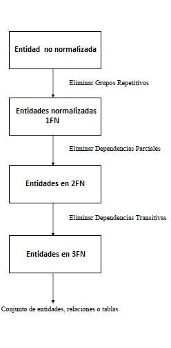

Lectura 15 - Teoría del diseño Relacional: Información General
--------------------------------------------------------------

Diseñar un esquema de base de datos
~~~~~~~~~~~~~~~~~~~~~~~~~~~~~~~~~~~

* Por lo general existen *muchos* diseños posibles.
* Algunos son (mucho) mejor que otros.
* ¿Cómo elegir?.

El diseño de una base de datos relacional puede abordarse de dos formas:

.. CMA: Se podría dejar algo más corto en negrita, para que fuera fácil de memorizar
.. Así lo aprenderán mejor, puesto que el segundo item es muuy largo y todo en negrita
.. es confuso, quizás "Obtener el esquema directamente" y "Realziar esquema conceptual".

* **Obteniendo el esquema relacional directamente:** Objetos y reglas captadas del análisis del mundo real, representadas por un conjunto de esquemas de relación, sus atributos y restricciones de integridad.
* **Realizando el diseño del esquema "conceptual" de la BD (modelo E/R) y transformándolo a esquema relacional**.

En los esquemas de bases de datos es posible encontrar anomalías que serán eliminadas
gracias al proceso de normalización.

Estas anomalías son:

* **La redundancia de los datos:** repetición de datos en un sistema.
* **Anomalías de actualización:** inconsistencias de los datos como resultado de datos redundantes y actualizaciones parciales.
* **Anomalías de eliminación:** pérdidas no intencionadas de datos debido a que se han borrado otros datos.
* **Anomalías de inserción:** imposibilidad de adicionar datos en la base de datos debido a la ausencia de otros datos.

A continuación se muestra una tabla y luego el detalle de los problemas que presenta:

.. math::

   \begin{array}{|c|c|c|}
    \hline
    \textbf{Nombre_autor} & \textbf{País} & \textbf{Cod_libro} & \textbf{Titulo_libro} & \textbf{Editor} \\
    \hline
    \text{Cortázar, Julio} & \text{Arg} & \text{9786071110725} & \text{Cuentos Completos 1 Julio Cortazar}  & \text{Alfaguara}\\
    \hline
    \text{Rosasco, José Luis}  & \text{Chi} & \text{9789561224056} & \text{Donde Estas, Constanza} & \text{Zig-Zag}  \\
    \hline
    \text{Rosasco, José Luis}  & \text{Chi} & \text{9561313669} & \text{Hoy Día es Mañana} & \text{Andrés Bello} \\
    \hline
    \text{Coloane, Francisco} & \text{Chi} & \text{9789563473308} & \text{Golfo De Penas} & \text{Alfaguara} \\
    \hline
   \end{array}

* **Redundancia:** cuando un autor tiene varios libros, se repite de la nacionalidad.
* **Anomalías de modificación:** Si el autor "Julio Cortázar" y "José Luis Rosasco", desean cambiar de editor, se modificará en los dos lugares. A priori no se puede saber cuando autores tiene un libro. Los errores son frecuentes al olvidar la modificación de un autor.
* **Anomalías de inserción:** Se desea ingresar a un autor sin libros. "Nombre_autor" y "Cod_libro" son campos claves, por lo que las claves no pueden ser valores nulos.

Al eliminar estas anomalías se asegura:

* **Integridad entre los datos:** consistencia de la información.

Otro ejemplo se muestra en la siguiente tabla:

**Aplicar(SSN, sNombre, cNombre, HS, HSciudad, hobby)**

.. note::
 La notación que se utiliza en la tabla es:

 HS = high school (escuela secundaria).

*123 Ann de PAHS (P.A) y GHS (P.A) juega tenis y toca la trompeta y postulo a Stanford, Berkeley y al MIT*

Los datos ingresados en la tabla podrían ser los que se muestran a continuación:

.. math::

   \begin{array}{|c|c|c|c|}
    \hline
    \text{123} & \text{Ann} & \text{Stanford} & \text{PAHS} & \textbf{P.A} & \text{tenis} \\
    \hline
    \text{123} & \text{Ann} & \text{Berkeley} & \text{PAHS}  & \text{P.A} & \text{tenis}\\
    \hline
    \text{123}  & \text{Ann} & \text{Berkeley} & \text{PAHS} & \text{P.A}  & \text{trompeta}\\
    \hline
    \text{.}  & \text{.} & \text{.} & \text{GHS} & \text{.} & \text{.}\\
    \hline
    \text{.} & \text{.} & \text{.} & \text{.} & \text{.} & \text{.}\\
    \hline
   \end{array}

* **Redundancia:** captura información muchas veces como por ejemplo "123 Ann", "PAHS", "tenis" o "MIT".
* **Anomalía de actualización:** actualizar datos de diferente manera como "corneta" por "trompeta".
* **Anomalía de eliminación:** eliminación inadvertida de datos.

Una correcta forma de realizar la tabla anterior sin anomalías es:

* Estudiante(SSN, sNombre);
* Aplicar(SSN, cNombre);
* Escuela_secundaria(SSN, HS);
* Ubicado(HS, HSciudad);
* Aficiones(SSN, hobby);

Ejercicio
=========

Considere la posibilidad de una base de datos que contiene información sobre los cursos
tomados por los estudiantes. Los estudiantes tienen un ID único de estudiante y
(posiblemente no el único) nombre; cursos tienen un número único de curso y (posiblemente
no el único) título, los estudiantes toman un curso de un año determinado y reciben una
calificación.

¿Cuál de los siguientes esquemas recomiendan?

a) Tomó(SID, nombre, cursoNum, título, año, calificación)

b) Curso(cursoNum, título, año), Tomó(SID, cursoNum, calificación)

c) Estudiante(SID, nombre), Curso(cursoNum, título), Tomó(SID, cursoNum, año, calificación)

d) Estudiante(SID, nombre), Curso(cursoNum, título), Tomó(nombre, título, año, calificación)

La alternativa correcta es la letra (c), puesto que en el enunciado se dice que existen
estudiantes con un ID único, que en este caso será "SID" y un "nombre"; los cursos tienen
un ID único que es "cursoNum" y un "titulo", además que los estudiantes toman un curso en un
año determinado "año" y reciben una calificación "grado", pero el atributo "cursoNum" actúa como
clave foránea de la tabla *Curso* con la cual se podrá obtener el titulo del curso y también debe
poseer una clave primaria para poder identificar el curso tomado que será "SID".

Diseño por descomposición
~~~~~~~~~~~~~~~~~~~~~~~~~

* Comience con las *"mega" relaciones* que contienen todo.
* *Descomponer* en partes más pequeñas, se obtienen mejores relaciones con la misma información.
* ¿Se puede *descomponer automáticamente*?

Descomposición automática:

 * "Mega" relaciones + propiedades de los datos.
 * El sistema descompone basándose en las propiedades.
 * Conjunto final de relaciones satisface la forma normal.
    * no hay anomalías, hay pérdida de información.

Normalización
~~~~~~~~~~~~~

Por todas las anomalías descritas anteriormente nace el proceso de normalización en el
cual se transforman datos complejos a un conjunto de estructuras de datos más pequeñas,
que además de ser más simples y más estables, son más fáciles de mantener.
También consiste en un conjunto de reglas denominadas Formas Normales (FN), las cuales
establecen las propiedades que deben cumplir los datos para alcanzar una representación
normalizada.

Propiedades y formas normales
=============================

.. CMA: Esto es como el paso para algo? o es una relación de conceptos?
.. quizás se debería explicar de otra forma.

Dependencias funcionales-> Boyce-Codd forma normal

.. CMA: Qué significa esta relación? y el signo "+" ?

"+ Multivalor dependencias-> Cuarta Forma Normal"

.. note::
 La cuarta forma normal es más estricta que Boyce-Codd forma normal.

Antes de estas formas de normalización se encuentran tres niveles de normalización:
Primera Forma Normal (1NF), Segunda Forma Normal (2NF) y Tercera Forma Normal (3NF).
Cada una de estas formas tiene sus propias reglas.

La siguiente imagen muestra los grados de normalización que se utilizan en el diseño
de esquemas de bases de datos.

El proceso de normalización es fundamental para obtener un diseño de base de datos
eficiente.
Una entidad no normalizada generalmente expresados en forma plana (como una tabla).
Es muy probable que existan uno o más grupos repetitivos, no pudiendo en ese caso ser
un atributo simple su clave primaria. Las tres primeras formas normales se definen de
la siguiente manera:

.. CMA: En la descripción de cada uno se podrían poner cosas en negritas
..      para resaltar las cosas importantes, pues ahora está todo muy aburrido y
..      explicado como de libro.

Primera formal normal (1FN)
^^^^^^^^^^^^^^^^^^^^^^^^^^^

Una tabla está normalizada o en 1FN, si contiene sólo valores atómicos en la intersección
de cada fila y columna, es decir, no posee grupos repetitivos.
Para poder cumplir con esto, se deben pasar a otra tabla aquellos grupos repetitivos
generándose dos tablas a partir de la tabla original. Las tablas resultantes deben
tener algún atributo en común, en general una de las tablas queda con una clave primaria
compuesta. Esta forma normal genera tablas con problemas de redundancia, y por ende,
anomalías de inserción, eliminación o modificación; la razón de esto es la existencia
de lo que se denomina dependencias parciales.

Segunda forma normal (2FN)
^^^^^^^^^^^^^^^^^^^^^^^^^^

Una tabla está en 2FN, si está en 1FN y se han eliminado las dependencias parciales
entre sus atributos. Una dependencia parcial se da cuando uno o más atributos que no
son clave primaria, son sólo dependientes de parte de la clave primaria compuesta,
o en otras palabras, cuando parte de la clave primaria determina a un atributo no clave.
Este tipo de dependencia se elimina creando varias tablas a partir de la tabla con
problemas: una con los atributos que son dependientes de la clave primaria completa
y otras con aquellos que son dependientes sólo de una parte. Las tablas generadas deben
quedar con algún atributo en común para representar la asociación entre ellas.
Al aplicar esta forma normal, aún se siguen teniendo problemas de anomalías
pues existen dependencias transitivas.

Tercera forma normal (3FN)
^^^^^^^^^^^^^^^^^^^^^^^^^^

Una tabla está en 3FN, si está en 2FN y no contiene dependencias transitivas. Es decir,
cada atributo no clave primaria no depende de otros atributos no claves primarias, sólo
depende de la clave primaria. Este tipo de dependencia se elimina creando una nueva
tabla con el o los atributo(s) no clave que depende(n) de otro atributo no clave, y
con la tabla inicial, la cual además de sus propios atributos, debe contener el atributo
que hace de clave primaria en la nueva tabla generada; a este atributo se le denomina
clave foránea dentro de la tabla inicial (por clave foránea se entiende entonces, a
aquel atributo que en una tabla no es clave primaria, pero sí lo es en otra tabla).

Ahora se detallarán las formas normales que se abordarán en las próximas lecturas como
son Boyce-Codd y cuarta forma normal.

Boyce-Codd forma normal (FNBC)
~~~~~~~~~~~~~~~~~~~~~~~~~~~~~~

Es una versión ligeramente más fuerte de la Tercera forma normal (3FN). La forma normal de
Boyce-Codd requiere que no existan dependencias funcionales no triviales de los atributos
que no sean un conjunto de la clave candidata. En una tabla en 3FN, todos los atributos dependen
de una clave. Se dice que una tabla está en FNBC si y solo si está en 3FN y cada dependencia
funcional no trivial tiene una clave candidata como determinante.

Dependencias funcionales y FNBC
===============================

**Aplicar(SSN, sNombre, CNOMBRE)**

* Redundancia, anomalías de actualización y eliminación.
* Almacenamiento del SSN-sNombre para una vez por cada universidad.

**Dependencia funcional SSN-> sNombre**

* SSN siempre tiene el mismo sNombre
* En caso de almacenar sNombre cada SSN sólo una vez

**Boyce-Codd forma normal si a-> b entonces a es una clave**

Descomponer: Estudiante(SSN, sNombre) Aplicar(SSN, CNOMBRE)

siendo finalmente SSN una clave primaria.

Ejemplo
^^^^^^^

Tenga en cuenta la relación Tomó(SID, nombre, cursoNum, título). Los estudiantes tienen
el carné de estudiante y un nombre único (posiblemente no el único), los cursos tienen
un número único curso y (posiblemente no el único) título. Cada tupla de la relación
codifica el hecho de que un estudiante dado tomó el curso. ¿Cuáles son todas las
dependencias funcionales para la relación tomó?

   a) sID → cursoNum
   b) sID → nombre, cursoNum → titulo
   c) nombre → sID, titulo → cursoNum
   d) cursoNum → sID

La respuesta correcta es la alternativa (b), puesto que un id de estudiante que único "sID", esta
asignado a solo un estudiante y un id del curso que es único "cursoNum" tiene asignado un titulo. Las
otras alternativas no son porque, la alternativa (a) dice un estudiante sólo puede tomar un curso, la
alternativa (c) dice que los nombres de los estudiantes y los títulos de los cursos son únicos y
la alternativa (d) dice que los cursos sólo pueden ser tomados por un estudiante.

Cuarta forma normal (4FN)
~~~~~~~~~~~~~~~~~~~~~~~~~

La 4NF se asegura de que las dependencias multivaluadas independientes estén correcta
y eficientemente representadas en un diseño de base de datos. La 4NF es el siguiente
nivel de normalización después de la forma normal de Boyce-Codd (BCNF).
Una tabla está en 4NF si y solo si esta en Tercera forma normal o en BCNF y no posee
dependencias multivaluadas no triviales. La definición de la 4NF confía en la noción
de una dependencia multivaluada. Una tabla con una dependencia multivaluada es donde
hay una existencia de dos o más relaciones independientes de muchos a muchos que causa
redundancia; que es suprimida por la cuarta forma normal.

Dependencias multivaluadas y 4FN
================================

**Aplicar(SSN, cNombre, HS)**

* Redundancia, anomalias de actualización y eliminación.
* Efecto multiplicativo: C colegios o H escuelas secundarias, por lo que se generarán "C * H" ó "C + H" tuplas.
* No es dirigida por BCNF: No hay dependencias funcionales.

.. CMA: Que significa el signo "->>" ?

**La dependencia multivalor SSN->>cName ó SSN->>HS**

* SSN cuenta todas las combinaciones de cName con HS.
* En caso de almacenar cada cName y HS, para obtener una vez un SSN.

**Cuarta Forma Normal si A->>B entonces A es una clave**

Descomponer: Aplicar(SSN, cNombre) Escuela_secundaria(SSN, HS)

Ejemplo
^^^^^^^

Tenga en cuenta la relación Informacion_estudiante(SID, dormitorio, cursoNum). Los estudiantes
suelen vivir en varios dormitorios y tomar muchos cursos en la universidad. Supongamos
que los datos no capta en que dormitorio(s) un estudiante estaba en la hora de tomar
un curso específico, es decir, todas las combinaciones de cursos dormitorio se registran
para cada estudiante. ¿Cuáles son todas las dependencias para la relación Informacion_estudiante?

   a) sID->>dormitorio
   b) sID->>cursoNum
   c) sID->>dormitorio, sID->>cursoNum
   d) sID->>dormitorio, sID->>cursoNum, dormitorio->>cursoNum

La alternativa correcta es (c), puesto que para un estudiante hay muchos dormitorios y
un estudiante puede tomar muchos cursos. La alternativa (a) y (b) ambos omiten una dependencia,
la alternativa (d) dice que todos los estudiantes de cada dormitorio toman el mismo conjunto de cursos.

