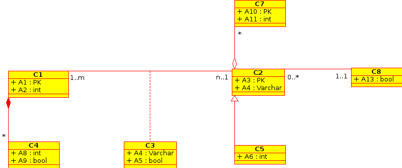

Tarea 5
=======

Fecha de entrega: Lunes 21 de Enero 2013 hasta 23:59
-----------------------------------------------------------

.. role:: sql(code)
      :language: sql
   :class: highlight

-------------------
Cuarta Forma Normal 
-------------------

Pregunta 1 (10 ptos.)
^^^^^^^^^^^^^^^^^^^^

----------------------------
UML: Preguntas conceptuales
----------------------------

Pregunta 1 (5 ptos.)
^^^^^^^^^^^^^^^^^^^
¿Para que sirve UML?

Pregunta 2 (25 ptos.)
^^^^^^^^^^^^^^^^^^^^
Defina los siguientes conceptos (5 ptos. c/u):

1. Clase:
2. Asociación:
3. Multiplicidad:
4. Superclase:
5. Clase hija:

----------------------------
UML: Preguntas de desarrollo
----------------------------

Pregunta 1 (30 ptos.)
^^^^^^^^^^^^^^^^^^^^^^
.. <inventar una situación>
 Palabras clave: equipo, campeonatos/copas, director técnico, plantel, países

.. clase de asociacion.
En inglaterra existe la 'Premier League'. Los equipos que componen esta liga (20), pueden jugar varios campeonatos
y copas, nacionales e internacionales. Dentro de los campeonatos internacionales destacan la 'Champions league',
la 'Europa League' y el 'Mundial de Clubes', entre otros. Por lo general en este tipo de campeonatos se juegan 
desde 16 a 32 equipos. Un equipo puede jugar en más de un campeonato internacional, pero debe llenar 
fichas de inscripción que permitan diferenciar en que campeonato juega.

Cada equipo esta compuesto tanto por el plantel de jugadores, como por un director técnico. 

.. herencia
Los jugadores del plantel son tanto extranjeros como nacionales; ellos se diferencian 
a través de un ID si es nacional y pasaporte si es extranjero. Cada jugador cuenta con características: ataque, 
defensa, capacidad de salto, mentalidad, riesgo de lesión, edad, estatura, nacionalidad, nombre.

.. agregación
Por otra parte cada jugador tiene una ficha médica, la que en caso de que el jugador se cambie de equipo
puede guardarse.

.. composición

A partir de la situación descrita realice un diagrama uml utilizando un software (DIA, StarUML, Umbrello, etc).

Pregunta 2 (30 ptos.)
^^^^^^^^^^^^^^^^^^^^^

Bender necesita una gran cantidad de cervezas, pues está escaso de energía. En la tierra no hay ya que los
habitantes del planeta 'Omicrón Persei 8' en una de sus constantes invasiones, han saqueado todo el suminstro de esta
bebida. Planet Express debe hacer un viaje al planeta UML (cuyos habitantes son grandes bebedores). Sin embargo,
Con el aupuro, Fry y Leela no llevaron dinero. Los 'UMLianos' permitirán llevarse cervezas si son capaces de resolver 
el siguiente problema, de casi 1000 años de antiguedad:

A partir de las siguientes clases y asociaciones, describa relaciones:

¿Podrás ayudar a Fry y Leela en su misión de salvar a bender?

.. note::
 
    La tarea se `entrega`_  en un archivo comprimido .rar , que contenga:
 
        * archivo `assignment5.jpg`, o .png, o bmp, que incluya la respuesta de la pregunta 1 de UML: preguntas de desarrollo”
        * archivo assigment5.doc , .docx o .pdf que incluya la respuesta de “UML: preguntas conceptuales y 
          la pregunta 2 de UML: preguntas de desarrollo”.

