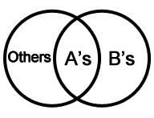

Lectura 17 - Teoría del diseño relacional: Forma normal Boyce-Codd 
-------------------------------------------------------------------

.. role:: sql(code)
   :language: sql
   :class: highlight

Conceptos previos:
~~~~~~~~~~~~~~~~~~

Tipos de claves (llaves)
=========================

**Llave primaria, clave candidata y superclave** se refieren a un atributo o un conjunto de atributos 
que permiten identificar unívocamente un registro. Es decir que no existe en esa relación un registro
que tenga el mismo valor en ese (esos) atributo(s).

* **Superclave:** (llave compuesta) es un conjunto de uno o más atributos que, tomados colectivamente, 
  permiten identificar unívocamente cada registro de la tabla. Es un subconjunto de atributos que permite 
  distinguir de forma única cada una de las tuplas. Si se une otro atributo al subconjunto anterior, el 
  resultado seguirá siendo una superclave.

Ejemplo
^^^^^^^^

El atributo *idCliente* de la relación *Cliente* es suficiente para distinguir una fila de un *Cliente* de 
las otras. Así, *idCliente* es una superclave. Análogamente, la combinación de *nombre y idCliente* es una
superclave del conjunto de relación *Cliente*. El atributo *nombre* de cliente no es una superclave, porque 
varias personas podrían tener el mismo nombre.

El concepto de una superclave no es suficiente para lo que aquí se propone, ya que, como se ha visto, una 
superclave puede contener atributos innecesarios. Si K es una superclave, entonces también lo es cualquier 
superconjunto de K. A menudo interesan las superclaves tales que los subconjuntos propios de ellas no son 
superclave. Tales **superclaves mínimas** se llaman **claves candidatas**.

* **Clave candidata:** Cuando una superclave, se reduce al mínimo de atributos que la componen, pero aún así 
  sirve para identificar la tupla, entonces ésta pasa a ser una clave candidata.  La **clave (o llave) candidata** 
  es solo a nivel **conceptual**. En una relación más de un atributo podría llegar a ser llave primaria, pues
  pueden identificar a cada tupla, es decir que no existen dos valores para ese atributo que sean iguales. Dichos
  atributos que se proponen a reconocer una tupla, se denominan **clave candidata** porque son **candidatos** 
  a ser **clave primaria**. 

Ejemplo
^^^^^^^^

Es posible que conjuntos distintos de atributos pudieran servir como clave candidata. Supóngase que una combinación 
de *nombre* y *dirección* es suficiente para distinguir entre los miembros del conjunto de la relación *Cliente*. 
Entonces, los conjuntos *{idCliente}* y *{nombre, calle}* son claves candidatas. Aunque los atributos *idCliente* y 
*nombre* juntos puedan distinguir las tuplas de *Cliente*, su combinación no forma una clave candidata, ya que el 
atributo *idCliente* por sí solo es una clave candidata.

* **Clave primaria:** Una vez que se elige cual de los atributos de la clave candidata será el que permitirá identificar 
  cada registro en una tabla, dicho atributo se pasa a llamar **llave primaria**. Se puede decir que la clave primaria 
  es una clave candidata, elegida por el diseñador de la base de datos, para identificar unívocamente las tuplas.

.. note::

	Otro concepto que se utilizará es el de **dependencia funcional(DF)** que se puede repasar en la `Lectura16`_

Forma normal Boyce-Codd
~~~~~~~~~~~~~~~~~~~~~~~~~~

La definición original de la 3FN no trataba satisfactoriamente el caso de una relación que tenía dos o más claves
candidatas compuestas y que tenían al menos un atributo en común. Es por esto que se crea la **forma normal de 
Boyce-codd(FNBC)**, que es una forma normal estrictamente más sólida que la 3FN, la cual atiende los caso que no
cubre correctamente la 3FN.

.. note:: 

	No es tan frecuente encontrar relaciones con más de una claves candidatas compuestas y con al menos un 
	atributo en común. Para una relación en donde no suceden, las 3FN y FNBC son equivalentes.

Definición
==========

Un esquema de relación R está en FNBC si, para todas las dependencias funcionales de la forma ``A->B``, donde
A y B son subconjuntos de R, se cumplen las siguientes condiciones:

* ``A->B`` **es una dependencia funcional (DF) trivial:** (B es subconjunto de A). Entonces se mantiene la condición
  de FNBC, debido a que sólo una DF no trivial puede violar esta condición. 

* **A es una superclave del esquema R:** Si se tiene ``A -> B``, pero no ``B-> A``, entonces A es la superclave
  y cada dependencia no trivial contiene A en la izquierda, por tanto no hay violación a la condición FNBC.

* Toda dependencia funcional trivial tiene una clave candidata como su determinante.

Un diseño de base de datos está en FNBC si cada miembro del conjunto de esquemas de relación que constituye
el diseño está en FNBC.

Vale la pena señalar que la definición FNBC es conceptualmente más simple que la definición anterior de la 3FN, 
ya que no hace referencias explícitas a la primera y segunda formas normales como tales, ni al concepto de 
dependencia transitiva. Además, aunque (como ya indicamos) la FNBC es estrictamente más sólida que la 3FN, 
se sigue dando el caso que cualquier relación dada puede descomponerse sin pérdida en una colección equivalente 
de relaciones FNBC.

Descomposición para lograr la FNBC 
===================================

En algunas ocasiones con la elección de descomposiciones adecuadas, se puede romper cualquier esquema 
de relación en una colección de subconjuntos de sus atributos con las siguientes propiedades importantes:

	1. Estos subconjuntos son los esquemas de relaciones en FNBC.

	2. Los datos de la relación original se representa fielmente por los datos en las relaciones resultantes 
  	   de la descomposición. A grandes rasgos, tenemos que ser capaces de reconstruir la relación original 
	   con exactitud a partir de las relaciones descompuestas.

Lo anterior sugiere que tal vez lo único que se debe hacer es romper un esquema de relación en subconjuntos
de dos atributos, y el resultado estará en FNBC. Sin embargo, tal descomposición arbitraria puede no satisfacer
la condición (2). De hecho, se debe ser más cuidadosos y utilizar el DF debido a guiar la descomposición.
La estrategia de descomposición que vamos a seguir es buscar un DF trivial `A_1 A_2 ... A_n -> B_1 B_2 ... B_m`
que viola FNBC, es decir, `{A_1, A_2, ... , A_n}` no es una superclave. Vamos a añadir a la derecha tantos atributos 
como son funcionalmente determinado por `{A_1, A_2, ... , A_n}` . Este paso no es obligatorio, pero a menudo se reduce
la cantidad de trabajo realizado, y lo vamos a incluir en nuestro algoritmo.
La Figura que se muestra a continuación ilustra cómo los atributos se dividen en dos esquemas de relación que se 
superponen. Uno es de todos los atributos involucrados en la violación de DF, y el otro es el lado izquierdo de la DF 
además de todos los atributos que no participan en la DF, es decir, todos los atributos excepto los B’s que no son A’s.

Ejemplo 1
^^^^^^^^^^
.. code-block:: sql

	Película:

	título        | año  | duración | género |     director    | actor
	--------------+------+----------+--------+-----------------+-------------
	Forrest Gump  | 1994 |   142    | Drama  | Robert Zemeckis | Tom Hanks
	Forrest Gump  | 1994 |   142    | Drama  | Robert Zemeckis | Robin Wright 
	Forrest Gump  | 1994 |   142    | Drama  | Robert Zemeckis | Gary Sinise
	The Godfather | 1972 |   175    | Crime  | Mario Puzo      | Marlon Brando
	Matrix        | 1999 |   136    | Action | Wachowski       | Keanu Reeves
	Matrix        | 1999 |   136    | Action | Wachowski       | Laurence Fishburne

La Relación *Películas* no es en FNBC. Para ver por qué, primero tenemos que determinar qué 
conjuntos de atributos son claves. Nuestra hipótesis será que *{título, año, actor}* son en conjunto una clave,
para demostrar que es una clave en primer lugar, tenemos que verificar que identifica inequívocamente
una tupla. Para ello supongamos que dos tuplas tienen igual valor en estos tres atributos: 
*{título, año, actor}*. Al ser la misma película, los otros atributos *{duración, género, director}* 
serán iguales también. Así, dos tuplas diferentes no pueden concordar en *{título, año, actor}* pues 
en realidad sería la misma tupla.

Ahora, debemos argumentar que ningún subconjunto propio de *{título, año, actor}* determina funcionalmente 
a todos los demás atributos. Primero se observa que el título y el año no determinan a actor, porque muchas 
películas tienen más de un actor. Por lo tanto, *{título, año}* no es una clave. *{año, actor}* no es una clave,
porque podríamos tener un actor en dos películas en el mismo año, por lo tanto: ``actor año -> título`` 
no es un DF. Asimismo, sostenemos que *{título, actor}* no es una clave, porque dos películas con el mismo 
título, realizada en diferentes años, de vez en cuando tienen un actor en común.

Como *{título, año, actor}* es una clave, cualquier conjunto de atributos que contienen estos tres es 
una superclave. Los mismos argumentos anteriores se pueden utilizar para explicar por qué no existe 
un conjunto de atributos que no incluya a los tres atributos *{título, año, actor}* que pudiera ser 
una superclave. Por lo tanto, afirmamos que *{título, año, actor}* es la única clave para *Películas*.

Sin embargo, tenga en cuenta: 
 
``título año-> duración género actor`` 

Desafortunadamente, el lado izquierdo de la anterior DF no es una superclave. En particular, se sabe
que el título y el año no determinan funcionalmente el atributo actor. Por lo tanto, la existencia de
esta DF viola la condición FNBC y nos dice que *Películas* **no está en FNBC.**

Por otro lado:

.. code-block:: sql

	Películas2:

	título        | año  | duración | género |     director    
	--------------+------+----------+--------+-----------------
	Forrest Gump  | 1994 |   142    | Drama  | Robert Zemeckis 
	The Godfather | 1972 |   175    | Crime  | Mario Puzo      
	Matrix        | 1999 |   136    | Action | Wachowski

año título -> duración género director

La única clave para *Películas2* es *{título, año}*. Por otra parte, la única DF no trivial 
debe tener por lo menos título y año en el lado izquierdo, y por lo tanto su lado izquierdo 
debe ser superclave. Por lo tanto, *Películas2* **está en FNBC**.

Ejemplo 2
^^^^^^^^^^
Se tiene un esquema de relación y sus respectivas dependencias funcionales:

* cliente = (nombreC, dirección, ciudadC)

``nombreC -> dirección ciudad``

* sucursal = (nombreS, activo,ciudadS)

``nombreS -> activo ciudadS``

Puede afirmarse que cliente está en FNBC. Obsérvese que una clave candidata para la relación es
nombreC. Las únicas dependencias funcionales no triviales que se cumplen en cliente tienen a 
nombreC a la izquierda de la flecha. Dado que nombreC es una clave candidata, las dependencias 
funcionales con nombreC en la parte izquierda no violan la definición de FNBC. De manera parecida,
se puede demostrar fácilmente que relación sucursal está en FNBC.

Ejemplo 3
^^^^^^^^^^
.. code-block:: sql

	Clases:

	ID  | asignatura | profesor
	----+------------+----------
	121 | Lenguaje   | Paul
	121 | Matemáticas| David 
	345 | Lenguaje   | Paul
	567 | Matemáticas| Robert
	567 | Lenguaje   | Julia
	563 | Matemáticas| Robert

La tabla está en 3FN pues no posee dependencias transitivas, pero no está en forma de Boyce - Codd,
ya que ``(ID, asignatura)->profesor`` y ``profesor->asignatura``. En este caso la redundancia ocurre por 
mala selección de clave. La redundancia de la asignatura es completamente evitable. La solución sería:

.. code-block:: sql

	ID  | profesor
	----+----------
	121 | Paul
	121 | David 
	345 | Paul
	567 | Robert
	567 | Julia
	563 | Robert

	asignatura | profesor
	-----------+----------
	Lenguaje   | Paul
	Matemáticas| David 
	Matemáticas| Robert
	Lenguaje   | Julia

En las formas de Boyce-Codd hay que tener cuidado al descomponer ya que se podría perder información por una mala descomposición.

.. _`lectura16`: http://sql.csrg.cl/es/lectures/week4/lecture16.html
