Lecture 19 - Unified Modeling Language: UML modelado de datos
--------------------------------------------------------------
.. role:: sql(code)
         :language: sql
         :class: highlight

Dentro del modelado de BD Relacionales, los métodos más conocidos son los diagramas de Entidad-Relación
(ER), vistos en la primera semana, y el Lenguaje de Modelado Unificado (UML, por sus siglas en inglés).
Ambos comparten la característica de ser gráficos; es decir que UML, al igual que ER está compuesto por
"símbolos" bajo una serie de reglas. Además, ambos comparten la cualidad de que pueden ser traspasados
a lenguaje de BD de forma relativamente autónoma.

Por otro lado, cabe destacar que ER es mucho más antiguo que UML, superándole en edad en el orden de 
décadas. UML es un lenguaje más amplio, es decir, no solo se utiliza para modelar BD, sino que es utilizado
para modelar programas también.

En lugar de crear las relaciones de forma directa en la BD, el diseñador realiza un modelado de 
alto nivel, de modo que la situación que se está enfrentando con la BD pueda verse en su totalidad.
Posteriormente el diseñador, una vez que valida su modelo, procede a su traducción al lenguaje de la BD.

Esta situación no presenta trabajo innecesario (correspondiente al modelado y a la posterior creación
de relaciones en la BD), pues afortunadamente la gran mayoría de estas herramientas permiten realizar 
una traducción al lenguaje de la BD.
 

.. note::
 
  Existen variadas herramientas a la hora de gráficar diagramas UML. Algunas de ellas son: 
  DIA, StarUML o Umbrello entre otras. 
  
  

Existen 5 conceptos claves en UML:

1. Clases
2. Asociaciones
3. Clases de asociación
4. Subclases
5. Composiciones y agregaciones

Clases
~~~~~~

Las clases se componen de: un nombre, atributos y métodos. Para quienes hayan experimentado alguna 
vez con la programación orientada a objetos probablemente se sientan algo familiarizados.

A la hora de realizar modelos de BD, es necesario agregar un identificador de que atributo corresponde a
la clave primaria, además de un método de eliminación.

No obstante en está lectura se pondrá énfasis a los atributos, pues está enfocada más al  modelado de datos
que a su operación a través de sus métodos.

Ejemplo 1
^^^^^^^^^
Retomemos el caso de los Estudiantes y Establecimientos Educacionales. Dibujemos ambas relaciones como
clases en UML:

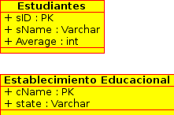

Asociaciones
~~~~~~~~~~~~

Las Asociaciones corresponden a como se relacionan 2 clases.

Ejemplo 2
^^^^^^^^^
El ejemplo 1 terminó con 2 clases separadas, es decir, Estudiantes y Establecimientos Educacionales.
Sin embargo, y como ya se ha visto en ejemplos de lecturas anteriores, los estudiantes postulan a estos 
establecimientos, por lo tanto la relación es **postular**, por lo tanto:

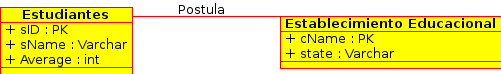

Es decir que el **Estudiante** **postula** a un **Establecimiento**. Es posible direccionar esta 
relación para lograr mayor claridad a la hora de ver los diagramas: 

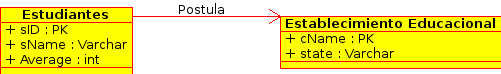

Sin embargo no marca la diferencia a la hora de traducir a relaciones.

=============
Multiplicidad
=============

Es necesario determinar cuantas veces un objeto de una clase puede relacionarse con objetos de otra clase. 
Supongamos que se han creado las clases **C1** y **C2**, la multiplicidad apunta a::
 
 "Cada objeto de la clase C1 está asociado (a través de la relación A)a al menos 
  'm' y a lo más 'n' objetos de la clase C2"
 
La notación para ello corresponde a *m..n*, es decir que el valor mínimo es *m* y el máximo *n*. Ambos
valores van separados por *..* (dos puntos).

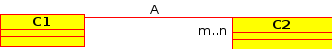

Cabe mencionar que estas relaciones pueden ser bidireccionales

Algunos casos especiales son::
 
 m..*   -> a lo menos 'm' a lo más cualquier valor superior a 'm'
 0..n   -> a lo menos '0' a lo más 'n'
 0..*   -> a lo menos '0' a lo más cualquier valor superior a '0', es decir , sin restricción.
 1..1   -> sólo 1 valor.

Existen varios tipos de multiplicidad, con su respectiva notación. Ellos son:

1. uno a uno: **0..1 - 0..1**
2. muchos a uno: **0..* - 0..1**
3. muchos a muchos:  **0..* - 0..*** 
4. completa: **1..* - 1..1** o **1..1 - 1..*** o **1..* - 1..***

.. note::
 
  En la multiplicidad completa, no deben quedar objetos sin relacionarse.

Ejemplo 3
^^^^^^^^^
Supongamos que cada Estudiante debe postular a lo menos a 1 Establecimientos y a lo más a 3. Por otro lado
Cada establecimiento puede recibir a lo más 50000 postulaciones.

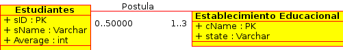

Ejemplo 4
^^^^^^^^^
Con el fin de diversificar y bajo el siguiente contexto, supongamos que tenemos personas que realizan
giros en bancos. Dependiendo del tipo de cuenta, supongamos que existe una cuenta que permite a lo más
3 giros por mes. Por su parte el banco no tiene restricción de giros que puede recibir.

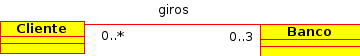

Clase de asociación
~~~~~~~~~~~~~~~~~~~~~~

Cuando la multiplicidad de las relaciones impide definir con exactitud que objeto de la clase **C1** esta asociado 
a que objeto de la clase **C2**.

Ejemplo 5
^^^^^^^^^

Supongamos que tenemos a varios  Estudiantes que desean postular a diferentes Establecimientos Educacionales.

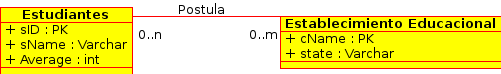

No obstante no hay información que permita definir que estudiante realiza la postulación, es por ello que se 
crea una clase de asociación, en este caso postulación (Apply).

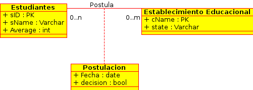

.. note::
 
 Cabe recordar que si no se especifica la multiplicidad de la relación, 
 se define **1..1** por defecto.

Sin embargo en este modelo no se permite el caso de que un Estudiante postule múltiples veces a un
mismo Establecimiento Educacional. Es por ello que es una buena práctica que, en caso de utilizar este
tipo de clases, se utilice como Clave Primaria (PK), las PK de las clases que están relacionadas. 

El siguiente diagrama clarificará la idea:

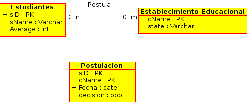

==========================================
Eliminar clases de asociación innecesarias
==========================================

Usando las clases genéricas C1, C2 de atributos A1, A2 y A3, A4 respectivamente. Supongamos que la relación entre 
ellas es de multiplicidad (* - 1..1) o (* - 0..1). Supongamos que existe una clase de asociación AC de atributos
B1 y B2. Todo ordenado de acuerdo a la siguiente imagen:

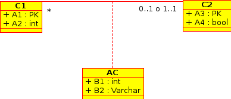

Es posible mover los atributos B1 y B2 a la clase C1, pues dada la multiplicidad un objeto de la clase C1 está
asociado a 1 objeto de la clase C2. Por lo tanto la clase de asociación se puede eliminar.

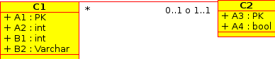

.. note::
 
  La clase de asociación se puede eliminar cuando hay multiplicidad 
  (* - 1..1) o (* - 0..1). De hecho está pensada para dejar en claro que
  la asociación entre objetos en caso de que la multiplicidad sea m, n o * en
  ambos lados de la relación.

=====================
Auto asociaciones
=====================

Corresponden a asociaciones entre una clase y si misma.

Ejemplo 6
^^^^^^^^^

Supongamos que se desea modelar en UML a la Universidad Técnica Federico Santa María (UTFSM), su Casa
Central y Campus. Supongamos que existen los atributos *NumAlumnos, Dirección, Nombre, Campus*. 

Existe una sola Casa Central, pero varios Campus, supongamos que por temas de presupuesto, solo existen
7 campus.

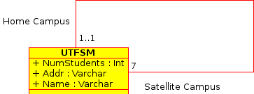

En UML, es posible etiquetar la relación.

Subclases
~~~~~~~~~

Las clases se dividen:

1. Superclase/ Clase Padre: De carácter general, contiene información que heredarán las diversas subclases.
2. Subclases/ Clases Hijas: De carácter específico, contiene información extra a la que hereda de la superclase.

Estos conceptos nacen de la programación orientada a objetos.

Ejemplo 7
^^^^^^^^^

Supongamos que dentro de la clase Estudiantes, se desea diferenciar a los estudiantes extranjeros
de los estudiantes nacionales.  Se podría pensar en crear dos clases nuevas, llamadas 
**Estudiantes Nacionales** y **Estudiantes Extranjeros**:

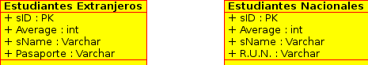

Sin embargo, hay atributos que se repiten en ambas, ellos son: *sID, sName, Average*. Es por ello que
se pueden separar en una superclase llamada Estudiante (la misma utilizada en las otras lecturas), y crear
2 subclases llamadas **Extranjeros** y **Nacionales**.

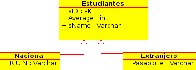

Como se puede observar, los atributos mencionados son heredados por ambas subclases. Ambas además agregan
información más específica, como lo son el *país* y *pasaporte* en el caso de los **Extranjeros**; la
*región* y *RUN* en el caso de los **Nacionales**. Esta técnica es muy útil para la reutilización.

.. note::
 
 Las Subclases **heredan** propiedades de las **superclases / clase padre**, es decir no solo 
 atributos, sino que también asociaciones u operaciones  están disponibles en las 
 **subclases / clases hijas**

Composiciones y Agregaciones
~~~~~~~~~~~~~~~~~~~~~~~~~~~~~

Ambas corresponden a la forma de representar que un objeto tiene como contenido a otro, esto quiere decir que 
**un objeto de un tipo, puede contener a otro**.

Ejemplo 8
^^^^^^^^^

Supongamos que un objeto de tipo ciudad tiene una lista de objetos de tipo aeropuerto, esto quiere decir, que 
una ciudad, tiene un número de aeropuertos. 

.. note::
  
   Hay que destacar, que la cardinalidad del extremo que lleva el rombo, es siempre uno.

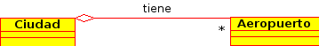

También se puede leer como que un medio de transporte tiene varias ruedas.
Nos esta diciendo que los objetos rueda forman parte del objeto medio de transporte. Pero, su ciclo de 
vida no esta atado al del objeto medio de transporte. Es decir si el automóvil se destruye las ruedas 
pueden seguir existiendo independientemente.

En la misma linea, la composición, es una relación más fuerte de los objetos, así como la agregación, es el 
hecho de que un objeto posea a otro, la composición es cuando la relación entre ambos objetos es tal, que el 
primero no tiene sentido suelto, y el segundo, necesita definir al primero para ampliar su significado

Ejemplo 9
^^^^^^^^^

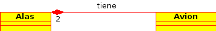

El avión tiene sentido por si solo. Esta claro que esta compuesto de 2 alas, esta relación es de mucha 
fuerza, mucho más que el caso de los aeropuertos, y esta claro, que un avión siempre tendrá sus dos alas, y 
estas siempre serán del mismo avión.

La composición corresponde a aquellos objetos de los que depende un objeto para que este llegue a funcionar,
en este caso el avión no puede funcionar sin las 2 alas.

