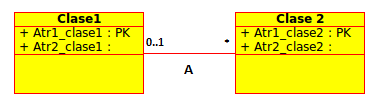

Lectura 20 - Lenguaje de Modelado Unificado: UML a las relaciones
-----------------------------------------------------------------

Base de datos de alto nivel y modelo de diseño

* Fácil de usar (gráfica) especificación del lenguaje
* Traducido al modelo de DBMS

.. image:: ../../../sql-course/src/dibujo1_semana5.png                               
   :align: center  

UML (Lenguaje de Modelado Unificado)
~~~~~~~~~~~~~~~~~~~~~~~~~~~~~~~~~~~~

Subconjunto de datos de modelado

* Cinco Conceptos

 1) Clases
 2) Asociaciones 
 3) Asociación de clases
 4) Subclases
 5) Composición y agregación

* Los diseños pueden ser traducidos automáticamente a las relaciones

 Siempre y cada clase "regular" tiene una clave.

Clases
======

Cada clase se convierte en una relación; pk -> clave primaria

.. image:: ../../../sql-course/src/diagrama1_semana5.png                               
   :align: center   

Según las clases descritas anteriormente tenemos las siguientes relaciones:

.. math::

 Estudiante(\underline{sID}, sName, GPA)

 Universidad(\underline{cName}, state, enr)

Asociaciones
============

Relación con la clave de cada lado.

.. image:: ../../../sql-course/src/diagrama2_semana5.png                               
   :align: center 

Se obtendrán las mismas relaciones del ejemplo anterior, pero se agregará una nueva 
relación con las claves primarias de ambas clases.

.. math::

 Aplicado(\underline{sID}, \underline{cName})

Claves para las relaciones de asociación
^^^^^^^^^^^^^^^^^^^^^^^^^^^^^^^^^^^^^^^^

* Depende de la multiplicidad

 * **Multiplicidad 1-1**

  * Cada objeto de A está asociado con un objeto de B, y cada objeto de B está asociado con un objeto de A.
  * Cualquiera de las dos tablas relacionadas implementará una columna con el *ID* de la otra tabla.
  * Esta columna será la clave foránea para relacionarlas.

 * **Multiplicidad 1-n**

  * Cada objeto A está asociado con más objetos B, pero cada objeto B está asociado con un objeto A.
  * Implementando la clave foránea *ID* en la tabla “muchos” a la tabla “uno”.

  Por ejemplo:

Ahora al tener una multiplicidad 1-n, se debe agregar la clave primaria *Atr1_clase1* 
de la *Clase1* a la *Clase2* (que es la que posee la multiplicidad "muchos"), quedando 
como clave foránea de la *Clase2*. 

Finalmente las relaciones quedan de la siguiente manera: 

.. math::

 Clase1(\underline{Atr1_clase1}, Atr2_clase1)
 
 Clase2(\underline{Atr1_clase2}, Atr2_clase2, Atr1_clase1)
    
Si la relación hubiese sido de 0..1-n, el atributo *Atr1_clase1* sería *NULL*.

Ahora se mostrará otro ejemplo:

Las relaciones para este ejemplo serían:

.. math::

 Estudiante(\underline{sID}, sNombre, GPA, cNombre)
 
 Universidad(\underline{cNombre}, estado, inscripción)
   
Al poseer este tipo de multiplicidad (1-n), se agrega a la clase *Estudiante* (muchos)
la clave primaria *cNombre* de la clase *Universidad*. 

 * **Multiplicidad n-m**
 
  * Cada objeto A está asociado con más objetos B, y a su vez, cada objeto B está asociado a más objetos A.
  * En el modelo relacional se usa una tabla auxiliar asociativa para representar la relación.
  * Dicha tabla tendrá al menos dos columnas, cada una representando la clave foránea a las dos tablas que relaciona.
  * Con lo anterior se transforma la relación n-m a dos relaciones (1-n, 1-m). 

.. CMD: Me falta un ejemplo aquí
 
Ejemplo
=======

Supongamos que tenemos 0..2 en el lado derecho, por lo que los estudiantes pueden 
solicitar hasta un máximo de 2 universidades. ¿Existe todavía una forma de "plegarse" 
la relación de asociación en este caso, o que tenemos una relación independiente *Aplicado*? 

.. image:: ../../../sql-course/src/ejemplo_asociacion.png                               
   :align: center 

a) Sí, hay una manera.
b) No, si no es 0..1 ó 1..1 *aplicado* entonces se requiere.

La alternativa correcta es (a), puesto que se debería crear la relación Estudiante(sID, sNombre, GPA, cNombre1, cNombre2), 
suponiendo que se permiten valores nulos. 

Asociación de clases
====================

