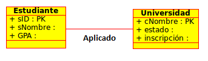
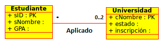
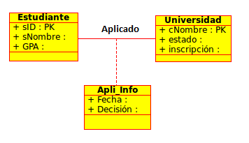
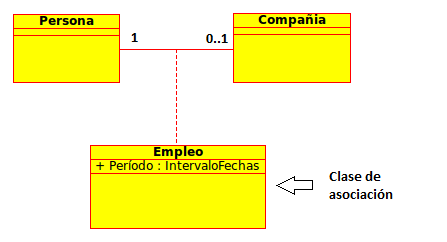
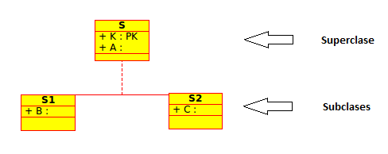
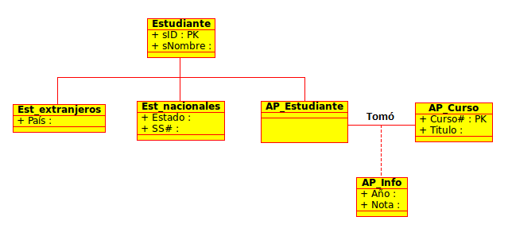
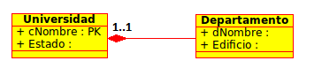
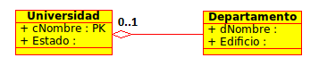

Lectura 20 - Lenguaje de Modelado Unificado: UML a las relaciones
-----------------------------------------------------------------

Base de datos de alto nivel y modelo de diseño

* Fácil de usar (gráfica) especificación del lenguaje
* Traducido al modelo de DBMS

.. image:: ../../../sql-course/src/dibujo1_semana5.png                               
   :align: center  

En la imagen anterior se observa que el lenguaje UML, puede ser traducido en relaciones
de una base de datos.

UML (Lenguaje de Modelado Unificado)
~~~~~~~~~~~~~~~~~~~~~~~~~~~~~~~~~~~~

Subconjunto de datos de modelado

* Cinco Conceptos

 1) Clases
 2) Asociaciones 
 3) Asociación de clases
 4) Subclases
 5) Composición y Agregación

* Los diseños pueden ser traducidos automáticamente a las relaciones

 Siempre y cada clase "regular" tiene una clave.

Clases
======

Cada clase se convierte en una relación; pk -> clave primaria

.. image:: ../../../sql-course/src/diagrama1_semana5.png                               
   :align: center   

Según las clases descritas anteriormente tenemos las siguientes relaciones:

.. math::

 Estudiante(\underline{sID}, sNombre, GPA)

 Universidad(\underline{cNombre}, estado, inscripción)

Asociaciones
============

Relación con la clave de cada lado.

Se obtendrán las mismas relaciones del ejemplo anterior, pero se agregará una nueva 
relación con las claves primarias de ambas clases.

.. math::

 Aplicado(sID, cNombre)

Claves para las relaciones de asociación
^^^^^^^^^^^^^^^^^^^^^^^^^^^^^^^^^^^^^^^^

* Depende de la multiplicidad

 * **Multiplicidad 1-1**

  * Cada objeto de A está asociado con un objeto de B, y cada objeto de B está asociado con un objeto de A.
  * Cualquiera de las dos tablas relacionadas implementará una columna con el *ID* de la otra tabla.
  * Esta columna será la clave foránea para relacionarlas.

 * **Multiplicidad 1-n**

  * Cada objeto A está asociado con más objetos B, pero cada objeto B está asociado con un objeto A.
  * Implementando la clave foránea *ID* en la tabla “muchos” a la tabla “uno”.

  Por ejemplo:

  .. image:: ../../../sql-course/src/diagrama3_semana5.png                               
     :align: center

  Ahora al tener una multiplicidad 1-n, se debe agregar la clave primaria *Atr1_clase1* 
  de la *Clase1* a la *Clase2* (que es la que posee la multiplicidad "muchos"), quedando 
  como clave foránea de la *Clase2*. 

  Finalmente las relaciones quedan de la siguiente manera: 

  .. math::

     Clase1(\underline{Atr1\_clase1}, Atr2\_clase1)
 
     Clase2(\underline{Atr1\_clase2}, Atr2\_clase2, Atr1\_clase1)
    
  Si la relación hubiese sido de 0..1-n, el atributo *Atr1_clase1* sería *NULL*.

  Ahora se mostrará otro ejemplo:

  .. image:: ../../../sql-course/src/diagrama4_semana5.png                               
     :align: center

  Las relaciones para este ejemplo serían:

  .. math::

     Estudiante(\underline{sID}, sNombre, GPA, cNombre)
 
     Universidad(\underline{cNombre}, estado, inscripción)
   
  Al poseer este tipo de multiplicidad (1-n), se agrega a la clase *Estudiante* (muchos)
  la clave primaria *cNombre* de la clase *Universidad*. 

 * **Multiplicidad n-m**
 
  * Cada objeto A está asociado con más objetos B, y a su vez, cada objeto B está asociado a más objetos A.
  * En el modelo relacional se usa una tabla auxiliar asociativa para representar la relación.
  * Dicha tabla tendrá al menos dos columnas, cada una representando la clave foránea a las dos tablas que relaciona.
  * Con lo anterior se transforma la relación n-m a dos relaciones (1-n, 1-m). 
 
Ejemplo
"""""""

Supongamos que tenemos 0..2 en el lado derecho, por lo que los estudiantes pueden 
solicitar hasta un máximo de 2 universidades. ¿Existe todavía una forma de "plegarse" 
la relación de asociación en este caso, o que tenemos una relación independiente *Aplicado*? 

a) Sí, hay una manera.
b) No, si no es 0..1 ó 1..1 *aplicado* entonces se requiere.

La alternativa correcta es (a), puesto que se debería crear la relación Estudiante(sID, sNombre, GPA, cNombre1, cNombre2), 
suponiendo que se permiten valores nulos. 

Clase de asociación
===================

Las clases de asociación permiten añadir atributos, operaciones y otras características
a las asociaciones.

Las relaciones de estas clases queda de la siguiente manera:

.. math::

 Estudiante(\underline{sID}, sNombre, GPA)                              
                                                                                     
 Universidad(\underline{cNombre}, estado, inscripción)

 Aplicado(sID, cNombre, Fecha, Decisión)

Otro ejemplo que detalla más claramente las clases de asociación

El diagrama nos permite apreciar que una *Persona* puede trabajar para una sola *Compañía*. 
Necesitamos conservar la información sobre el período de tiempo que trabaja cada empleado 
para cada *Compañía*.

Para lograrlo, añadimos un atributo *Período* a la asociación *Empleo*.

Subclases
=========

Si la clase "A" hereda de la clase "B", entonces "B" es la **superclase** de "A". "A" es 
**subclase** de "B". Los objetos de una **subclase** pueden ser usados en las circunstancias 
donde son usados los objetos de la **superclase** correspondiente. Esto se debe al hecho 
que los objetos de la **subclase** comparten el mismo comportamiento que los objetos de la **superclase**.

1) Las relaciones de las subclases contienen una clave de la superclase más atributos especializados. 
   
.. math::

  S(\underline{K}, A)

  S1(\underline{K}, B)

  S2(\underline{K}, C)
   
2) Las relaciones de las subclases contienen todos los atributos.

.. math::

  S(\underline{K}, A)

  S1(\underline{K}, A, B)

  S2(\underline{K}, A, C)

3) Una relación que contiene todos los atributos de la superclase y la subclase.

.. math::

  S(\underline{K}, A, B, C)

Ejemplo de subclases
^^^^^^^^^^^^^^^^^^^^

Las relaciones de este ejemplo son:

.. math::

 Estudiante(\underline{sID}, sNombre)

 Est\_extranjeros(\underline{sID}, País)

 Est\_nacionales(\underline{sID}, Estado, SS\#)

 AP\_Estudiante(\underline{sID})

 AP\_Curso(\underline{Curso\#}, Titulo)

 Tomó(sID, Curso\#, Año, Nota)

Composición y Agregación
========================

Composición
^^^^^^^^^^^

La composición es un tipo de relación estática, en donde el tiempo de vida del objeto 
incluido está condicionado por el tiempo de vida del que lo incluye (el objeto base se 
construye a partir del objeto incluido, es decir, es parte/todo).

Ejemplo
"""""""

Las relaciones se definen de la siguiente manera:

.. math::

 Universidad(\underline{cNombre}, Estado)

 Departamento(\underline{dNombre}, Edificio, cNombre)

Agregación
^^^^^^^^^^

La agregación es un tipo de relación dinámica, en donde el tiempo de vida del objeto 
incluido es independiente del que lo incluye (el objeto base utiliza al incluido para 
su funcionamiento).

Ejemplo
"""""""

Las relaciones son de la misma manera que el ejemplo anterior pero al poseer una diferente
multiplicidad el valor del atributo *cNombre* de la clase *Departamento*, puede tomar el 
valor **NULL**.

.. note::

 El software utilizado en esta lectura para realizar los diagramas es "Umbrello".
