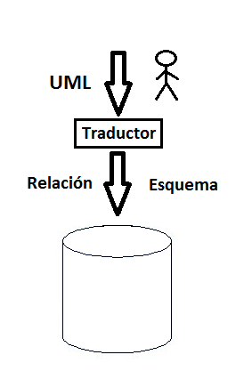
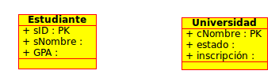

Lectura 20 - Lenguaje de Modelado Unificado: UML a las relaciones
-----------------------------------------------------------------

Base de datos de alto nivel y modelo de diseño

* Fácil de usar (gráfica) especificación del lenguaje
* Traducido al modelo de DBMS

UML (Lenguaje de Modelado Unificado)
~~~~~~~~~~~~~~~~~~~~~~~~~~~~~~~~~~~~

Subconjunto de datos de modelado

* Cinco Conceptos

 1) Clases
 2) Asociaciones 
 3) Asociación de clases
 4) Subclases
 5) Composición y agregación

* Los diseños pueden ser traducidos automáticamente a las relaciones

 Siempre y cada clase "regular" tiene una clave.

Clases
======

Cada clase se convierte en una relación; pk -> clave primaria

Según las clases descritas anteriormente tenemos las siguientes relaciones:

.. math::

 Estudiante(\underline{sID}, sName, GPA)

 Universidad(\underline{cName}, state, enr)

Asociaciones
============

Relación con la clave de cada lado.

