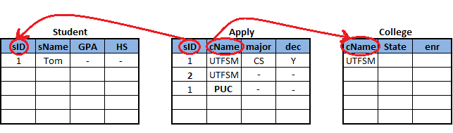

Lectura 23 - Restricciones y triggers: Integridad Referencial
-------------------------------------------------------------

.. role:: sql(code)
         :language: sql
         :class: highlight

Esta lectura presenta un tipo muy importante de *restricción* conocida como **integridad
referencial**.

Como un recordatorio de las lecturas anteriores, las restricciones de *integridad* de
una base de datos es imponer restricciones a los datos permitidos más allá de las impuestas
por la estructura y tipos de la base de datos.
Ahora, el término de **integridad referencial** se refiere a la *integridad de referencias*
que aparecen en la base de datos.

A continuación se muestra de ejemplo una base de datos con las tablas de *Student*, *Apply* y
*College*.

.. image:: ../../../sql-course/src/lectura23/imagen1_semana6.png
   :align: center

Supongamos por ejemplo, que se tiene un alumno, "1", que había solicitado a la universidad
"UTFSM", para una especialización en "CS" (ciencias), con una decisión de aceptación "Y" (sí) en
la tabla **Apply**.
Al poseer estos datos en la tabla **Apply**, se puede observar que los datos de esta tupla (o fila)
deben estar referenciados de otras tablas como es el caso del atributo *sID* y *cName*, en las que podremos
obtener mayor información, es por esto que aparece la tabla **Student**, que posee los datos
de cada estudiante que postula a alguna especialización en una universidad y la tabla **College**,
que entrega mayor información de la universidad a la que postula el estudiante.

En la tabla **Student** los atributos son: *sID* "1", *sName* "Tom", un cierto *GPA* y "HS" (escuela secundaria) y
en la tabla **College** los atributos son: *cName* "UTFSM", *State* y *enr*.

Entonces en este ejemplo se habla de **integridad referencial** al realizar las referencias
correspondientes en las otras tablas, como es el caso de *sID* en la tabla **Student** y
*cName* en la tabla **College**.

Específicamente si tenemos integridad referencial de un atributo ``A`` de una relación
``R`` (R.A)  en un atributo ``B`` de otra relación ``S`` (S.B).

A lo que se refiere es que cada valor que aparece en la columna A de la relación R debe
tener algún valor correspondiente en la columna B de la relación S. Así que, si observamos
el ejemplo anterior, podríamos decir que tendríamos **integridad referencial** de la columna
*sID* de **Apply**, a la columna *sID* de **Student**. Del mismo modo se tiene que la
**integridad referencial** de la columna *cName* de **Apply**, a la columna *cName*, en **College**.

En la siguiente imagen se muestra una violación de **integridad referencial**, por ejemplo,
si tuviéramos un *sID* "2", *cName* "UTFSM", un *major* y *dec*, en la tabla **Apply** y en la
tabla **Student** no existe este *sID*, por lo que sería considerado una violación de la
integridad referencial.

Del mismo modo podríamos tener un *sID* "1", lo cual es válido porque tenemos un estudiante
"1" en la tabla **Student**, pero si "1" se postulas a la universidad "PUC" y en la tabla
**College** no se encuentra "PUC", de nuevo se tiene una violación de la integridad referencial.

Ejemplo
=======

Consideremos dos tablas:

Dorm(name, address)
Student(name, dormName, roommateName)

Supongamos que algunos estudiantes viven en habitaciones individuales (roommateName es nulo)
y los dormitorios no están vacíos. ¿Cuál de las siguientes restricciones de integridad referencial
no se cumple?

a) Student.dormName a Dorm.name
b) Dorm.name a Student.dormName
c) Student.name a Student.roommateName
d) Student.roommateName a Student.name

La alternativa correcta es (c), puesto que la respuesta 1 dorm dice que cada estudiante existe.
Respuesta 2 dice que cada dormitorio tiene por lo menos un estudiante. Respuesta 3 dice que
cada estudiante tiene algún compañero estudiante de dormitorio (no es necesario).
Respuesta 4 dice que cada compañero de dormitorio es un estudiante actual.

Ahora sólo se darán unos detalles de las restricciones de **integridad referencial**.

Las relaciones ``R.A a S.B`` tienen como características:

* "A" es **clave foránea**

  Y de hecho, la **integridad referencial** se refiere a menudo como restricciones de claves foráneas.
  E incluso en la sintaxis SQL, veremos que la clave externa se utiliza el término.
* B se requiere generalmente para ser la clave primaria para la tabla S o por lo menos único.
* Múltiples atributos de claves foráneas son permitidos.

  Por ejemplo, si el atributo *cName* y *State* de la tabla **College** fuesen claves foráneas
  es necesario agregar una columna en la tabla **Apply** de *State*.

Aplicacion de la integridad referencial (R.A a R.B)
~~~~~~~~~~~~~~~~~~~~~~~~~~~~~~~~~~~~~~~~~~~~~~~~~~~

Modificaciones potencialmente violadas:

* :sql:`INSERT INTO` R.

   Si insertamos una tupla (o fila) en la relación *Apply* se puede haber violado la
   integridad referencial si el valor insertado, por ejemplo un nombre de *sID* o *cName*,
   no tienen valores coincidentes en las relaciones de referencia como son: **Student** y **College**.
* :sql:`DELETE FROM` R.

   Si borramos de una relación de referencia, digamos que se borra un estudiante de la tabla
   **Student**, entonces eso podría causar una violación de integridad referencial, puesto que
   al borrar la tupla (o fila) de la tabla **Student** el valor *sID* = "1", se pierde la
   referencia que existía de este estudiante en la tabla **Apply**.
* :sql:`UPDATE` R.A.
* :sql:`UPDATE` S.B.

   Y por supuesto, si actualizamos el valor que hace referencia a cualquiera de estas
   columnas podrían causar una violación de integridad referencial si es que el nuevo valor no
   existe en la tabla de referencia, o si se actualizaran los valores de referencia.

Ejemplo
=======

Considere las tablas Dorm(name, address) y Student(name, dormName, roommateName)
con restricciones de integridad referencial:

(1) Student.dormName a Dorm.name
(2) Dorm.name a Student.dormName
(3) Student.roommateName a Student.name

¿Cuál de las siguientes modificaciones no pueden causar una violación de la integridad
referencial?

a) Insertion into Student.
b) Deletion from Student.
c) Update Student.roommateName.
d) Todos ellos pueden causar violaciones.

La alternativa correcta es (d), puesto que al *insertar* un estudiante puede violar las restricciones
(1) y/o (3). Al eliminar un estudiante se pueden violar las restricciones (2) y/o (3).
Al actualizar un compañero de cuarto puede violar la restricción (3).

En el estándar SQL y en todas las implementaciones, si tenemos una inserción en la tabla
de referencia o una actualización de la tabla de referencia que cause una violación a la
restricción de integridad, entonces se genera un error, y que la modificación no es permitida,
al igual que la violación de otros tipos de restricciones.

Acciones especiales
~~~~~~~~~~~~~~~~~~~

* :sql:`DELETE FROM` S.

 * Restrict(default):
 * SET NULL
 * CASCADE

* :sql:`UPDATE` S.B.

 * Restrict(default)
 * SET NULL
 * CASCADE

Ahora se explicará con ejemplos en postgreSQL, para una mayor comprensión:

.. code-block:: sql

 CREATE TABLE College(cName text PRIMARY KEY, state text, enrollment INT);
 CREATE TABLE Student(sID INT PRIMARY KEY, sName text, GPA REAL, sizeHS INT);
 CREATE TABLE Apply(sID INT REFERENCES Student(sID), cName text REFERENCES College(cName), major text, decision text);

En la tabla **Apply** se puede observar la integridad referencial con "REFERENCES" a la
tabla **Student** con el atributo *sID* y **College** con le atributo *cName*.

.. code-block:: sql

 INSERT INTO Apply VALUES(1,'UTFSM','CS','Y');
 INSERT INTO Apply VALUES(2,'PUC','biology','N');

Al querer ingresar estas tuplas (o filas), sale el siguiente error::

 ERROR:  insert or update on table "apply" violates foreign key constraint "apply_sid_fkey"
 DETAIL:  Key (sid)=(1) is not present in table "student".
 ERROR:  insert or update on table "apply" violates foreign key constraint "apply_sid_fkey"
 DETAIL:  Key (sid)=(2) is not present in table "student".

Esto ocurre porque no se encuentran las referencias de estos datos en las tablas **Student**
y **College**.

Para solucionar este error es necesario primero *insertar* las tuplas en las tablas de
**Student** y **College** y finalmente insertar las tuplas en **Apply**.

.. code-block:: sql

 INSERT INTO Student VALUES(1, 'Tom', 3.4, 1000);
 INSERT INTO Student VALUES(2, 'Brad', 3.8, 1500);

 INSERT INTO College VALUES('UTFSM', 'CA', 15000);
 INSERT INTO College VALUES('PUC', 'CA', 36000);

 INSERT INTO Apply VALUES(1,'UTFSM','CS','Y');
 INSERT INTO Apply VALUES(2,'PUC','biology','N');

Ahora se quiere actualizar la tabla **Apply**.

.. code-block:: sql

 UPDATE Apply SET sID=3 WHERE sID=1;

Retornando el siguiente ``error``, puesto que intenta establecer la identificación del
estudiante a "3", pero vamos a conseguir una violación de la integridad referencial
porque no hay estudiantes con ID = "3".::

 ERROR:  insert or update on table "apply" violates foreign key constraint "apply_sid_fkey"
 DETAIL:  Key (sid)=(3) is not present in table "student".

.. code-block:: sql

 UPDATE Apply SET sID=2 WHERE sID=1;
 UPDATE 1

Esta última actualización es satisfactoria, puesto que se actualizará la postulación del
estudiante "1" para tener un *sID* = "2".

Hasta ahora, hemos visto modificaciones a la tabla de referencia, pero también tenemos
que preocuparnos acerca de las modificaciones de las tablas de referencia.

Por ejemplo, supongamos que tratamos de eliminar de la tabla **College**, donde el *cName*
es "UTFSM".

.. code-block:: sql

 DELETE FROM College WHERE cName='UTFSM';

Pero retorna el siguiente error, puesto que el atributo *cName* posee una referencia
al atributo *sName* de la tabla **Apply**, por lo que es imposible borrar esta tupla (o fila).::

 ERROR:  update or delete on table "college" violates foreign key constraint "apply_cname_fkey" on table "apply"
 DETAIL:  Key (cname)=(UTFSM) is still referenced from table "apply".

De la misma manera ocurre si se intenta eliminar la siguiente tupla (o fila) de la tabla
**Student**.

.. code-block:: sql

 DELETE FROM Student WHERE sID=2;

Retornando el siguiente error, puesto que el atributo *sID* de la tabla **Student** posee
una referencia al atributo *sID* de la tabla **Apply**.::

 ERROR:  update or delete on table "student" violates foreign key constraint "apply_sid_fkey" on table "apply"
 DETAIL:  Key (sid)=(2) is still referenced from table "apply".

Al querer eliminar la siguiente tupla (o fila), no retorna error, puesto que el estudiante
*sID* = "1", no posee referencia en la tabla **Apply**.

.. code-block:: sql

 DELETE FROM Student WHERE sID=1;
 DELETE 1

Si queremos actualizar el nombre de la universidad "UTFSM" por "USM" en la tabla **College**.

.. code-block:: sql

 UPDATE College SET cName='USM' WHERE cName='UTFSM';

Pero el resultado no es satisfactorio, puesto que si se modificara el atributo *cName* por
"USM" de la tabla **College**, se tendrá una referencia en la tabla **Apply** con el atributo
*cName*, pero que posee el valor de "UTFSM", generandose una violación de integridad.::

 ERROR:  update or delete on table "college" violates foreign key constraint "apply_cname_fkey" on table "apply"
 DETAIL:  Key (cname)=(UTFSM) is still referenced from table "apply".

Ahora veremos la eliminación de tablas.

Por ejemplo, si tratamos de eliminar la tabla **Student**, de nuevo se tendría una restricción
de integridad referencial, ya que los datos de la tabla **Apply** estarían referenciando
a una tabla **Student** inexistente.

.. code-block:: sql

 DROP TABLE Student;

retornando el siguiente error::

 ERROR:  cannot drop table student because other objects depend on it
 DETAIL:  constraint apply_sid_fkey on table apply depends on table student
 HINT:  Use DROP ... CASCADE to drop the dependent objects too.

A continuación vamos a configurar la tabla **Apply** con algunos de los mecanismos automáticos
para el manejo de violaciones de integridad referencial.

.. code-block:: sql

 CREATE TABLE Apply(sID INT REFERENCES Student(sID) ON DELETE SET NULL, cName text REFERENCES College(cName) ON UPDATE CASCADE, major text, decision text);
 CREATE TABLE

Para la para la restricción de *sID* la integridad referencial que vamos a especificar
es que si un estudiante es eliminado, no vamos a establecer ninguna referencia a valores
a "null", y lo hacemos con las palabras clave "ON DELETE" que nos dice qué hacer cuando
hay una eliminación de la tabla de referencia, se utiliza la opción SET NULL.

Para el atributo *cName* la integridad referencial que vamos a especificar es que si
la universidad se actualiza en la tabla **College** se utilizará la opción de cascada.
Esto quiere decir que si se modifica el valor de una tupla del atributo *cName* en la tabla
**College**, está también se modificará automáticamente en la tabla **Apply**.

Se podría haber especificado dos opciones más que hubiese sido una opción de actualización
para el *sID* de estudiante y una opción para borrar el *cName*, así que podrían haber sido
cuatro en total.

Vamos a generar ahora algunas modificaciones (comenzamos las tablas desde cero):

.. code-block:: sql

 INSERT INTO Student VALUES(1, 'Tom', 3.4, 1000);
 INSERT INTO Student VALUES(2, 'Brad', 3.8, 1500);
 INSERT INTO Student VALUES(3, 'Lucy', 3.9, 3600);

 INSERT INTO College VALUES('UTFSM', 'CA', 15000);
 INSERT INTO College VALUES('PUC', 'CA', 36000);

 INSERT INTO Apply VALUES(1,'UTFSM','CS','Y');
 INSERT INTO Apply VALUES(2,'PUC','biology','N');
 INSERT INTO Apply VALUES(1,'PUC','CS','Y');
 INSERT INTO Apply VALUES(3,'UTFSM','history','Y');
 INSERT INTO Apply VALUES(3,'UTFSM','CS','Y');

Cumpliendo todas las tuplas de la tabla **Apply** con la integridad referencial.

.. code-block:: sql

 SELECT * FROM Student;
 sid | sname | gpa | sizehs
 -----+-------+-----+--------
    1 | Tom   | 3.4 |   1000
    2 | Brad  | 3.8 |   1500
    3 | Lucy  | 3.9 |   3600
 (3 rows)

 SELECT * FROM College;
 cname | state | enrollment
 -------+-------+------------
  UTFSM | CA    |      15000
  PUC   | CA    |      36000
 (2 rows)

 SELECT * FROM Apply;
 sid | cname |  major  | decision
 -----+-------+---------+----------
    1 | UTFSM | CS      | Y
    2 | PUC   | biology | N
    1 | PUC   | CS      | Y
    3 | UTFSM | history | Y
    3 | UTFSM | CS      | Y
 (5 rows)

Ejemplo :sql:`ON DELETE SET NULL`
=================================

Ahora vamos a eliminar todos los estudiantes cuyo *sID* es mayor a 2:

.. code-block:: sql

 DELETE FROM Student WHERE sID > 2;
 DELETE 1

Quedando como resultado las tablas **Student** y **Apply**

.. code-block:: sql

 SELECT * FROM Student;
 sid | sname | gpa | sizehs
 -----+-------+-----+--------
    1 | Tom   | 3.4 |   1000
    2 | Brad  | 3.8 |   1500
 (2 rows)

 SELECT * FROM Apply;
 sid | cname |  major  | decision
 -----+-------+---------+----------
    1 | UTFSM | CS      | Y
    2 | PUC   | biology | N
    1 | PUC   | CS      | Y
      | UTFSM | history | Y
      | UTFSM | CS      | Y
 (5 rows)

Se observa que se eliminó a la estudiante "Lucy", que tenía un *sID* = 3, de la tabla
**Student** y la tabla **Apply** dejando en esta última el valor del atributo *sID* = "null",
cumpliéndose la restricción que se detalló en la creación de la tabla :sql:`ON DELETE SET NULL`.

Ejemplo :sql:`CASCADE`
======================

Se desea actualizar el *cName* de la tabla **College** el valor de "UTFSM" por "USM".

.. code-block:: sql

 UPDATE College SET cName='USM' WHERE cName='UTFSM';
 UPDATE 1

Ahora no retornó ningún error como en el ejemplo anterior, esto se debe a la restricción que
se agregó en la creación de la tabla **Apply**, en que se maneja automáticamente las
violaciones a la integración referencial.

Las tablas después de ejecutar el comando de actualización quedaron de la siguiente manera:

.. code-block:: sql

 SELECT * FROM College;
 cname | state | enrollment
 -------+-------+------------
  PUC   | CA    |      36000
  USM   | CA    |      15000
 (2 rows)

 SELECT * FROM Apply;
 sid | cname |  major  | decision
 -----+-------+---------+----------
    2 | PUC   | biology | N
    1 | PUC   | CS      | Y
    1 | USM   | CS      | Y
      | USM   | history | Y
      | USM   | CS      | Y
 (5 rows)

Observándose en las tablas **College** y **Apply** que se actualizó *cName* = 'USM', en
ambas tablas.

A continuación se mostrarán otras características que no se han visto en los ejemplos
anteriores:

.. code-block:: sql

 CREATE TABLE T(A INT, B INT, C INT, PRIMARY KEY(A,B), FOREIGN KEY(B,C) REFERENCES T(A,B) ON DELETE CASCADE);

 INSERT INTO T VALUES(1,1,1);
 INSERT INTO T VALUES(2,1,1);
 INSERT INTO T VALUES(3,2,1);
 INSERT INTO T VALUES(4,3,2);
 INSERT INTO T VALUES(5,4,3);
 INSERT INTO T VALUES(6,5,4);
 INSERT INTO T VALUES(7,6,5);
 INSERT INTO T VALUES(8,7,6);

Este ejemplo es para demostrar la integridad referencial dentro de una sola tabla **T**.

.. code-block:: sql

 SELECT * FROM T;
  a | b | c
 ---+---+---
  1 | 1 | 1
  2 | 1 | 1
  3 | 2 | 1
  4 | 3 | 2
  5 | 4 | 3
  6 | 5 | 4
  7 | 6 | 5
  8 | 7 | 6
 (8 rows)

Si queremos borrar de la tabla **T**, cuando A=1.

.. code-block:: sql

 DELETE FROM T WHERE A=1;

Quedando la tabla como:

.. code-block:: sql

 SELECT * FROM T;
  a | b | c
 ---+---+---
 (0 rows)

Podemos observar que al dar la condición de borrar A=1, se eliminan todos los demás valores,
esto sucede por la definición que se dio como clave foránea de B y C en la creación de la
tabla **T**.

La integración referencial es muy común en las implementaciones de las bases de datos relacionales.
La forma natural de diseñar un esquema relacional suelen tener valores en columnas de una tabla
que se refieren a los valores de las columnas de otra tabla, y el establecimiento de
restricciones de integridad referencial, este sistema controlará la base de datos y se
asegurará de que se mantenga siempre constante.

