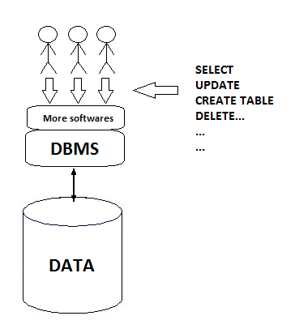

Lectura 25 - Transacciones: Introducción
----------------------------------------

En esta lectura se presentarán los conceptos de *transacciones* e acciones de interacción 
con los sistemas de base de datos.

El concepto de *transacciones* está realmente motivada por dos cuestiones totalmente 
independientes.

Uno tiene que ver con el **acceso concurrente** de varios clientes a la base de datos y el 
otro tiene que ver con tener un **sistema que es resistente** a los fallos de sistema.

Primero vamos a ver como funciona la estructura de los sistemas de bases de datos y la 
interacción con los clientes.

En la siguiente imagen podemos observar que los datos son almacenados en el disco, que 
tiene comunicación con el sistema de gestión de base de datos, o DBMS, que controla las 
interacciones con los datos.
A menudo hay software adicional por encima del DBMS, tal vez un servidor de aplicaciones 
o servidor web, que luego interactúan con los que podrían ser usuarios a través de comandos 
de selección, actualización, creación de tablas, comandos de borrado, etc. Y es aquí 
finalmente donde ocurre el problema que es la interacción concurrente de múltiples usuarios. 

Integridad de las transacciones
~~~~~~~~~~~~~~~~~~~~~~~~~~~~~~~

* Una *transacción* es un conjunto de operaciones (u órdenes) que se ejecutan en forma 
indivisible (atómica) sobre una base de datos.
* El DBMS debe mantener la integridad de los datos, haciendo que estas *transacciones* no 
puedan finalizar en un estado intermedio.
* Si por algún motivo se debe cancelar la *transacción*, el DBMS empieza a deshacer las 
órdenes ejecutadas hasta dejar la base de datos en su estado inicial (llamado punto de 
integridad), como si la orden de la transacción nunca se hubiese realizado.

Ahora se mostrarán ejemplos de dificultades que puede ocurrir cuando múltiples clientes 
están interactuando con la base de datos.

Nivel de Inconsistencia en Atributos
===================================

.. code-block:: sql

 UPDATE College SET enrollment = enrollment + 500 WHERE cName = 'UTFSM';

concurrente con

.. code-block:: sql

 UPDATE College SET enrollment = enrollment + 1000 WHERE cName = 'UTFSM';

En el ejemplo anterior se puede observar que tenemos 2 clientes, uno esta emitiendo una 
declaración que aumenta las matriculas de *UTFSM* en 500.
El segundo cliente, alrededor del mismo instante, está emitiendo una declaración que 
aumenta las matriculas en 1000.

El problema que se genera en este caso es que si el primer cliente modifica el valor 
de la matricula de la universidad *UTFSM* en 500 y ahora el segundo cliente va a modificar 
el valor de la matricula, sobre lo que modifico el primer cliente, por lo que a la base 
de datos se modifico dos veces el valor de la matricula.

Supongamos que el valor de la matricula está a 3000 y estas dos sentencias se ejecutan 
al mismo tiempo, el valor final de la matricula será 4500.

Nivel de Inconsistencia en Tuplas
=================================

.. code-block:: sql

 UPDATE Apply SET major = 'history' WHERE sID = 1;

concurrente con

.. code-block:: sql

 UPDATE Apply SET decision = 'Y' WHERE sID = 1;

En este ejemplo al poseer dos clientes que están realizando una modificación en una tupla 
(o fila) *sID = 1*, el primero actualizando la especialidad a *history* y el segundo a una decision 
con valor *Y*.
Es posible que se vean ambas modificaciones reflejadas en la base de datos, pero también 
existe la posibilidad de que solo se visualice una. 

Nivel de Inconsistencia en Tablas
================================

.. code-block:: sql

 UPDATE Apply SET decision = 'Y' WHERE sID IN (SELECT sID FROM Student WHERE GPA > 3.9);

concurrente con

.. code-block:: sql

 UPDATE Student SET GPA = (1.1) * GPA WHERE sizeHS > 2500;

Tenemos el primer cliente trabajando en la tabla **Apply**, pero las condiciones que se 
detallan en la tabla **Apply**, dependen de la tabla **Student**.
Mientras tanto el segundo cliente esta modificando la tabla **Student**.

Así que lo que sucede en la tabla **Apply**, puede depender de si ocurre antes, después o 
durante la modificación de la tabla **Student**.

Entonces los GPA se modifican y luego las aceptaciones se hacen o viceversa.

Objetivo de la Concurrencia
~~~~~~~~~~~~~~~~~~~~~~~~~~~

Tenemos múltiples clientes interactuando con la base de datos al mismo tiempo, y si en 
realidad los comandos que se ejecutan en la base de datos fuesen intercalados, a menudo los 
comandos de *actualización* e incluso los de *selección*, pueden generar un comportamiento 
inconsistente o inesperado.
    
Lo que idealmente se busca es que el cliente ejecute comandos a las bases de datos y no 
preocuparse de lo que están realizando otros clientes en ese mismo instante.

Objetivo Principal
==================

Ejecutar secuencias de instrucciones SQL que parecen estar funcionando de manera aislada.

* **Solución Simple:** ejecutarlos de forma aislada.

Pero desea habilitar la concurrencia siempre que sea seguro hacerlo.

Por lo general para poder hacer funcionar un ambiente con concurrencia es posible con un 
sistema que posea:

* Sistema multi-procesador.
* Sistema multi-threads

Y los sistemas de bases de datos, como también tienen acceso a la base de datos, tienden 
a realizar muchos I/O (entrada/salida) para un sistema que proporciona I/O (entrada/salida) 
asíncrona, también puede ejecutar varias cosas al mismo tiempo.

Ahora vamos a cambiar de tema y hablaremos acerca de las fallas de sistema.

Resistencia a fallos del sistema
~~~~~~~~~~~~~~~~~~~~~~~~~~~~~~~~

Una vez más, tenemos nuestro sistema de base de datos con los datos en el disco, y supongamos 
que justo estamos en el proceso de una carga masiva de datos en la base de datos.

Quizás una gran cantidad de datos de una fuente externa, por ejemplo un conjunto de archivos, 
y justo en el medio de carga masiva de datos, tenemos una caída del sistema o un fallo del sistema.

Esto podría deberse a un fallo de software o hardware, o algo tan simple como la salida de energía.

Por lo tanto, si se cargaron la mitad de los datos que se debían cargar en la base de datos 

¿Qué sucede cuando el sistema vuelve?

Se queda en un estado inconsistente bastante desagradable.

Como ejemplo, vamos a suponer que estábamos realizando un montón de cambios en la base de datos.
Entonces los datos que se quieren actualizar son modificados en la memoria y luego se escriben nuevamente 
en el disco.
Así que suponemos que en medio de este proceso tenemos una caída del sistema.

Esto volvería a dejar a la base de datos en un estado inconsistente.

Así que el objetivo general frente a los fallos del sistema es que cuando queremos hacer 
algo en la base de datos es indicarle al sistema que queremos garantizar la ejecución de todo 
o nada para ese conjunto particular de operaciones en la base de datos independientemente 
de los fallos que pudieran ocurrir durante la ejecución. 

Solución para la concurrencia y fallos
~~~~~~~~~~~~~~~~~~~~~~~~~~~~~~~~~~~~~~

Una transacción es una secuencia de una o más operaciones de SQL tratados como una unidad.

* Transacciones parecen funcionar de forma aislada.
* Si el sistema falla, los cambios de cada transacción se reflejan en su totalidad.

Estándar SQL:

* Una transacción comienza automáticamente en la primera sentencia SQL.
* Cuando el comando "commit" (una palabra clave especial) se ejecuta, la transacción 
actual termina y comienza una nueva.
* La transacción actual, también termina cuando su período de sesiones termina con la base 
de datos.
* "Autocommit" cada sentencia SQL se ejecuta como una transacción.  
