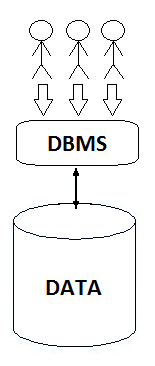

Lectura 26 - Transacciones: Propiedades
---------------------------------------

En esta lectura se va a profundizar sobre las propiedades de las transacciones.

Como recordatorio, las transacciones son un concepto que ha sido introducido como una 
solución tanto para el problema de control de concurrecia y fallos de sistemas en las bases 
de datos.

Todo conocedor de bases de datos, sabe que las transacciones soportan lo que se conoce como
las propiedades ACID.

``A``: Atomicidad.
``C``: Consistencia.
``I``: Aislamiento.
``D``: Durabilidad.

A continuación se detallaran estas cuatro propiedades; primero aislamiento, segundo durabilidad, 
tercero atomicidad y finalmente consistencia.

Aislamiento (I)
~~~~~~~~~~~~~~~

Podemos tener una gran cantidad de clientes que operan en una base de datos (como se muestra en la imagen), 
en que cada cliente piensa que está operando por su cuenta.
Así como se comento en la lectura anterior, cada cliente emite en el sistema de base de datos 
una secuencia de transacciones.
Así que un primer cliente podría emitir primero la transacción T1, a continuación, T2, T3, 
y así sucesivamente.
Un segundo cliente podría emitir una transacción T9, T10, T11.

Como recordatorio, cada transacción en sí puede ser una secuencia de instrucciones.

Por lo tanto estas transacciones, podrían ser una instrucción, dos instrucciones, tres instrucciones y 
así sucesivamente, y finalmente estas instrucciones serán tratadas como una unidad.

De manera que la **propiedad aislante** es implementada de una muy especifica forma normal 
llamada *serializacion*.

La *serialización* quiere decir que las operaciones pueden ser intercaladas entre los clientes, 
pero la ejecución debe ser equivalente a un orden secuencial (serial) de todas las transacciones.

En base a la imagen anterior, el propio sistema puede ejecutar todas las instrucciones 
dentro de cada operación y al mismo tiempo por cada cliente, pero tiene que garantizar 
que el comportamiento de la base de datos es equivalente a una secuencia en orden.

