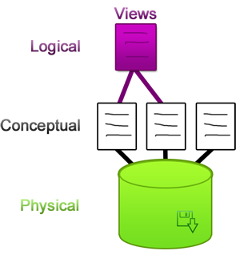

Lectura 27 – Vistas: Definición y usos
----------------------------------------------------------

.. role:: sql(code)
         :language: sql
         :class: highlight

Las vistas se basan en una visión bases de datos de tres niveles, que lo componen:

* **Capa física:** En el nivel inferior, se encuentran los datos reales almacenados en un disco.

* **Capa conceptual:** Es la abstracción de las relaciones (o tabla) de los datos almacenados en un disco. 

* **Capa de lógica:** la última capa es una abstracción por encima de las relaciones es lo que se conoce como **vistas (views)**.

Definición
~~~~~~~~~~~

**Una vista es una tabla virtual derivada de las tablas reales** de una base de datos. Las vistas 
no se almacenan en la base de datos, sólo se almacena una definición de consulta, es decir una 
vista contiene la instrucción :sql:`SELECT` necesaria para crearla. Resultado de la cual se 
produce una tabla cuyos datos proceden de la base de datos o de otras vistas. Eso asegura que 
los datos sean coherentes al utilizar los datos almacenados en las tablas. Si los datos de las 
relaciones cambian, los de la vista que utiliza esos datos también cambia.  Por todo ello, las 
vistas gastan muy poco espacio de disco.

Como una vista se define como una consulta sobre las relaciones, aún pertenecen en el modelo de datos relacional.

Para definir una vista **V**, se especifica una consulta de Vista en SQL, a través de un conjunto 
de tablas existentes **(R1, R2,…Rn)**. 

``Vista V= ConsultaSQL(R1, R2, …, Rn)``
 
La vista **V**, entonces, se puede pensar como una tabla de los resultados de la consulta. Ahora 
supongamos que se desea ejecutar una consulta **Q** en la base de datos. Esta no es una consulta 
de vista, es sólo una consulta como las vistas anteriormente en el curso. La consulta **Q** hace 
referencia a **V**.

``V := ViewQuery(R1,R2,…,Rn)`` 

``Evaluate Q``

Lo que realmente hace Q es consultar o editar las relaciones R1, R2,…, Rn instanciadas por V.  
El DBMS realiza automáticamente el proceso de rescritura sobre las relaciones.

Usos de las vistas
~~~~~~~~~~~~~~~~~~~

Las vistas se emplean para:

* **Realizar consultas complejas más fácilmente:** Las vistas permiten dividir la consulta en varias partes.

* **Proporcionar tablas con datos específicos:** Las vistas permiten ser utilizadas como tablas que resumen 
  todos los datos, así como también permiten ocultar ciertos datos. Cuando ese se requiere un detalle que no 
  corresponde precisamente a las relaciones. 

* **Modularidad de acceso a base de datos:** las vistas se pueden pensar en forma de módulos que nos da acceso 
  a partes de la base de datos. Cuando ese detalle que se requiere no corresponde precisamente a las relaciones. 

Las aplicaciones reales tienden a usar un muchas vistas, por lo que cuanto más grande es la aplicación, más necesario 
es que haya modularidad, para facilitar determinadas consultas o para ocultar los datos. Las vistas entonces son 
el mecanismo para alcanzar dichos objetivos.

Creación de una vista
~~~~~~~~~~~~~~~~~~~~~~~

* :sql:`CREATE VIEW` : Define una tabla lógica a partir de una o más tablas físicas o de otras vistas.

* :sql:`DROP VIEW` : Elimina una definición de vista (y cualquier vista definida a partir de ella).

.. code-block:: sql

	Create View Vname(A1,A2,…,An) As <QuerySQLstandar>

*Vname* es el nombre que se le asigna a la vista, A1, A2,…, An son los nuevos nombres de los atributos que tendrá la vista.

Ejemplo 1
^^^^^^^^^^^^

Se utiliza una base de datos con las siguientes relaciones:
 
`\text{Specie}(\underline{\text{sName}},\text{comName,family})`

Esta tabla almacena los datos que caracterizan las especies animales. Almacena el nombre científico en 
*sName* , el nombre común con el que se le conoce es guardado en *comName* y la familia *family* a la que 
pertenece la especie.

`\text{Zoo}(\underline{\text{zID}},\text{zooName,size, budget})`

La relación Zoo almacena los datos de los zoológicos. Un *zID* que es la primary key, el nombre en *zooName*, 
*size* es el tamaño en hectáreas y presupuesto *budget* en unidades monetarias.
  
`\text{Animal}(\underline{\text{zID, sName, aName}},\text{country})`

La tabla *animal* guarda los datos de los animales que habitan cada zoológico. El atributo  *zID* es clave
foránea a *Zoo*, se refiere al zoológico en el que se encuentra un animal, *sName* es clave foránea a la
*Specie* que pertenece, *country* es el país de procedencia.
  
La creación de las relaciones y los valores que se utilizarán en este ejemplo se encuentran en el siguiente archivo

.. (INSERTAR LINK).

Se crea una vista:

.. code-block:: sql

	CREATE VIEW View1 AS
	SELECT zID, sName
	FROM Animal
	WHERE aName = 'Tony' and country = 'China';

Como ya se mencionó para crear una vista se usan las palabras clave :sql:`CREATE VIEW` especificando el 
nombre de la vista *view1* . Luego se declara la consulta en SQL estándar. Dicha consulta selecciona
*zID* y *sName* de los animales que se llamen 'Tony'  y procedan de  'China' .

PostgreSQL retorna:

.. code-block:: sql

	CREATE VIEW

Al realizar un :sql:`SELECT` de la vista, PostgreSQL la despliega como si fuera una relación cualquiera.

.. code-block:: sql

	 DBviews=# SELECT * FROM View1;
	 
	 zid |         sname          
	-----+------------------------
	   5 | Ailuropoda melanoleuca
	   1 | Panthera leo
	   3 | Panthera tigris
	(3 rows)

Sin embargo la vista no almacena los datos, sino que estos siguen almacenados en la relación *Animal*.  
Observe que ocurre cuando se insertan más datos en *Animal*

.. code-block:: sql

	INSERT INTO Animal
	(zID, sName, aName, country) 
	VALUES
	(4,'Ailuropoda melanoleuca', 'Tony', 'China'),
	(3,'Panthera leo', 'Tony', 'China'),
	(1,'Loxodonta africana', 'Tony', 'China');

La *View1* se actualiza automáticamente: 

.. code-block:: sql

	 DBviews=# SELECT * FROM View1;

	 zid |         sname          
	-----+------------------------
	   5 | Ailuropoda melanoleuca
	   1 | Panthera leo
	   3 | Panthera tigris
	   4 | Ailuropoda melanoleuca
	   3 | Panthera leo
	   1 | Loxodonta africana
	(6 rows)

Ejemplo 2
^^^^^^^^^^^^

Si se desea renombrar los atributos de una vista, la sentencia debe ser:

.. code-block:: sql

	CREATE VIEW Viewt(IDzoo,specieName) as
	SELECT zID, sName
	FROM Animal
	WHERE aName = 'Tony' and country = 'China';

PostgreSQL retorna:

.. code-block:: sql

	CREATE VIEW

La vista *Viewt* fue definida igual que *View1*, pero esta vez los atributos que selecciona son 
renombrados, *zID* se despliega como *IDzoo* y *sName* como *specieName*

.. code-block:: sql 

	DBviews=# SELECT * FROM Viewt;

	 idzoo |       speciename       
	-------+------------------------
	     5 | Ailuropoda melanoleuca
	     1 | Panthera leo
	     3 | Panthera tigris
	     4 | Ailuropoda melanoleuca
	     3 | Panthera leo
	     1 | Loxodonta africana
	(6 rows)

Para seleccionar un atributo de *Viewt* debe hacerse con el nuevo nombre asignado:

.. code-block:: sql 

	DBviews=# SELECT zID FROM viewt;
	ERROR:  column "zid" does not exist
	LÍNEA 1: select zid from viewt;

	DBviews=# SELECT idzoo FROM viewt;
	 idzoo 
	-------
	     5
	     1
	     3
	     4
	     3
	     1
	(6 rows)

Ejemplo 3
^^^^^^^^^^^^

A pesar que la vista no almacena valores, solo los referencia, se puede trabajar como si fuera una relación real.  
La siguiente consulta selecciona *Zoo.zID, zooName y size* de la tabla *Zoo* y de la vista *View1*,  donde *zID* 
de la tabla *Zoo* sea igual al *zID* de *View1*, recordar que *View1*  y *sName* de *View1* sea 'Ailuropoda melanoleuca' 
y que *size* de *Zoo* sea menor a 10.  

.. code-block:: sql

	SELECT Zoo.zID, zooName, size
	FROM Zoo, View1
	WHERE Zoo.zID = View1.zID and sName = 'Ailuropoda melanoleuca' and size < 10;

	zid |  zooname   | size 
	-----+------------+------
	   4 | London Zoo |    9
	(1 row)

Ejemplo 4
^^^^^^^^^^^^

**Una vista también puede referenciar a otra vista**. Para ello se crea una vista llamada *View2* 
que referencia a la tabla *Zoo* y a la vista *View1*. 

.. code-block:: sql

	CREATE view View2 as
	SELECT Zoo.zID, zooName, size
	FROM Zoo, View1
	WHERE Zoo.zID = View1.zID and sName = 'Panthera leo' and  budget > 80;

La sentencia crea una vista que almacena datos de *Zoo* que poseen animales 'Panthera leo', la búsqueda 
la hace dentro de los datos que posee *View1*, además el *budget* de *Zoo* debe ser mayor a 80. Cabe mencionar  
que al ejecutar este comando no muestra el resultado, sólo crea la vista.

Luego View2 puede ser utilizada en sentencias :sql:`SELECT` de la misma forma que las tablas:
 
.. code-block:: sql

	DBviews=# SELECT * FROM View2;
	 
	 zid |    zooname    | size 
	-----+---------------+------
	   1 | Metropolitano |    4
	   3 | San Diego     |   14
	(2 rows)

	DBviews=# SELECT * FROM View2 WHERE size > 5;

	 zid |  zooname  | size 
	-----+-----------+------
	   3 | San Diego |   14
	(1 row)

